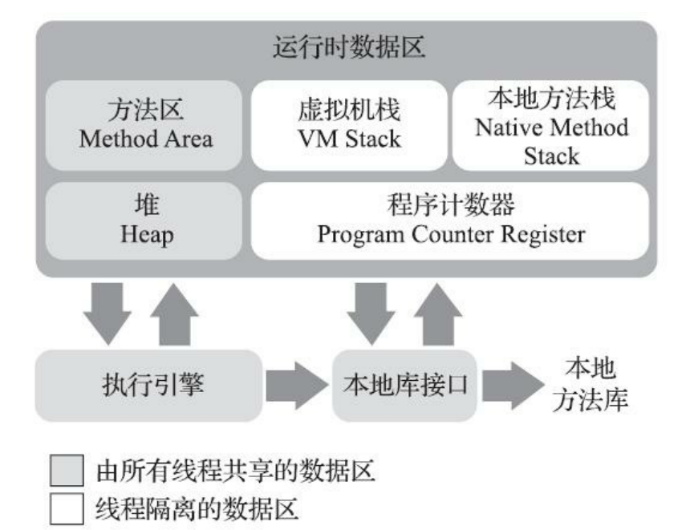
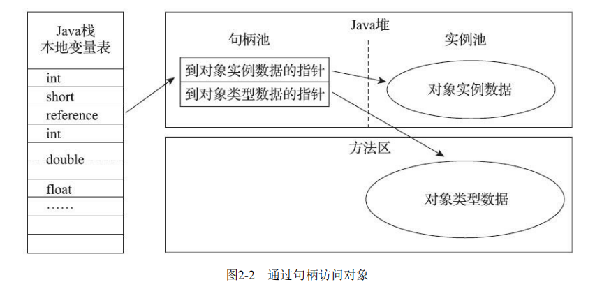
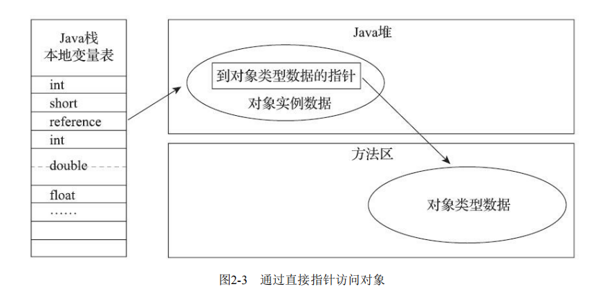
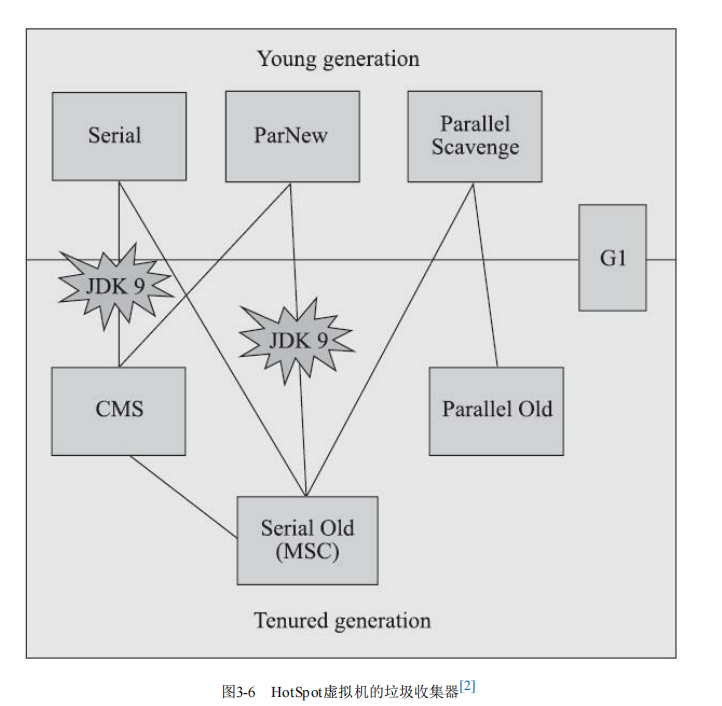
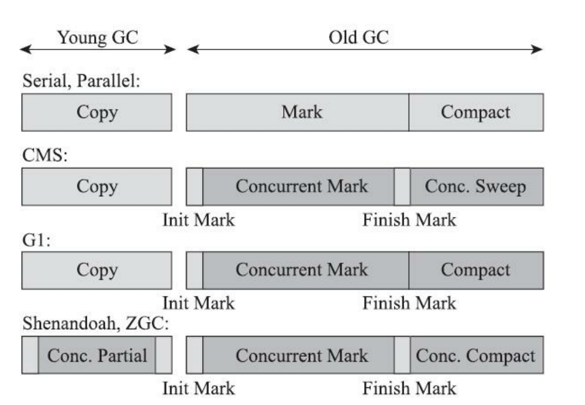

### 运行时数据区域

Java虚拟机在执行Java程序的过程中会把它所管理的内存划分为若干个不同的数据区域。这些区域
有各自的用途，以及创建和销毁的时间，有的区域随着虚拟机进程的启动而一直存在，有些区域则是
依赖用户线程的启动和结束而建立和销毁

#### 程序计数器

程序计数器（Program Counter Register）是一块较小的内存空间，它可以看作是当前线程所执行的
字节码的行号指示器。在Java虚拟机的概念模型里，字节码解释器工作时就是通过改变这个计数器
的值来选取下一条需要执行的字节码指令，它是程序控制流的指示器，分支、循环、跳转、异常处
理、线程恢复等基础功能都需要依赖这个计数器来完成。

由于Java虚拟机的多线程是通过线程轮流切换、分配处理器执行时间的方式来实现的，在任何一
个确定的时刻，一个处理器（对于多核处理器来说是一个内核）都只会执行一条线程中的指令。因
此，为了线程切换后能恢复到正确的执行位置，每条线程都需要有一个独立的程序计数器，各条线程
之间计数器互不影响，独立存储，我们称这类内存区域为“线程私有”的内存。

如果线程正在执行的是一个Java方法，这个计数器记录的是正在执行的虚拟机字节码指令的地
址；如果正在执行的是本地（Native）方法，这个计数器值则应为空（Undefined）。此内存区域是唯
一一个在《Java虚拟机规范》中没有规定任何OutOfMemoryError情况的区域。

#### Java虚拟机栈

与程序计数器一样，Java虚拟机栈（Java Virtual Machine Stack）也是线程私有的，它的生命周期
与线程相同。虚拟机栈描述的是Java方法执行的线程内存模型：每个方法被执行的时候，Java虚拟机都
会同步创建一个栈帧（Stack Frame）用于存储局部变量表、操作数栈、动态连接、方法出口等信
息。每一个方法被调用直至执行完毕的过程，就对应着一个栈帧在虚拟机栈中从入栈到出栈的过程。

##### **可能出现的问题**

在《Java虚拟机规范》中，对这个内存区域规定了两类异常状况：如果线程请求的栈深度大于虚
拟机所允许的深度，将抛出StackOverflowError异常；如果Java虚拟机栈容量可以动态扩展[2]，当栈扩
展时无法申请到足够的内存会抛出OutOfMemoryError异常。

#### 本地方法栈

本地方法栈（Native Method Stacks）与虚拟机栈所发挥的作用是非常相似的，其区别只是虚拟机
栈为虚拟机执行Java方法（也就是字节码）服务，而本地方法栈则是为虚拟机使用到的本地（Native）
方法服务。

##### **可能出现的问题**

在《Java虚拟机规范》中，对这个内存区域规定了两类异常状况：如果线程请求的栈深度大于虚
拟机所允许的深度，将抛出StackOverflowError异常；如果Java虚拟机栈容量可以动态扩展[2]，当栈扩
展时无法申请到足够的内存会抛出OutOfMemoryError异常。

#### Java堆

对于Java应用程序来说，Java堆（Java Heap）是虚拟机所管理的内存中最大的一块。Java堆是被所
有线程共享的一块内存区域，在虚拟机启动时创建。此内存区域的唯一目的就是存放对象实例，Java
世界里**几乎**所有的对象实例都在这里分配内存。

**几乎** 
>随着Java语言的发展，现在已经能看到些许迹象表明日后可能出现值类型的支持，即使只考虑现在，由于即时编
译技术的进步，尤其是逃逸分析技术的日渐强大，栈上分配、标量替换优化手段已经导致一些微妙
的变化悄然发生，所以说Java对象实例都分配在堆上也渐渐变得不是那么绝对了。
> 
> 

#### 方法区

方法区（Method Area）与Java堆一样，是各个线程共享的内存区域，它用于存储已被虚拟机加载
的类型信息、常量、静态变量、即时编译器编译后的代码缓存等数据。

《Java虚拟机规范》对方法区的约束是非常宽松的，除了和Java堆一样不需要连续的内存和可以选
择固定大小或者可扩展外，甚至还可以选择不实现垃圾收集。相对而言，垃圾收集行为在这个区域的
确是比较少出现的，但并非数据进入了方法区就如永久代的名字一样“永久”存在了。这区域的内存回
收目标主要是针对常量池的回收和对类型的卸载，一般来说这个区域的回收效果比较难令人满意，尤
其是类型的卸载，条件相当苛刻，但是这部分区域的回收有时又确实是必要的。

#### 运行时常量池

运行时常量池（Runtime Constant Pool）是方法区的一部分。Class文件中除了有类的版本、字
段、方法、接口等描述信息外，还有一项信息是常量池表（Constant Pool Table），用于存放编译期生
成的各种字面量与符号引用，这部分内容将在类加载后存放到方法区的运行时常量池中。

#### 直接内存

直接内存（Direct Memory）并不是虚拟机运行时数据区的一部分，也不是《Java虚拟机规范》中
定义的内存区域。但是这部分内存也被频繁地使用，而且也可能导致OutOfMemoryError异常出现，所
以我们放到这里一起讲解。
在JDK 1.4中新加入了NIO（New Input/Output）类，引入了一种基于通道（Channel）与缓冲区
（Buffer）的I/O方式，它可以使用Native函数库直接分配堆外内存，然后通过一个存储在Java堆里面的
DirectByteBuffer对象作为这块内存的引用进行操作。这样能在一些场景中显著提高性能，因为避免了
在Java堆和Native堆中来回复制数据。
显然，本机直接内存的分配不会受到Java堆大小的限制，但是，既然是内存，则肯定还是会受到
本机总内存（包括物理内存、SWAP分区或者分页文件）大小以及处理器寻址空间的限制，一般服务
器管理员配置虚拟机参数时，会根据实际内存去设置-Xmx等参数信息，但经常忽略掉直接内存，使得
各个内存区域总和大于物理内存限制（包括物理的和操作系统级的限制），从而导致动态扩展时出现
OutOfMemoryError异常。

#### 对象的创建

当Java虚拟机遇到一条字节码new指令时，首先将去检查这个指令的参数是否能在常量池中定位到
一个类的符号引用，并且检查这个符号引用代表的类是否已被加载、解析和初始化过。如果没有，那
必须先执行相应的类加载过程，

**问题1**
> 在类加载检查通过后，接下来虚拟机将为新生对象分配内存。对象所需内存的大小在类加载完成
后便可完全确定（如何确定将在2.3.2节中介绍），为对象分配空间的任务实际上便等同于把一块确定
大小的内存块从Java堆中划分出来。假设Java堆中内存是绝对规整的，所有被使用过的内存都被放在一
边，空闲的内存被放在另一边，中间放着一个指针作为分界点的指示器，那所分配内存就仅仅是把那
个指针向空闲空间方向挪动一段与对象大小相等的距离，这种分配方式称为“指针碰撞”（Bump The
Pointer）。但如果Java堆中的内存并不是规整的，已被使用的内存和空闲的内存相互交错在一起，那
就没有办法简单地进行指针碰撞了，虚拟机就必须维护一个列表，记录上哪些内存块是可用的，在分
配的时候从列表中找到一块足够大的空间划分给对象实例，并更新列表上的记录，这种分配方式称
为“空闲列表”（Free List）。选择哪种分配方式由Java堆是否规整决定，而Java堆是否规整又由所采用
的垃圾收集器是否带有空间压缩整理（Compact）的能力决定。因此，当使用Serial、ParNew等带压缩
整理过程的收集器时，系统采用的分配算法是指针碰撞，既简单又高效；而当使用CMS这种基于清除
（Sweep）算法的收集器时，理论上[1]就只能采用较为复杂的空闲列表来分配内存。

**问题2**
> 除如何划分可用空间之外，还有另外一个需要考虑的问题：对象创建在虚拟机中是非常频繁的行
为，即使仅仅修改一个指针所指向的位置，在并发情况下也并不是线程安全的，可能出现正在给对象
A分配内存，指针还没来得及修改，对象B又同时使用了原来的指针来分配内存的情况。解决这个问题
有两种可选方案：一种是对分配内存空间的动作进行同步处理——实际上虚拟机是采用CAS配上失败
重试的方式保证更新操作的原子性；另外一种是把内存分配的动作按照线程划分在不同的空间之中进
行，即每个线程在Java堆中预先分配一小块内存，称为本地线程分配缓冲（Thread Local Allocation
Buffer，TLAB），哪个线程要分配内存，就在哪个线程的本地缓冲区中分配，只有本地缓冲区用完
了，分配新的缓存区时才需要同步锁定。虚拟机是否使用TLAB，可以通过-XX：+/-UseTLAB参数来
设定。
内存分配完成之后，虚拟机必须将分配到的内存空间（但不包括对象头）都初始化为零值，如果
使用了TLAB的话，这一项工作也可以提前至TLAB分配时顺便进行。这步操作保证了对象的实例字段
在Java代码中可以不赋初始值就直接使用，使程序能访问到这些字段的数据类型所对应的零值。
> 
> 

#### 对象的内存布局

在HotSpot虚拟机里，对象在堆内存中的存储布局可以划分为三个部分：对象头（Header）、实例
数据（Instance Data）和对齐填充（Padding）

1. HotSpot虚拟机对象的对象头部分包括两类信息。第一类是用于存储对象自身的运行时数据，如哈
希码（HashCode）、GC分代年龄、锁状态标志、线程持有的锁、偏向线程ID、偏向时间戳等，这部
分数据的长度在32位和64位的虚拟机（未开启压缩指针）中分别为32个比特和64个比特，官方称它
为“Mark Word”。

2. 对象头的另外一部分是类型指针，即对象指向它的类型元数据的指针，Java虚拟机通过这个指针
来确定该对象是哪个类的实例。并不是所有的虚拟机实现都必须在对象数据上保留类型指针，换句话
说，查找对象的元数据信息并不一定要经过对象本身，这点我们会在下一节具体讨论。此外，如果对
象是一个Java数组，那在对象头中还必须有一块用于记录数组长度的数据，因为虚拟机可以通过普通
Java对象的元数据信息确定Java对象的大小，但是如果数组的长度是不确定的，将无法通过元数据中的
信息推断出数组的大小。
3. 接下来实例数据部分是对象真正存储的有效信息，即我们在程序代码里面所定义的各种类型的字
   段内容，无论是从父类继承下来的，还是在子类中定义的字段都必须记录起来。这部分的存储顺序会
   受到虚拟机分配策略参数（-XX：FieldsAllocationStyle参数）和字段在Java源码中定义顺序的影响。
   HotSpot虚拟机默认的分配顺序为longs/doubles、ints、shorts/chars、bytes/booleans、oops（Ordinary
   Object Pointers，OOPs），从以上默认的分配策略中可以看到，相同宽度的字段总是被分配到一起存
   放，在满足这个前提条件的情况下，在父类中定义的变量会出现在子类之前。如果HotSpot虚拟机的
   +XX：CompactFields参数值为true（默认就为true），那子类之中较窄的变量也允许插入父类变量的空
   隙之中，以节省出一点点空间。
4. 对象的第三部分是对齐填充，这并不是必然存在的，也没有特别的含义，它仅仅起着占位符的作
   用。由于HotSpot虚拟机的自动内存管理系统要求对象起始地址必须是8字节的整数倍，换句话说就是
   任何对象的大小都必须是8字节的整数倍。对象头部分已经被精心设计成正好是8字节的倍数（1倍或者
   2倍），因此，如果对象实例数据部分没有对齐的话，就需要通过对齐填充来补全

#### 对象的访问定位

主流的访问方式主要有使用句柄和直接指针两种：

1. 如果使用句柄访问的话，Java堆中将可能会划分出一块内存来作为句柄池，reference中存储的就
   是对象的句柄地址，而句柄中包含了对象实例数据与类型数据各自具体的地址信息，其结构如图2-2所
   示。
2. 如果使用直接指针访问的话，Java堆中对象的内存布局就必须考虑如何放置访问类型数据的相关
   信息，reference中存储的直接就是对象地址，如果只是访问对象本身的话，就不需要多一次间接访问
   的开销

使用直接指针来访问最大的好处就是速度更快，它节省了一次指针定位的时间开销，由于对象访
问在Java中非常频繁，因此这类开销积少成多也是一项极为可观的执行成本，就本书讨论的主要虚拟
机HotSpot而言，它主要使用第二种方式进行对象访问（有例外情况，如果使用了Shenandoah收集器的
话也会有一次额外的转发，具体可参见第3章），但从整个软件开发的范围来看，在各种语言、框架中
使用句柄来访问的情况也十分常见。

#### 如何判断对象已死

1. 引用计数算法

很多教科书判断对象是否存活的算法是这样的：在对象中添加一个引用计数器，每当有一个地方
引用它时，计数器值就加一；当引用失效时，计数器值就减一；任何时刻计数器为零的对象就是不可
能再被使用的。

这个看似简单
的算法有很多例外情况要考虑，必须要配合大量额外处理才能保证正确地工作，譬如单纯的引用计数
就很难解决对象之间相互循环引用的问题。

2. 可达性分析算法

。这个算法的基本思路就是通过
一系列称为“GC Roots”的根对象作为起始节点集，从这些节点开始，根据引用关系向下搜索，搜索过
程所走过的路径称为“引用链”（Reference Chain），如果某个对象到GC Roots间没有任何引用链相连，
或者用图论的话来说就是从GC Roots到这个对象不可达时，则证明此对象是不可能再被使用的。

如图3-1所示，对象object 5、object 6、object 7虽然互有关联，但是它们到GC Roots是不可达的，
因此它们将会被判定为可回收的对象。

在Java技术体系里面，固定可作为GC Roots的对象包括以下几种：
1. 在虚拟机栈（栈帧中的本地变量表）中引用的对象，譬如各个线程被调用的方法堆栈中使用到的
   参数、局部变量、临时变量等
2. 在方法区中类静态属性引用的对象，譬如Java类的引用类型静态变量。
3. 在方法区中常量引用的对象，譬如字符串常量池（String Table）里的引用
4. 在本地方法栈中JNI（即通常所说的Native方法）引用的对象
5. Java虚拟机内部的引用，如基本数据类型对应的Class对象，一些常驻的异常对象（比如
   NullPointExcepiton、OutOfMemoryError）等，还有系统类加载器
6. 所有被同步锁（synchronized关键字）持有的对象
7. 反映Java虚拟机内部情况的JMXBean、JVMTI中注册的回调、本地代码缓存等

#### 引用类型

1. ·强引用是最传统的“引用”的定义，是指在程序代码之中普遍存在的引用赋值，即类似“Object
   obj=new Object()”这种引用关系。无论任何情况下，只要强引用关系还存在，垃圾收集器就永远不会回
   收掉被引用的对象
2. 软引用是用来描述一些还有用，但非必须的对象。只被软引用关联着的对象，在系统将要发生内
   存溢出异常前，会把这些对象列进回收范围之中进行第二次回收，如果这次回收还没有足够的内存，
   才会抛出内存溢出异常。在JDK 1.2版之后提供了SoftReference类来实现软引用。
3. ·弱引用也是用来描述那些非必须对象，但是它的强度比软引用更弱一些，被弱引用关联的对象只
   能生存到下一次垃圾收集发生为止。当垃圾收集器开始工作，无论当前内存是否足够，都会回收掉只
   被弱引用关联的对象。在JDK 1.2版之后提供了WeakReference类来实现弱引用
4. ·虚引用也称为“幽灵引用”或者“幻影引用”，它是最弱的一种引用关系。一个对象是否有虚引用的
   存在，完全不会对其生存时间构成影响，也无法通过虚引用来取得一个对象实例。为一个对象设置虚
   引用关联的唯一目的只是为了能在这个对象被收集器回收时收到一个系统通知。在JDK 1.2版之后提供
   了PhantomReference类来实现虚引用。

#### 生存还是死亡

即使在可达性分析算法中判定为不可达的对象，也不是“非死不可”的，这时候它们暂时还处于“缓
刑”阶段，要真正宣告一个对象死亡，至少要经历两次标记过程：如果对象在进行可达性分析后发现没
有与GC Roots相连接的引用链，那它将会被第一次标记，随后进行一次筛选，筛选的条件是此对象是
否有必要执行finalize()方法。假如对象没有覆盖finalize()方法，或者finalize()方法已经被虚拟机调用
过，那么虚拟机将这两种情况都视为“没有必要执行”。

如果这个对象被判定为确有必要执行finalize()方法，那么该对象将会被放置在一个名为F-Queue的
队列之中，并在稍后由一条由虚拟机自动建立的、低调度优先级的Finalizer线程去执行它们的finalize()
方法。这里所说的“执行”是指虚拟机会触发这个方法开始运行，但并不承诺一定会等待它运行结束。
这样做的原因是，如果某个对象的finalize()方法执行缓慢，或者更极端地发生了死循环，将很可能导
致F-Queue队列中的其他对象永久处于等待，甚至导致整个内存回收子系统的崩溃。finalize()方法是对
象逃脱死亡命运的最后一次机会，稍后收集器将对F-Queue中的对象进行第二次小规模的标记，如果对
象要在finalize()中成功拯救自己——只要重新与引用链上的任何一个对象建立关联即可，譬如把自己
（this关键字）赋值给某个类变量或者对象的成员变量，那在第二次标记时它将被移出“即将回收”的集
合；如果对象这时候还没有逃脱，那基本上它就真的要被回收了。从代码清单3-2中我们可以看到一个
对象的finalize()被执行，但是它仍然可以存活。

**注意** 这是因为任何一个对象的finalize()方法都只会被系统自动调用一次，如果对象面临
下一次回收，它的finalize()方法不会被再次执行，因此第二段代码的自救行动失败了。

#### 回收方法区

在Java堆中，尤其是在新生代中，对常规应用进行一次垃圾收集通常
可以回收70%至99%的内存空间，相比之下，方法区回收囿于苛刻的判定条件，其区域垃圾收集的回
收成果往往远低于此

方法区的垃圾收集主要回收两部分内容：废弃的常量和不再使用的类型。回收废弃常量与回收
Java堆中的对象非常类似。举个常量池中字面量回收的例子，假如一个字符串“java”曾经进入常量池
中，但是当前系统又没有任何一个字符串对象的值是“java”，换句话说，已经没有任何字符串对象引用
常量池中的“java”常量，且虚拟机中也没有其他地方引用这个字面量。如果在这时发生内存回收，而且
垃圾收集器判断确有必要的话，这个“java”常量就将会被系统清理出常量池。常量池中其他类（接
口）、方法、字段的符号引用也与此类似。

判定一个常量是否“废弃”还是相对简单，而要判定一个类型是否属于“不再被使用的类”的条件就
比较苛刻了。需要同时满足下面三个条件：
1. 该类所有的实例都已经被回收，也就是Java堆中不存在该类及其任何派生子类的实例。
2. 加载该类的类加载器已经被回收，这个条件除非是经过精心设计的可替换类加载器的场景，如
   OSGi、JSP的重加载等，否则通常是很难达成的
3. 该类对应的java.lang.Class对象没有在任何地方被引用，无法在任何地方通过反射访问该类的方
   法

#### 分代收集理论

1. 弱分代假说（Weak Generational Hypothesis）：绝大多数对象都是朝生夕灭的。
2. 强分代假说（Strong Generational Hypothesis）：熬过越多次垃圾收集过程的对象就越难以消
   亡。
3. 跨代引用假说（Intergenerational Reference Hypothesis）：跨代引用相对于同代引用来说仅占极
   少数。

#### 根节点

由于目前主流Java虚拟机使用的都是准确式垃圾收集（这个概念在第1章介绍Exact VM相对于
Classic VM的改进时介绍过），所以当用户线程停顿下来之后，其实并不需要一个不漏地检查完所有
执行上下文和全局的引用位置，虚拟机应当是有办法直接得到哪些地方存放着对象引用的

在HotSpot
的解决方案里，是使用一组称为OopMap的数据结构来达到这个目的。一旦类加载动作完成的时候，
HotSpot就会把对象内什么偏移量上是什么类型的数据计算出来，在即时编译（见第11章）过程中，也
会在特定的位置记录下栈里和寄存器里哪些位置是引用。这样收集器在扫描时就可以直接得知这些信
息了，并不需要真正一个不漏地从方法区等GC Roots开始查找

#### 安全点

实际上HotSpot也的确没有为每条指令都生成OopMap，前面已经提到，只是在“特定的位置”记录
了这些信息，这些位置被称为安全点（Safepoint）。有了安全点的设定，也就决定了用户程序执行时
并非在代码指令流的任意位置都能够停顿下来开始垃圾收集，而是强制要求必须执行到达安全点后才
能够暂停。因此，安全点的选定既不能太少以至于让收集器等待时间过长，也不能太过频繁以至于过
分增大运行时的内存负荷。安全点位置的选取基本上是以“是否具有让程序长时间执行的特征”为标准
进行选定的，因为每条指令执行的时间都非常短暂，程序不太可能因为指令流长度太长这样的原因而
长时间执行，“长时间执行”的最明显特征就是指令序列的复用，例如方法调用、循环跳转、异常跳转
等都属于指令序列复用，所以只有具有这些功能的指令才会产生安全点。
对于安全点，另外一个需要考虑的问题是，如何在垃圾收集发生时让所有线程（这里其实不包括
执行JNI调用的线程）都跑到最近的安全点，然后停顿下来。这里有两种方案可供选择：抢先式中断
（Preemptive Suspension）和主动式中断（Voluntary Suspension），抢先式中断不需要线程的执行代码
主动去配合，在垃圾收集发生时，系统首先把所有用户线程全部中断，如果发现有用户线程中断的地
方不在安全点上，就恢复这条线程执行，让它一会再重新中断，直到跑到安全点上。现在几乎没有虚
拟机实现采用抢先式中断来暂停线程响应GC事件。
而主动式中断的思想是当垃圾收集需要中断线程的时候，不直接对线程操作，仅仅简单地设置一
个标志位，各个线程执行过程时会不停地主动去轮询这个标志，一旦发现中断标志为真时就自己在最
近的安全点上主动中断挂起。轮询标志的地方和安全点是重合的，另外还要加上所有创建对象和其他
需要在Java堆上分配内存的地方，这是为了检查是否即将要发生垃圾收集，避免没有足够内存分配新
对象。

#### 安全区域

使用安全点的设计似乎已经完美解决如何停顿用户线程，让虚拟机进入垃圾回收状态的问题了，
但实际情况却并不一定。安全点机制保证了程序执行时，在不太长的时间内就会遇到可进入垃圾收集
过程的安全点。但是，程序“不执行”的时候呢？所谓的程序不执行就是没有分配处理器时间，典型的
场景便是用户线程处于Sleep状态或者Blocked状态，这时候线程无法响应虚拟机的中断请求，不能再走
到安全的地方去中断挂起自己，虚拟机也显然不可能持续等待线程重新被激活分配处理器时间。对于
这种情况，就必须引入安全区域（Safe Region）来解决。
安全区域是指能够确保在某一段代码片段之中，引用关系不会发生变化，因此，在这个区域中任
意地方开始垃圾收集都是安全的。我们也可以把安全区域看作被扩展拉伸了的安全点。
当用户线程执行到安全区域里面的代码时，首先会标识自己已经进入了安全区域，那样当这段时
间里虚拟机要发起垃圾收集时就不必去管这些已声明自己在安全区域内的线程了。当线程要离开安全
区域时，它要检查虚拟机是否已经完成了根节点枚举（或者垃圾收集过程中其他需要暂停用户线程的
阶段），如果完成了，那线程就当作没事发生过，继续执行；否则它就必须一直等待，直到收到可以
离开安全区域的信号为止。

#### 记忆卡与卡表

讲解分代收集理论的时候，提到了为解决对象跨代引用所带来的问题，垃圾收集器在新生代中建
立了名为记忆集（Remembered Set）的数据结构，用以避免把整个老年代加进GC Roots扫描范围。事
实上并不只是新生代、老年代之间才有跨代引用的问题，所有涉及部分区域收集（Partial GC）行为的
垃圾收集器，典型的如G1、ZGC和Shenandoah收集器，都会面临相同的问题，

记忆集是一种用于记录从非收集区域指向收集区域的指针集合的抽象数据结构。如果我们不考虑
效率和成本的话，最简单的实现可以用非收集区域中所有含跨代引用的对象数组来实现这个数据结
构

这种记录全部含跨代引用对象的实现方案，无论是空间占用还是维护成本都相当高昂。而在垃圾
收集的场景中，收集器只需要通过记忆集判断出某一块非收集区域是否存在有指向了收集区域的指针
就可以了，并不需要了解这些跨代指针的全部细节。那设计者在实现记忆集的时候，便可以选择更为
粗犷的记录粒度来节省记忆集的存储和维护成本，下面列举了一些可供选择（当然也可以选择这个范
围以外的）的记录精度：
1. 字长精度：每个记录精确到一个机器字长（就是处理器的寻址位数，如常见的32位或64位，这个
   精度决定了机器访问物理内存地址的指针长度），该字包含跨代指针
2. 对象精度：每个记录精确到一个对象，该对象里有字段含有跨代指针。
3. 卡精度：每个记录精确到一块内存区域，该区域内有对象含有跨代指针。

#### 并发的可达性分析

想解决或者降低用户线程的停顿，就要先搞清楚为什么必须在一个能保障一致性的快照上才能进
行对象图的遍历？为了能解释清楚这个问题，我们引入三色标记（Tri-color Marking）[1]作为工具来辅
助推导，把遍历对象图过程中遇到的对象，按照“是否访问过”这个条件标记成以下三种颜色：
·白色：表示对象尚未被垃圾收集器访问过。显然在可达性分析刚刚开始的阶段，所有的对象都是
白色的，若在分析结束的阶段，仍然是白色的对象，即代表不可达。
·黑色：表示对象已经被垃圾收集器访问过，且这个对象的所有引用都已经扫描过。黑色的对象代
表已经扫描过，它是安全存活的，如果有其他对象引用指向了黑色对象，无须重新扫描一遍。黑色对
象不可能直接（不经过灰色对象）指向某个白色对象。
·灰色：表示对象已经被垃圾收集器访问过，但这个对象上至少存在一个引用还没有被扫描过。

关于可达性分析的扫描过程，读者不妨发挥一下想象力，把它看作对象图上一股以灰色为波峰的
波纹从黑向白推进的过程，如果用户线程此时是冻结的，只有收集器线程在工作，那不会有任何问
题。但如果用户线程与收集器是并发工作呢？收集器在对象图上标记颜色，同时用户线程在修改引用
关系——即修改对象图的结构，这样可能出现两种后果。一种是把原本消亡的对象错误标记为存活，
这不是好事，但其实是可以容忍的，只不过产生了一点逃过本次收集的浮动垃圾而已，下次收集清理
掉就好。另一种是把原本存活的对象错误标记为已消亡，这就是非常致命的后果了，程序肯定会因此
发生错误，

Wilson于1994年在理论上证明了，当且仅当以下两个条件同时满足时，会产生“对象消失”的问
题，即原本应该是黑色的对象被误标为白色：
·赋值器插入了一条或多条从黑色对象到白色对象的新引用；
·赋值器删除了全部从灰色对象到该白色对象的直接或间接引用。

因此，我们要解决并发扫描时的对象消失问题，只需破坏这两个条件的任意一个即可。由此分别
产生了两种解决方案：增量更新（Incremental Update）和原始快照（Snapshot At The Beginning，
SATB）。
增量更新要破坏的是第一个条件，当黑色对象插入新的指向白色对象的引用关系时，就将这个新
插入的引用记录下来，等并发扫描结束之后，再将这些记录过的引用关系中的黑色对象为根，重新扫
描一次。这可以简化理解为，黑色对象一旦新插入了指向白色对象的引用之后，它就变回灰色对象
了。
原始快照要破坏的是第二个条件，当灰色对象要删除指向白色对象的引用关系时，就将这个要删
除的引用记录下来，在并发扫描结束之后，再将这些记录过的引用关系中的灰色对象为根，重新扫描
一次。这也可以简化理解为，无论引用关系删除与否，都会按照刚刚开始扫描那一刻的对象图快照来
进行搜索。
以上无论是对引用关系记录的插入还是删除，虚拟机的记录操作都是通过写屏障实现的。在
HotSpot虚拟机中，增量更新和原始快照这两种解决方案都有实际应用，譬如，CMS是基于增量更新
来做并发标记的，G1、Shenandoah则是用原始快照来实现

#### 经典垃圾收集器

1. Serial收集器

> 
> 
2. ParNew收集器

3. Parallel Scavenge收集器:Parallel Scavenge收集器也是一款新生代收集器，它同样是基于标记-复制算法实现的收集器，也是
   能够并行收集的多线程收集器

4. Serial Old收集器

5. Parallel Old收集器

#### CMS收集器

CMS（Concurrent Mark Sweep）收集器是一种以获取最短回收停顿时间为目标的收集器。目前很
大一部分的Java应用集中在互联网网站或者基于浏览器的B/S系统的服务端上，这类应用通常都会较为
关注服务的响应速度，希望系统停顿时间尽可能短，以给用户带来良好的交互体验。CMS收集器就非
常符合这类应用的需求。
从名字（包含“Mark Sweep”）上就可以看出CMS收集器是基于标记-清除算法实现的，它的运作
过程相对于前面几种收集器来说要更复杂一些，整个过程分为四个步骤，包括：
1）初始标记（CMS initial mark）
2）并发标记（CMS concurrent mark）
3）重新标记（CMS remark）
4）并发清除（CMS concurrent sweep）

三个明显的缺点
1. 首先，CMS收集器对处理器资源非常敏感。事实上，面向并发设计的程序都对处理器资源比较敏
   感。在并发阶段，它虽然不会导致用户线程停顿，但却会因为占用了一部分线程（或者说处理器的计
   算能力）而导致应用程序变慢，降低总吞吐量。CMS默认启动的回收线程数是（处理器核心数量
   +3）/4，也就是说，如果处理器核心数在四个或以上，并发回收时垃圾收集线程只占用不超过25%的
   处理器运算资源，并且会随着处理器核心数量的增加而下降。但是当处理器核心数量不足四个时，
   CMS对用户程序的影响就可能变得很大。如果应用本来的处理器负载就很高，还要分出一半的运算能
   力去执行收集器线程，就可能导致用户程序的执行速度忽然大幅降低。为了缓解这种情况，虚拟机提
   供了一种称为“增量式并发收集器”（Incremental Concurrent Mark Sweep/i-CMS）的CMS收集器变种，
   所做的事情和以前单核处理器年代PC机操作系统靠抢占式多任务来模拟多核并行多任务的思想一样，
   是在并发标记、清理的时候让收集器线程、用户线程交替运行，尽量减少垃圾收集线程的独占资源的
   时间，这样整个垃圾收集的过程会更长，但对用户程序的影响就会显得较少一些，直观感受是速度变
   慢的时间更多了，但速度下降幅度就没有那么明显。实践证明增量式的CMS收集器效果很一般，从
   JDK 7开始，i-CMS模式已经被声明为“deprecated”，即已过时不再提倡用户使用，到JDK 9发布后iCMS模式被完全废弃
2. 然后，由于CMS收集器无法处理“浮动垃圾”（Floating Garbage），有可能出现“Con-current Mode
   Failure”失败进而导致另一次完全“Stop The World”的Full GC的产生。在CMS的并发标记和并发清理阶
   段，用户线程是还在继续运行的，程序在运行自然就还会伴随有新的垃圾对象不断产生，但这一部分
   垃圾对象是出现在标记过程结束以后，CMS无法在当次收集中处理掉它们，只好留待下一次垃圾收集
   时再清理掉。这一部分垃圾就称为“浮动垃圾”。同样也是由于在垃圾收集阶段用户线程还需要持续运
   行，那就还需要预留足够内存空间提供给用户线程使用，因此CMS收集器不能像其他收集器那样等待
   到老年代几乎完全被填满了再进行收集，必须预留一部分空间供并发收集时的程序运作使用。在JDK
   5的默认设置下，CMS收集器当老年代使用了68%的空间后就会被激活，这是一个偏保守的设置，如果
   在实际应用中老年代增长并不是太快，可以适当调高参数-XX：CMSInitiatingOccu-pancyFraction的值
   来提高CMS的触发百分比，降低内存回收频率，获取更好的性能。到了JDK 6时，CMS收集器的启动
   阈值就已经默认提升至92%。但这又会更容易面临另一种风险：要是CMS运行期间预留的内存无法满
   足程序分配新对象的需要，就会出现一次“并发失败”（Concurrent Mode Failure），这时候虚拟机将不
   得不启动后备预案：冻结用户线程的执行，临时启用Serial Old收集器来重新进行老年代的垃圾收集，
   但这样停顿时间就很长了。所以参数-XX：CMSInitiatingOccupancyFraction设置得太高将会很容易导致
   大量的并发失败产生，性能反而降低，用户应在生产环境中根据实际应用情况来权衡设置
3. 还有最后一个缺点，在本节的开头曾提到，CMS是一款基于“标记-清除”算法实现的收集器，如果
   读者对前面这部分介绍还有印象的话，就可能想到这意味着收集结束时会有大量空间碎片产生。空间
   碎片过多时，将会给大对象分配带来很大麻烦，往往会出现老年代还有很多剩余空间，但就是无法找
   到足够大的连续空间来分配当前对象，而不得不提前触发一次Full GC的情况。为了解决这个问题，
   CMS收集器提供了一个-XX：+UseCMS-CompactAtFullCollection开关参数（默认是开启的，此参数从
   JDK 9开始废弃），用于在CMS收集器不得不进行Full GC时开启内存碎片的合并整理过程，由于这个
   内存整理必须移动存活对象，（在Shenandoah和ZGC出现前）是无法并发的。这样空间碎片问题是解
   决了，但停顿时间又会变长，因此虚拟机设计者们还提供了另外一个参数-XX：CMSFullGCsBeforeCompaction（此参数从JDK 9开始废弃），这个参数的作用是要求CMS收集器在执行过若干次（数量
   由参数值决定）不整理空间的Full GC之后，下一次进入Full GC前会先进行碎片整理（默认值为0，表
   示每次进入Full GC时都进行碎片整理）。

#### Garbage First收集器

#### 低延迟垃圾收集器

衡量垃圾收集器的三项最重要的指标是：内存占用（Footprint）、吞吐量（Throughput）和延迟
（Latency），三者共同构成了一个“不可能三角[1]”。三者总体的表现会随技术进步而越来越好，但是
要在这三个方面同时具有卓越表现的“完美”收集器是极其困难甚至是不可能的，一款优秀的收集器通
常最多可以同时达成其中的两项。
在内存占用、吞吐量和延迟这三项指标里，延迟的重要性日益凸显，越发备受关注。其原因是随
着计算机硬件的发展、性能的提升，我们越来越能容忍收集器多占用一点点内存；硬件性能增长，对
软件系统的处理能力是有直接助益的，硬件的规格和性能越高，也有助于降低收集器运行时对应用程
序的影响，换句话说，吞吐量会更高。但对延迟则不是这样，硬件规格提升，准确地说是内存的扩
大，对延迟反而会带来负面的效果，这点也是很符合直观思维的：虚拟机要回收完整的1TB的堆内
存，毫无疑问要比回收1GB的堆内存耗费更多时间。由此，我们就不难理解为何延迟会成为垃圾收集
器最被重视的性能指标了。现在我们来观察一下现在已接触过的垃圾收集器的停顿状况，如图3-14所
示。

#### Shenandoah收集器

那Shenandoah相比起G1又有什么改进呢？虽然Shenandoah也是使用基于Region的堆内存布局，同样
有着用于存放大对象的Humongous Region，默认的回收策略也同样是优先处理回收价值最大的
Region……但在管理堆内存方面，它与G1至少有三个明显的不同之处，最重要的当然是支持并发的整
理算法，G1的回收阶段是可以多线程并行的，但却不能与用户线程并发，这点作为Shenandoah最核心
的功能稍后笔者会着重讲解。其次，Shenandoah（目前）是默认不使用分代收集的，换言之，不会有
专门的新生代Region或者老年代Region的存在，没有实现分代，并不是说分代对Shenandoah没有价值，
这更多是出于性价比的权衡，基于工作量上的考虑而将其放到优先级较低的位置上。最后，
Shenandoah摒弃了在G1中耗费大量内存和计算资源去维护的记忆集，改用名为“连接矩阵”（Connection
Matrix）的全局数据结构来记录跨Region的引用关系，降低了处理跨代指针时的记忆集维护消耗，也降
低了伪共享问题（见3.4.4节）的发生概率。连接矩阵可以简单理解为一张二维表格，如果Region N有
对象指向Region M，就在表格的N行M列中打上一个标记，如图3-15所示，如果Region 5中的对象Baz
引用了Region 3的Foo，Foo又引用了Region 1的Bar，那连接矩阵中的5行3列、3行1列就应该被打上标
记。在回收时通过这张表格就可以得出哪些Region之间产生了跨代引用

#### ZGC收集器

首先从ZGC的内存布局说起。与Shenandoah和G1一样，ZGC也采用基于Region的堆内存布局，但
与它们不同的是，ZGC的Region（在一些官方资料中将它称为Page或者ZPage，本章为行文一致继续称
为Region）具有动态性——动态创建和销毁，以及动态的区域容量大小。在x64硬件平台下，ZGC的
Region可以具有如图3-19所示的大、中、小三类容量：
·小型Region（Small Region）：容量固定为2MB，用于放置小于256KB的小对象。
·中型Region（Medium Region）：容量固定为32MB，用于放置大于等于256KB但小于4MB的对
象。
·大型Region（Large Region）：容量不固定，可以动态变化，但必须为2MB的整数倍，用于放置
4MB或以上的大对象。每个大型Region中只会存放一个大对象，这也预示着虽然名字叫作“大型
Region”，但它的实际容量完全有可能小于中型Region，最小容量可低至4MB。大型Region在ZGC的实
现中是不会被重分配（重分配是ZGC的一种处理动作，用于复制对象的收集器阶段，稍后会介绍到）
的，因为复制一个大对象的代价非常高昂。

#### 虚拟机及垃圾收集器日志

1. 查看GC基本信息，在JDK 9之前使用-XX：+PrintGC，JDK 9后使用-Xlog：gc：
2. ）查看GC详细信息，在JDK 9之前使用-XX：+PrintGCDetails，在JDK 9之后使用-X-log：gc*，
   用通配符*将GC标签下所有细分过程都打印出来，如果把日志级别调整到Debug或者Trace（基于版面
   篇幅考虑，例子中并没有），还将获得更多细节信息：
3. 查看GC前后的堆、方法区可用容量变化，在JDK 9之前使用-XX：+PrintHeapAtGC，JDK 9之
   后使用-Xlog：gc+heap=debug：
4. 查看GC过程中用户线程并发时间以及停顿的时间，在JDK 9之前使用-XX：+PrintGCApplicationConcurrentTime以及-XX：+PrintGCApplicationStoppedTime，JDK 9之后使用-Xlog：
   safepoint：
5. 查看收集器Ergonomics机制（自动设置堆空间各分代区域大小、收集目标等内容，从Parallel收
   集器开始支持）自动调节的相关信息。在JDK 9之前使用-XX：+PrintAdaptive-SizePolicy，JDK 9之后
   使用-Xlog：gc+ergo*=trace：
6. 查看熬过收集后剩余对象的年龄分布信息，在JDK 9前使用-XX：+PrintTenuring-Distribution，
   JDK 9之后使用-Xlog：gc+age=trace：

#### 内存分配

Java技术体系的自动内存管理，最根本的目标是自动化地解决两个问题：自动给对象分配内存以
及自动回收分配给对象的内存。关于回收内存这方面，

##### 对象优先在Eden分配

##### 大对象直接进入老年代

大对象就是指需要大量连续内存空间的Java对象，最典型的大对象便是那种很长的字符串，或者
元素数量很庞大的数组，本节例子中的byte[]数组就是典型的大对象。大对象对虚拟机的内存分配来说
就是一个不折不扣的坏消息，比遇到一个大对象更加坏的消息就是遇到一群“朝生夕灭”的“短命大对
象”，我们写程序的时候应注意避免。在Java虚拟机中要避免大对象的原因是，在分配空间时，它容易
导致内存明明还有不少空间时就提前触发垃圾收集，以获取足够的连续空间才能安置好它们，而当复
制对象时，大对象就意味着高额的内存复制开销。HotSpot虚拟机提供了-XX：PretenureSizeThreshold
参数，指定大于该设置值的对象直接在老年代分配，这样做的目的就是避免在Eden区及两个Survivor区
之间来回复制，产生大量的内存复制操作。
执行代码清单3-8中的testPretenureSizeThreshold()方法后，我们看到Eden空间几乎没有被使用，而
老年代的10MB空间被使用了40%，也就是4MB的allocation对象直接就分配在老年代中，这是因为-
XX：PretenureSizeThreshold被设置为3MB（就是3145728，这个参数不能与-Xmx之类的参数一样直接
写3MB），因此超过3MB的对象都会直接在老年代进行分配。

##### 长期存活的对象将进入老年代

HotSpot虚拟机中多数收集器都采用了分代收集来管理堆内存，那内存回收时就必须能决策哪些存
活对象应当放在新生代，哪些存活对象放在老年代中。为做到这点，虚拟机给每个对象定义了一个对
象年龄（Age）计数器，存储在对象头中（详见第2章）。对象通常在Eden区里诞生，如果经过第一次
Minor GC后仍然存活，并且能被Survivor容纳的话，该对象会被移动到Survivor空间中，并且将其对象
年龄设为1岁。对象在Survivor区中每熬过一次Minor GC，年龄就增加1岁，当它的年龄增加到一定程
度（默认为15），就会被晋升到老年代中。对象晋升老年代的年龄阈值，可以通过参数-XX：
MaxTenuringThreshold设置

#### 动态对象年龄判定

为了能更好地适应不同程序的内存状况，HotSpot虚拟机并不是永远要求对象的年龄必须达到-
XX：MaxTenuringThreshold才能晋升老年代，如果在Survivor空间中相同年龄所有对象大小的总和大于
Survivor空间的一半，年龄大于或等于该年龄的对象就可以直接进入老年代，无须等到-XX：
MaxTenuringThreshold中要求的年龄。

#### 空间分配担保

在发生Minor GC之前，虚拟机必须先检查老年代最大可用的连续空间是否大于新生代所有对象总
空间，如果这个条件成立，那这一次Minor GC可以确保是安全的。如果不成立，则虚拟机会先查看-
XX：HandlePromotionFailure参数的设置值是否允许担保失败（Handle Promotion Failure）；如果允
许，那会继续检查老年代最大可用的连续空间是否大于历次晋升到老年代对象的平均大小，如果大
于，将尝试进行一次Minor GC，尽管这次Minor GC是有风险的；如果小于，或者-XX：
HandlePromotionFailure设置不允许冒险，那这时就要改为进行一次Full GC。
解释一下“冒险”是冒了什么风险：前面提到过，新生代使用复制收集算法，但为了内存利用率，
只使用其中一个Survivor空间来作为轮换备份，因此当出现大量对象在Minor GC后仍然存活的情况
——最极端的情况就是内存回收后新生代中所有对象都存活，需要老年代进行分配担保，把Survivor无
法容纳的对象直接送入老年代，这与生活中贷款担保类似。老年代要进行这样的担保，前提是老年代
本身还有容纳这些对象的剩余空间，但一共有多少对象会在这次回收中活下来在实际完成内存回收之
前是无法明确知道的，所以只能取之前每一次回收晋升到老年代对象容量的平均大小作为经验值，与
老年代的剩余空间进行比较，决定是否进行Full GC来让老年代腾出更多空间。

#### 虚拟机性能监控、故障处理工具

1. jps：虚拟机进程状况工具
2. jstat：虚拟机统计信息监视工具
3. jinfo：Java配置信息工具
4. jmap：Java内存映像工具
5. jhat：虚拟机堆转储快照分析工具
6. jstack：Java堆栈跟踪工具
7. JConsole：Java监视与管理控制台
8. VisualVM：多合-故障处理工具

#### 类加载的过程

“加载”（Loading）阶段是整个“类加载”（Class Loading）过程中的一个阶段，希望读者没有混淆
这两个看起来很相似的名词。在加载阶段，Java虚拟机需要完成以下三件事情：
1）通过一个类的全限定名来获取定义此类的二进制字节流。
2）将这个字节流所代表的静态存储结构转化为方法区的运行时数据结构。
3）在内存中生成一个代表这个类的java.lang.Class对象，作为方法区这个类的各种数据的访问入
口。

验证是非常重要的，这个阶段是否严谨，直接决定了Java虚拟机是否能承受恶意代码的攻
击，从代码量和耗费的执行性能的角度上讲，验证阶段的工作量在虚拟机的类加载过程中占了相当大
的比重。

1.文件格式验证
第一阶段要验证字节流是否符合Class文件格式的规范，并且能被当前版本的虚拟机处理。这一阶
段可能包括下面这些验证点：
·是否以魔数0xCAFEBABE开头。
·主、次版本号是否在当前Java虚拟机接受范围之内。
·常量池的常量中是否有不被支持的常量类型（检查常量tag标志）。
·指向常量的各种索引值中是否有指向不存在的常量或不符合类型的常量。
·CONSTANT_Utf8_info型的常量中是否有不符合UTF-8编码的数据。
·Class文件中各个部分及文件本身是否有被删除的或附加的其他信息。

2.元数据验证
第二阶段是对字节码描述的信息进行语义分析，以保证其描述的信息符合《Java语言规范》的要
求，这个阶段可能包括的验证点如下：
·这个类是否有父类（除了java.lang.Object之外，所有的类都应当有父类）。
·这个类的父类是否继承了不允许被继承的类（被final修饰的类）。
·如果这个类不是抽象类，是否实现了其父类或接口之中要求实现的所有方法。
·类中的字段、方法是否与父类产生矛盾（例如覆盖了父类的final字段，或者出现不符合规则的方
法重载，例如方法参数都一致，但返回值类型却不同等）。

3.字节码验证
第三阶段是整个验证过程中最复杂的一个阶段，主要目的是通过数据流分析和控制流分析，确定
程序语义是合法的、符合逻辑的。在第二阶段对元数据信息中的数据类型校验完毕以后，这阶段就要
对类的方法体（Class文件中的Code属性）进行校验分析，保证被校验类的方法在运行时不会做出危害
虚拟机安全的行为，例如：
·保证任意时刻操作数栈的数据类型与指令代码序列都能配合工作，例如不会出现类似于“在操作
栈放置了一个int类型的数据，使用时却按long类型来加载入本地变量表中”这样的情况。
·保证任何跳转指令都不会跳转到方法体以外的字节码指令上。
·保证方法体中的类型转换总是有效的，例如可以把一个子类对象赋值给父类数据类型，这是安全
的，但是把父类对象赋值给子类数据类型，甚至把对象赋值给与它毫无继承关系、完全不相干的一个
数据类型，则是危险和不合法的。

4.符号引用验证
最后一个阶段的校验行为发生在虚拟机将符号引用转化为直接引用[3]的时候，这个转化动作将在
连接的第三阶段——解析阶段中发生。符号引用验证可以看作是对类自身以外（常量池中的各种符号
引用）的各类信息进行匹配性校验，通俗来说就是，该类是否缺少或者被禁止访问它依赖的某些外部
类、方法、字段等资源。本阶段通常需要校验下列内容：
·符号引用中通过字符串描述的全限定名是否能找到对应的类。
·在指定类中是否存在符合方法的字段描述符及简单名称所描述的方法和字段。
·符号引用中的类、字段、方法的可访问性（private、protected、public、<package>）是否可被当
前类访问。

准备阶段是正式为类中定义的变量（即静态变量，被static修饰的变量）分配内存并设置类变量初
始值的阶段

解析阶段是Java虚拟机将常量池内的符号引用替换为直接引用的过程，符号引用在第6章讲解Class
文件格式的时候已经出现过多次，在Class文件中它以CONSTANT_Class_info、
CONSTANT_Fieldref_info、CONSTANT_Methodref_info等类型的常量出现，那解析阶段中所说的直接
引用与符号引用又有什么关联呢？
·符号引用（Symbolic References）：符号引用以一组符号来描述所引用的目标，符号可以是任何
形式的字面量，只要使用时能无歧义地定位到目标即可。符号引用与虚拟机实现的内存布局无关，引
用的目标并不一定是已经加载到虚拟机内存当中的内容。各种虚拟机实现的内存布局可以各不相同，
但是它们能接受的符号引用必须都是一致的，因为符号引用的字面量形式明确定义在《Java虚拟机规
范》的Class文件格式中。
·直接引用（Direct References）：直接引用是可以直接指向目标的指针、相对偏移量或者是一个能
间接定位到目标的句柄。直接引用是和虚拟机实现的内存布局直接相关的，同一个符号引用在不同虚
拟机实例上翻译出来的直接引用一般不会相同。如果有了直接引用，那引用的目标必定已经在虚拟机
的内存中存在

类的初始化阶段是类加载过程的最后一个步骤，之前介绍的几个类加载的动作里，除了在加载阶
段用户应用程序可以通过自定义类加载器的方式局部参与外，其余动作都完全由Java虚拟机来主导控
制。直到初始化阶段，Java虚拟机才真正开始执行类中编写的Java程序代码，将主导权移交给应用程
序。
进行准备阶段时，变量已经赋过一次系统要求的初始零值，而在初始化阶段，则会根据程序员通
过程序编码制定的主观计划去初始化类变量和其他资源。我们也可以从另外一种更直接的形式来表
达：初始化阶段就是执行类构造器<clinit>()方法的过程。<clinit>()并不是程序员在Java代码中直接编写
的方法，它是Javac编译器的自动生成物，但我们非常有必要了解这个方法具体是如何产生的，以及
<clinit>()方法执行过程中各种可能会影响程序运行行为的细节，这部分比起其他类加载过程更贴近于
普通的程序开发人员的实际工作[1]。
·<clinit>()方法是由编译器自动收集类中的所有类变量的赋值动作和静态语句块（static{}块）中的
语句合并产生的，编译器收集的顺序是由语句在源文件中出现的顺序决定的，静态语句块中只能访问
到定义在静态语句块之前的变量，定义在它之后的变量，在前面的静态语句块可以赋值，但是不能访
问