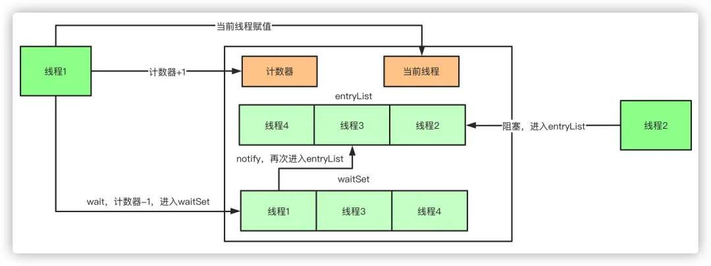

synchronized是java提供的原子性内置锁，这种内置的并且使用者看不到的锁也被称为监视器锁，使用synchronized之后，会在编译之后在同步的代码块前后加上monitorenter和monitorexit字节码指令，他依赖操作系统底层互斥锁实现。他的作用主要就是实现原子性操作和解决共享变量的内存可见性问题。

执行monitorenter指令时会尝试获取对象锁，如果对象没有被锁定或者已经获得了锁，锁的计数器+1。此时其他竞争锁的线程则会进入等待队列中。

执行monitorexit指令时则会把计数器-1，当计数器值为0时，则锁释放，处于等待队列中的线程再继续竞争锁。

synchronized是排它锁，当一个线程获得锁之后，其他线程必须等待该线程释放锁后才能获得锁，而且由于Java中的线程和操作系统原生线程是一一对应的，线程被阻塞或者唤醒时时会从用户态切换到内核态，这种转换非常消耗性能。

从内存语义来说，加锁的过程会清除工作内存中的共享变量，再从主内存读取，而释放锁的过程则是将工作内存中的共享变量写回主内存。

实际上大部分时候我认为说到monitorenter就行了，但是为了更清楚的描述，还是再具体一点。

如果再深入到源码来说，synchronized实际上有两个队列waitSet和entryList。

当多个线程进入同步代码块时，首先进入entryList
有一个线程获取到monitor锁后，就赋值给当前线程，并且计数器+1
如果线程调用wait方法，将释放锁，当前线程置为null，计数器-1，同时进入waitSet等待被唤醒，调用notify或者notifyAll之后又会进入entryList竞争锁
如果线程执行完毕，同样释放锁，计数器-1，当前线程置为null。

