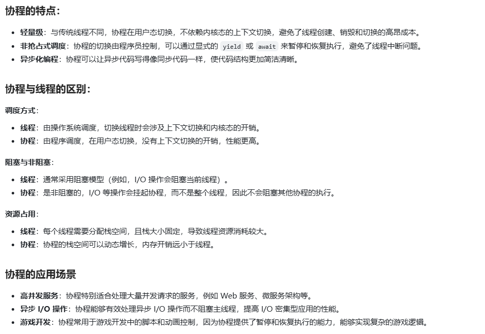
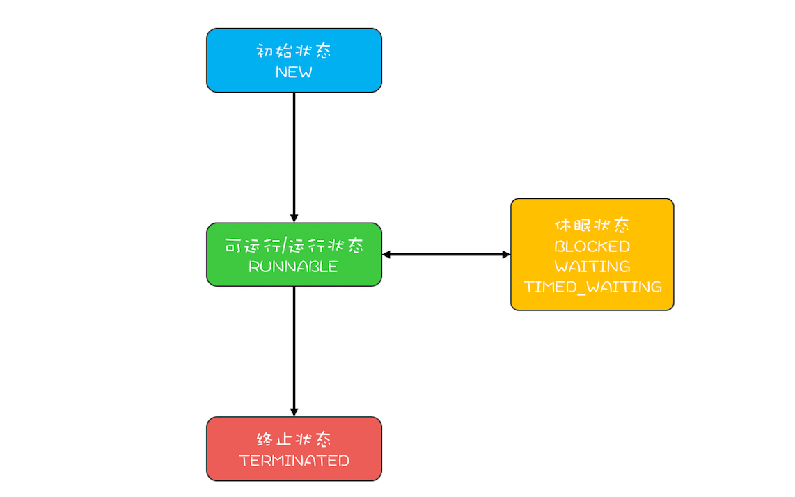
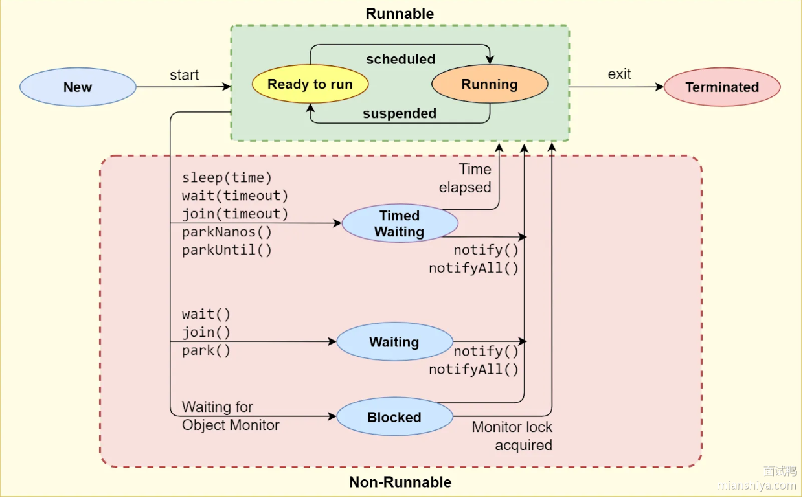
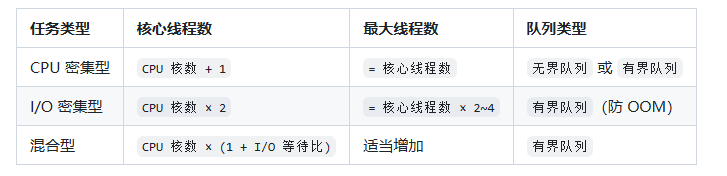

## Java中的线程安全是指什么

线程安全是指多个线程访问某一共享资源时，能够保诉一致件和下确件，即无论线程如何交替执行，程序都能够产生预期的结果，目不会出现数据竞争或内存冲突、在 Java 中，线程安全的
实现通常依赖于同步机制和线程隔离技术。

## 常见的线程安全的方法

- 同步锁:通过synchronized关键字或ReentrantLock 实现对共享资源的同步控制。
- 原子操作类:Java 提供的 AtomicInteger、AtomicReference 等类确保多线程环境下的原子性操作。
- 线程安全容器:如ConcurrentHashMap、 CopyOnWriteArrayList等，避免手动加锁
- 局部变量:线程内独立的局部变量天然是线程安全的，因为每个线程都有自己的栈空间(线程隔离)
- ThreadLocal:类似于同部变量，属于线程本地资源，通过线程隔离保证了线程安全。

## 线程安全

### **1. 线程安全的核心问题**

多线程环境下可能出现的问题主要源于以下几点：


- **竞态条件**（Race Condition）：多个线程同时访问和修改共享资源，导致执行结果依赖于线程执行的时序。
- **内存可见性**（Visibility）：一个线程对共享变量的修改可能无法及时被其他线程看到。
- **指令重排序**（Reordering）：编译器或处理器为了优化性能，可能会对指令执行顺序进行重排，影响多线程环境下的正确性。

### **2. Java 中实现线程安全的主要方式**

#### **2.1 同步机制**

- synchronized 关键字

  ：通过获取对象锁（监视器锁）来保证同一时刻只有一个线程执行同步代码块。

  java


  ```java
  public synchronized void increment() {
      count++; // 同一时刻只有一个线程能执行此方法
  }
  ```


![img](data:image/png;base64,iVBORw0KGgoAAAANSUhEUgAAAHgAAAAwCAYAAADab77TAAAACXBIWXMAABYlAAAWJQFJUiTwAAAAAXNSR0IArs4c6QAAAARnQU1BAACxjwv8YQUAAAjBSURBVHgB7VxNUxNJGO7EoIIGygoHQi0HPbBWeWEN+LFlKRdvsHf9AXBf9y7eZe/wA5a7cPNg3LJ2VYjFxdLiwFatVcBBDhAENfjxPO3bY2cyM/maiYnOU5VMT0/PTE+/3+9Md0LViJWVla6PHz8OHB4e9h8/fjyNbQ+qu1SMVqCUSqX2Mea7KG8nk8mt0dHRUi0nJqo1AGF7cPHT79+/H1IxQdsJr0DoNRB6P6iRL4EpsZ8+ffoZv9NW9TZ+Wzs7O9unTp3ar5WLYjQH0uLDhw+9iUSiD7sD+GXMsaNHj65Dstf8aJHwuWAPuOOyqGGiJm6J0RqQPjCXwygOSdU+6POvF30qCHz//v2+TCYzSuKCaw729vaWr1+/vqNitB2E0L+i2I3fPsrLly5d2rXbJNwnWJJLqX0eq+H2hji/I+qL6q6Q5ITdEAevCnG3Lly4sKxidAyePn1KIlNlk8h/G8FMmgZ0qIxaRoNVFaOjQG2LzQF+jHqGnXr+UTUbb7mrq+ufWC13HkgzRDda6yKkPUOasqwJLB4Z8Sr2lDsX4gy/Ypm5C26TtL1K3G2GQipGR8PQkIkp7Vcx/SjHtmPp7XwIDZmQ0qnllPqaFdlSPyiWl5dvgPPTGJC1sbGxvIoAjx49Sh87duwuy/B3lhClLK6urg6XSqWb6XR69uzZs0UVHkjLDN8bkMBMf6k3b97squ8cUFmLGNyNI0eO5M+fP79g6pECvIn6LIpL+OVVRMB9ctyCmQpPnjwZBgH+Qp1CMin37NmzafRpQ4UAppL7+vpoh3tTCIt68MAKXBRZtorcizdQD7yO4QE3crncb0HngzA8N232QYwCJG1a1QFKCwY0i/tleb5qMa5cuVLEczj7Fy9eXEPsegfE/h27WdDhNrZ1PZMf+J4A2ojF7hSISylWUYZGSIiP+x3DYA++fPkyXUVFpVWTgCrMUVoEoRKYzAMCVe0jnlVvMfiDhUKB0ryB8gL6dYNqm3WgR3FkZKQpZ5e0BPOw2JVSLQA6PWEezgswD+PYLKoagQGp217hnElTxqBOwu5OWodPSpsc6mf8rvHu3bt5SGKFGoVmmMUmq2rvC8djQsq6DpJ8m2MERiTzhSLJROQEhm0ZxIDmgtrgwYb9jkG9D3q031P198G5BwfYp2k24Jjq7u4mE4ZiJ1uFyAkM7s6BO8vqMIgFECln7V/DZrbGS9YtwVCfU5Z63vRoYqSP162LeVzIv3379k+/g/BD5ngv+gDQBndUCxA5gT3Ucx6/h/g5BA6yw5CarFu910Ngkd4JuY+nc0bvWn0Z+Ic4PqMaBDWLlwq37sN+k5nSdrsafJCGkVQRgoNrSyqBwX54cHBQ4eSIHQ4duN+cKUOTzKtviw3px0lTwTFCmPQAtn+OZRUyIpVgqMZrlmokigzwWQA3U1U6jkmQHXajVgmGJ3nL3INeKrzLSMOjACctLwmUTemLQ0hjwniuTfiwEKkEM4Fg71MFWuWCq+01n8s05GQx9sZmnGVI8SY9YBU9tJPm/oFwmnmZZLH6p5+LJsz0sdnwyAuRSbBJLNh1eNBFq1wwoQJRYzysgcGo2oaJBQziNGLwOSTep5EmHEac6ekh494mTGKbKa821Bp29ssHRbRbs65bZp74IsD4E+wPVLKyIoxIGDAyAjPH6lbPsL2bVthT4Yz4xMMV8SUGqiYVLY6MjnehOqdshvLBcICp4LX8CKwZhBoKZmDGVK58TV1p1YznX4MnrSuokmHCxs0YgQkjMR+REdjkXS0wXXnP7HglPuqxw20GncUC4wXGyNQq0BAmRGRmzajupSDvuxlEQmCm3CR5XxfcKk3qKlKA1ASqTkj4M+N1zAqTluoNk8TWa9jOnytBYxOPksrndJg5Sv8gEieLqUDVAMjRtMN2nReB2wmI0x1Coa+O/T0JeLUHcy7Z+zhnPirpJSKRYA/1nEddhf0CI6RRf9euKxaLPDdvXatioPr7+yNJCjQCpkCNHcXW0Sz2y40TJ044hIdzVRYtQGNo6RWndBbXmzehZBgIncBwZsaVyzFi+s6PS93xsDBH3tpPu+11VFmfRmCYmWEOX0Xiee7Zx1lv+ou4fBJtbtnH+bEBiLwAhhjk+XzpAPVeCEuqo1DR4/YO1VZQZ93xsJcdbldI5mmcZebX8V6bz2IzH8MmnWNn+EXimQMkvJw3xeuYWJn1YarsUCWYDof7bQwIFhg7uuNhY4cN17ttMD8QUDVCJKZaaERk5drMRM0FNaQjhVDoD+nbhPUcWq0i9JlOpVK6zwyLaKN5TZtxQcQ7SHBsoI73Sks61cTioYZLoRLY68V+tfiOeWkTGxq47HDDThYGMVunRtBffAQ1MAxGZsa1tTNJqYPd1M/JLzVMW4m9nTdZbIf9W6YNjs+KynbuaSeDwgA/2TnkVx38xLLZrzrcb46ofqupGx6Xtyx2uGETuMzJMqqtFuDZNtGnUCXC3F9iWn7jxcyXZ5iD8GcBTD8JopGAC2B2esyOCqfthZZh2nXKtBE13xRkvhKLpQRuQK+uV+azxLMI6wRj/iCi8OM6quxqhGPcHJbtffHiRQZakLMOdxNQE7+AC3/CznOomXUVo+MBoT2DzTnFGaIg7mupH1Axvhc4kxmSXNCDdhg7GTNhKUbnQmiYYZm0TdKxgo3QE5bsD9NidCZcEwlLOtEBr9XY3qHHjx/3qhgdCZHesomEmsAyYWldDozJjMMYHQRZoeGy7K6biYROqlIormeIQ8zPqRgdBa7TYa3Q4CRbKhZhsVZt2eJSDvFs//aGJDUokEMkrqzQ4EwDLnvZwAOyDAAleQAnXo096/YFl7ziwjlKiMslr9xzvH0XQrMkmYgXQmsjuBdC85Jcg8ClDOUiZ6xqvZQhiM25xDux+m4NxOklURnfli1lCKyL8NW+lKHr4u5l82J8YzAxhdeQ/8Op+q/hxUjdMMsJqy/c0ycTx1sy/fRHh7zx08sJIyn1up7lhD8DfU3/IDqhNFQAAAAASUVORK5CYII=)

- ReentrantLock

  ：显式锁，功能更灵活（如可中断锁、公平锁）。

  java


  ```java
  private final Lock lock = new ReentrantLock();
  public void increment() {
      lock.lock();
      try {
          count++;
      } finally {
          lock.unlock();
      }
  }
  ```

#### **2.2 原子操作**

使用`java.util.concurrent.atomic`包中的原子类（如`AtomicInteger`、`AtomicReference`），基于 CAS（Compare-and-Swap）实现无锁线程安全。


java


```java
private AtomicInteger count = new AtomicInteger(0);
public void increment() {
    count.incrementAndGet(); // 原子操作，无需加锁
}
```

#### **2.3 不可变对象**

不可变对象（如`String`、`Integer`）天生线程安全，因为状态不可修改。


java


```java
public final class ImmutableValue {
    private final int value;
    public ImmutableValue(int value) {
        this.value = value;
    }
    public int getValue() {
        return value;
    }
}
```

#### **2.4 线程封闭**

将对象限制在单线程中使用，避免共享（如`ThreadLocal`、局部变量）。


java


```java
private ThreadLocal<Integer> threadLocal = ThreadLocal.withInitial(() -> 0);
public void increment() {
    threadLocal.set(threadLocal.get() + 1); // 每个线程独立维护自己的值
}
```

#### **2.5 并发容器**

使用线程安全的容器（如`ConcurrentHashMap`、`CopyOnWriteArrayList`）替代非线程安全的容器（如`HashMap`、`ArrayList`）。


java


```java
private Map<String, Integer> map = new ConcurrentHashMap<>();
public void put(String key, int value) {
    map.put(key, value); // 线程安全的put操作
}
```

### **3. 线程安全的分类**

根据线程安全的程度，Java 中的类可分为以下几类：


- **不可变类**（如`String`、`BigInteger`）：无需同步，永远线程安全。
- **无条件线程安全**（如`ConcurrentHashMap`、`AtomicInteger`）：方法本身实现了同步，调用时无需额外同步。
- **有条件线程安全**（如`Collections.synchronizedList`）：某些操作需要外部同步（如迭代器需要手动加锁）。
- **非线程安全**（如`HashMap`、`ArrayList`）：多线程环境下必须通过外部手段保证线程安全。

### **4. 示例对比**

#### **非线程安全示例（HashMap）**

java


```java
Map<String, Integer> map = new HashMap<>(); // 非线程安全
// 多线程环境下可能出现竞态条件
new Thread(() -> map.put("key", 1)).start();
new Thread(() -> map.put("key", 2)).start();
```

#### **线程安全示例（ConcurrentHashMap）**

java


```java
Map<String, Integer> map = new ConcurrentHashMap<>(); // 线程安全
// 多线程环境下无需额外同步
new Thread(() -> map.put("key", 1)).start();
new Thread(() -> map.put("key", 2)).start();
```

### **5. 线程安全的注意事项**

- **过度同步的风险**：同步会带来性能开销，甚至可能导致死锁。
- **复合操作的原子性**：即使单个方法是线程安全的，多个操作的组合也可能不是原子的（如`if (map.containsKey(key)) { map.put(key, value); }`）。
- **可见性与有序性**：仅靠`synchronized`或`Lock`无法完全解决可见性问题，需要配合`volatile`关键字。

### **总结**

Java 中的线程安全是通过各种机制（同步、原子操作、不可变对象等）确保多线程环境下共享资源的正确性。选择合适的线程安全策略需要根据具体场景权衡性能和安全性，避免过度同步或同步不足。理解线程安全的本质是编写高效、可靠并发程序的关键。


## 协程

### **1. 协程的核心概念**

- **轻量级**：协程的创建和销毁成本远低于线程，通常只需 KB 级内存。
- **非抢占式调度**：协程主动让出执行权（而非被操作系统强制暂停），因此称为**协作式多任务**。
- **挂起与恢复**：协程可以在执行过程中暂停（挂起），保存当前状态，稍后从暂停处继续执行（恢复）。
- **线程绑定**：多个协程可以在同一个线程上运行，减少线程切换开销。

### **2. Java 中的协程实现**

Java 传统上依赖`Thread`和`ExecutorService`实现并发，这些都是**抢占式线程**。但近年来，随着项目 Loom 的推进，Java 开始支持原生协程（称为**虚拟线程**）。

#### **2.1 虚拟线程（Virtual Threads，JDK 19+）**

虚拟线程是 Java 对协程的原生支持，作为项目 Loom 的一部分引入，从 JDK 19 开始作为预览特性。


**特点**：


- **由 JVM 管理**：虚拟线程依附于普通线程（载体线程）执行，JVM 负责调度。
- **与平台线程解耦**：一个载体线程可以运行多个虚拟线程，避免创建大量操作系统线程。
- **语法兼容**：使用与普通线程相同的 API（`Thread`、`Runnable`），无需额外学习。

### **3. 协程的应用场景**

- **高并发 IO 密集型任务**：如 Web 服务器、数据库连接池，协程可以在等待 IO 时让出执行权，提高吞吐量。
- **事件驱动系统**：处理大量异步事件，避免回调地狱。
- **微服务通信**：在服务间调用时减少线程阻塞。

### **4. 协程与线程的对比**

| **特性**       | **线程（Thread）**       | **协程（Coroutine）**          |
| -------------- | ------------------------ | ------------------------------ |
| **调度方式**   | 抢占式（由操作系统调度） | 协作式（由应用程序调度）       |
| **内存占用**   | 较大（通常 1MB+）        | 极小（通常 KB 级）             |
| **创建成本**   | 高                       | 低                             |
| **上下文切换** | 开销大（涉及内核态）     | 开销小（用户态）               |
| **适用场景**   | CPU 密集型任务           | IO 密集型任务                  |
| **阻塞影响**   | 阻塞会导致整个线程挂起   | 仅当前协程挂起，不影响其他协程 |

### **5. 协程的优缺点**

**优点**：


- **资源高效**：支持数百万级并发，内存占用少。
- **简化异步编程**：避免回调地狱，代码更接近同步写法。
- **提高吞吐量**：在 IO 密集型场景下显著提升性能。


**缺点**：


- **调试困难**：协程的执行顺序可能不直观，调试工具不完善。
- **不适合 CPU 密集型任务**：协程切换仍有开销，无法替代多线程并行。
- **兼容性问题**：第三方库可能需要适配虚拟线程。



## 线程的生命周期
在 Java 语言里线程共有六种状态，分别是：

1. NEW 初始化状态
2. RUNNABLE 可运行 / 运行状态
3. BLOCKED 阻塞状态
4. WAITING 无时限等待
5. TIMED_WAITING 有时限等待
6. TERMINATED 终止状态



那么有哪些情形会导致线程从 RUNNABLE 状态切换到这三种状态呢？

1. RUNNABLE 与 BLOCKED 的状态切换

   只有一种场景会触发这种切换，就是线程等待 synchronized 的隐式锁。synchronized 修饰的方法、代码块同一时刻只允许一个线程执行，其他线程只能等待，这种情况下，等待的线程就会从 RUNNABLE 转换为 BLOCKED 状态。而当等待的线程获得 synchronized 隐式锁时，就又会从 BLOCKED 转换为 RUNNABLE 状态。

   如果线程调用阻塞式 API 时，是否会转换为 BLOCKED 状态呢？在操作系统层面，线程是会转换到休眠状态的，但是在 JVM 层面，Java 线程的状态不会发生变化，也就是说 Java 线程的状态会依然保持 RUNNABLE 状态。JVM 层面并不关心操作系统调度相关的状态，因为在 JVM 看来，等待 CPU 使用权（操作系统层面此时处于可执行状态）与等待 I/O（操作系统层面此时处于休眠状态）没有区别，都在等待某个资源，所以都归入了 RUNNABLE 状态。

   而我们平时所谓的 Java 在调用阻塞式 API 时，线程会阻塞，指的是操作系统线程的状态，并不是 Java 线程的状态。

2. RUNNABLE 与 WAITING 的状态转换

   总的来说，有三种场景会触发这种转换。

   第一种场景，获得 synchronized 隐式锁的过程，调用无参数的 Object.wait() 方法。

   第二种场景，调用无参数的 Thread.join() 方法。其中的 join() 是一种线程同步方法。例如有一个线程对象 ThreadA，当调用 ThreadA.join() 的时候，执行这条语句的线程会等待 ThreadA 执行完，而等待中的这个线程，其状态会从 RUNNABLE 转换到 WAITING。当线程 ThreadA 执行完，原来等待它的线程又会从 WAITING 状态转换到 RUNNABLE。

   第三章场景，调用 LockSupport.park() 方法，当前线程会阻塞，线程的状态会从 RUNNABLE 转换到 WAITING。调用 LockSupport.unpark(Thread thread) 可唤醒目标线程，目标线程的状态又会从 WAITING 状态转换到 RUNNABLE。

3. RUNNABLE 与 TIMED_WAITING 的状态转换

   有五种场景会触发这种转换。

   第一种，调用带超时参数的 Thread.sleep(long millis) 方法；

   第二种，获得 synchronized 隐式锁的线程，调用带超时参数的 Object.wait(long millis) 方法；

   第三种，调用带超时参数的 Thread.join(long millis) 方法；

   第四种，调用带超时参数的 LockSupport.parkNanos(Object blocker, long deadline) 方法；

   第五种，调用带超时参数的 LockSupport.parkUntil(long deadline) 方法；

   这里 TIMED_WAITING 和 WAITING 状态的区别，仅仅是触发条件多了超时参数。

4. 从 NEW 到 RUNNABLE 状态

   Java 刚创建出来的 Thread 对象就是 NEW 状态，而创建 Thread 对象主要有两种方法。一种是继承 Thread 对象，另一种是实现 Runnable 接口。NEW 状态的线程，不会被操作系统调度，因此不会执行。Java 线程要执行，就必须转换为 RUNNABLE 状态。从 NEW 状态转换到 RUNNABLE 状态很简单，只要调用线程对象的 start() 方法即可。

5. 从 RUNNABLE 到 TERMINATED 状态

   线程执行完 run() 方法后，会自动转换到 TERMINATED 状态，当然如果执行 run() 方法的时候抛出异常，也会导致线程终止。有时候我们需要强制中断 run() 方法的执行，例如 run() 方法访问一个很慢的网络，我们等不下去了，想要终止怎么办？Java 的 Thread 类倒是提供了 stop() 方法，不过已经被标记为 @Deprecated，所以不建议使用了，正确的姿势其实是调用 interrupt() 方法。

那 stop() 和 interrupt() 方法的主要区别是什么呢？

stop() 方法会真的杀死线程，不给线程喘息的机会，如果线程持有 synchronized 隐式锁，也不会释放，那其他线程就再也没机会获得 synchronized 隐式锁，这实在是太危险了。所以该方法就不建议使用了，类似的方法还有 suspend() 和 resume() 方法。

而 interrupt() 方法就温柔多了，interrupt() 方法仅仅是通知线程，线程有机会执行一些后续操作，同时也可以无视这个通知。被 interrupt 的线程，是怎么收到通知的呢？一种是异常，另一种是主动检测。

当线程 A 处于 WAITING、TIMED_WAITING 状态时，如果其它线程调用 A 的 interrupt() 方法，会使线程 A 返回到 RUNNABLE 状态，同时线程 A 的代码会触发 InterruptedException 异常。上面我们提到转换到 WAITING、TIMED_WAITING 状态的触发条件，都是调用了类似 wait()、join()、sleep() 这样的方法，这些方法都会 throws InterruptedException 这个异常。这个异常的触发条件就是：其它线程调用了该线程的 interrupt() 方法。

当线程 A 处于 RUNNABLE 状态时，并且阻塞在 java.nio.channels.InterruptibleChannel 上时，如果其它线程调用线程 A 的 interrupt() 方法，线程 A 会触发 java.nio.channels.ClosedByInterruptException 这个异常；而阻塞在 java.nio.channels.Selector 上时，如果其它线程调用线程 A 的 interrupt() 方法，线程 A 的 java.nio.channels.Selector 会立即返回。

上面这两种情况属于被中断的线程通过异常的方式获得了通知。还有一种是主动监测，如果线程处于 RUNNABLE 状态，并且没有阻塞在某个 I/O 操作上，例如中断计算圆周率的线程 A，这时就得依赖线程 A 主动检测中断状态了。如果其它线程调用线程 A 的 interrupt() 方法，那么线程 A 可以通过 isInterrupted() 方法，检测是不是自己被中断了。




## Java中线程间如何通信

### **1. 共享内存（隐式通信）**

通过共享变量实现线程间的数据交换，需配合同步机制（如`synchronized`、`volatile`）保证可见性和原子性。

#### **1.1 `volatile`关键字**

保证变量的可见性，即一个线程修改后，其他线程能立即看到最新值。


java


```java
public class VolatileExample {
    private static volatile boolean flag = false;

    public static void main(String[] args) {
        // 线程1：修改flag
        new Thread(() -> {
            try {
                Thread.sleep(1000);
            } catch (InterruptedException e) {
                e.printStackTrace();
            }
            flag = true;
            System.out.println("线程1：flag已设为true");
        }).start();

        // 线程2：等待flag
        new Thread(() -> {
            while (!flag) {
                // 等待flag变为true
            }
            System.out.println("线程2：检测到flag为true");
        }).start();
    }
}
```

#### **1.2 `synchronized`同步块**

通过锁保证代码块的原子性和可见性。


java


```java
public class SynchronizedExample {
    private final Object lock = new Object();
    private boolean ready = false;

    public void producer() {
        synchronized (lock) {
            // 生产数据
            ready = true;
            lock.notifyAll(); // 唤醒等待的线程
        }
    }

    public void consumer() {
        synchronized (lock) {
            while (!ready) {
                try {
                    lock.wait(); // 等待数据准备好
                } catch (InterruptedException e) {
                    Thread.currentThread().interrupt();
                }
            }
            // 消费数据
        }
    }
}
```

### **2. 等待 / 通知机制（显式通信）**

通过`Object`类的`wait()`、`notify()`、`notifyAll()`方法实现线程间的协作。

#### **2.1 `wait()`与`notify()`**

- **`wait()`**：使当前线程进入等待状态，释放对象锁。
- **`notify()`**：唤醒在此对象监视器上等待的单个线程。
- **`notifyAll()`**：唤醒在此对象监视器上等待的所有线程。


**示例：生产者 - 消费者模型**


java


```java
public class ProducerConsumer {
    private final Queue<Integer> queue = new LinkedList<>();
    private final int CAPACITY = 5;

    public void produce() throws InterruptedException {
        synchronized (this) {
            while (queue.size() == CAPACITY) {
                wait(); // 队列满时等待
            }
            int item = new Random().nextInt(100);
            queue.add(item);
            System.out.println("生产者：生产了 " + item);
            notifyAll(); // 通知消费者
        }
    }

    public void consume() throws InterruptedException {
        synchronized (this) {
            while (queue.isEmpty()) {
                wait(); // 队列空时等待
            }
            int item = queue.poll();
            System.out.println("消费者：消费了 " + item);
            notifyAll(); // 通知生产者
        }
    }
}
```

### **3. 显式锁与条件变量（`Lock`与`Condition`）**

`ReentrantLock`和`Condition`提供了比`synchronized`更灵活的等待 / 通知机制。


**示例：**


java


```java
public class ConditionExample {
    private final Lock lock = new ReentrantLock();
    private final Condition condition = lock.newCondition();
    private boolean ready = false;

    public void producer() throws InterruptedException {
        lock.lock();
        try {
            while (ready) {
                condition.await(); // 等待消费者处理
            }
            // 生产数据
            ready = true;
            condition.signalAll(); // 通知消费者
        } finally {
            lock.unlock();
        }
    }

    public void consumer() throws InterruptedException {
        lock.lock();
        try {
            while (!ready) {
                condition.await(); // 等待生产者准备
            }
            // 消费数据
            ready = false;
            condition.signalAll(); // 通知生产者
        } finally {
            lock.unlock();
        }
    }
}
```

### **4. 阻塞队列（`BlockingQueue`）**

`java.util.concurrent`包中的阻塞队列提供线程安全的队列操作，当队列为空 / 满时会自动阻塞线程。


**示例：**


java


```java
public class BlockingQueueExample {
    private final BlockingQueue<Integer> queue = new LinkedBlockingQueue<>(10);

    public void producer() throws InterruptedException {
        while (true) {
            int item = new Random().nextInt(100);
            queue.put(item); // 队列满时自动阻塞
            System.out.println("生产者：生产了 " + item);
        }
    }

    public void consumer() throws InterruptedException {
        while (true) {
            int item = queue.take(); // 队列空时自动阻塞
            System.out.println("消费者：消费了 " + item);
        }
    }
}
```

### **5. 信号量（`Semaphore`）**

控制同时访问某个资源的线程数量，可用于实现限流或资源池。


java


```java
public class SemaphoreExample {
    private final Semaphore semaphore = new Semaphore(3); // 最多3个线程同时访问

    public void accessResource() throws InterruptedException {
        semaphore.acquire(); // 获取许可
        try {
            // 访问共享资源
            System.out.println(Thread.currentThread().getName() + " 获得许可");
            Thread.sleep(1000);
        } finally {
            semaphore.release(); // 释放许可
        }
    }
}
```

### **6. 线程池与 Future**

通过`ExecutorService`提交任务并获取`Future`结果，实现线程间的数据传递。


java


```java
public class FutureExample {
    public static void main(String[] args) throws ExecutionException, InterruptedException {
        ExecutorService executor = Executors.newSingleThreadExecutor();
        
        // 提交任务并获取Future
        Future<Integer> future = executor.submit(() -> {
            Thread.sleep(2000);
            return 42;
        });
        
        // 获取任务结果（阻塞直到完成）
        Integer result = future.get();
        System.out.println("任务结果：" + result);
        
        executor.shutdown();
    }
}
```

### **7. 管道流（`PipedInputStream`/`PipedOutputStream`）**

用于线程间的字节流通信，一个线程写入数据，另一个线程读取。


java


```java
public class PipedStreamExample {
    public static void main(String[] args) throws IOException {
        PipedOutputStream pos = new PipedOutputStream();
        PipedInputStream pis = new PipedInputStream(pos); // 连接输入输出流

        // 写入线程
        new Thread(() -> {
            try {
                pos.write("Hello, reader!".getBytes());
                pos.close();
            } catch (IOException e) {
                e.printStackTrace();
            }
        }).start();

        // 读取线程
        new Thread(() -> {
            try {
                int data;
                while ((data = pis.read()) != -1) {
                    System.out.print((char) data);
                }
                pis.close();
            } catch (IOException e) {
                e.printStackTrace();
            }
        }).start();
    }
}
```

### **8. 原子变量（`Atomic`系列）**

通过原子操作实现线程间的高效通信，避免锁的开销。


java


```java
public class AtomicExample {
    private static final AtomicInteger counter = new AtomicInteger(0);

    public static void main(String[] args) throws InterruptedException {
        Thread t1 = new Thread(() -> {
            for (int i = 0; i < 1000; i++) {
                counter.incrementAndGet(); // 原子自增
            }
        });

        Thread t2 = new Thread(() -> {
            for (int i = 0; i < 1000; i++) {
                counter.decrementAndGet(); // 原子自减
            }
        });

        t1.start();
        t2.start();
        t1.join();
        t2.join();

        System.out.println("最终结果：" + counter.get()); // 输出0
    }
}
```


## Java中如何创建多线程

### **1. 继承`Thread`类**

**步骤**：


1. 继承`Thread`类并重写`run()`方法。
2. 创建子类实例并调用`start()`方法启动线程。


**示例**：


java


```java
public class MyThread extends Thread {
    @Override
    public void run() {
        System.out.println("线程执行中：" + Thread.currentThread().getName());
    }

    public static void main(String[] args) {
        MyThread thread = new MyThread();
        thread.start(); // 启动新线程，执行run()方法
        System.out.println("主线程执行中：" + Thread.currentThread().getName());
    }
}
```


![img](data:image/png;base64,iVBORw0KGgoAAAANSUhEUgAAAHgAAAAwCAYAAADab77TAAAACXBIWXMAABYlAAAWJQFJUiTwAAAAAXNSR0IArs4c6QAAAARnQU1BAACxjwv8YQUAAAjBSURBVHgB7VxNUxNJGO7EoIIGygoHQi0HPbBWeWEN+LFlKRdvsHf9AXBf9y7eZe/wA5a7cPNg3LJ2VYjFxdLiwFatVcBBDhAENfjxPO3bY2cyM/maiYnOU5VMT0/PTE+/3+9Md0LViJWVla6PHz8OHB4e9h8/fjyNbQ+qu1SMVqCUSqX2Mea7KG8nk8mt0dHRUi0nJqo1AGF7cPHT79+/H1IxQdsJr0DoNRB6P6iRL4EpsZ8+ffoZv9NW9TZ+Wzs7O9unTp3ar5WLYjQH0uLDhw+9iUSiD7sD+GXMsaNHj65Dstf8aJHwuWAPuOOyqGGiJm6J0RqQPjCXwygOSdU+6POvF30qCHz//v2+TCYzSuKCaw729vaWr1+/vqNitB2E0L+i2I3fPsrLly5d2rXbJNwnWJJLqX0eq+H2hji/I+qL6q6Q5ITdEAevCnG3Lly4sKxidAyePn1KIlNlk8h/G8FMmgZ0qIxaRoNVFaOjQG2LzQF+jHqGnXr+UTUbb7mrq+ufWC13HkgzRDda6yKkPUOasqwJLB4Z8Sr2lDsX4gy/Ypm5C26TtL1K3G2GQipGR8PQkIkp7Vcx/SjHtmPp7XwIDZmQ0qnllPqaFdlSPyiWl5dvgPPTGJC1sbGxvIoAjx49Sh87duwuy/B3lhClLK6urg6XSqWb6XR69uzZs0UVHkjLDN8bkMBMf6k3b97squ8cUFmLGNyNI0eO5M+fP79g6pECvIn6LIpL+OVVRMB9ctyCmQpPnjwZBgH+Qp1CMin37NmzafRpQ4UAppL7+vpoh3tTCIt68MAKXBRZtorcizdQD7yO4QE3crncb0HngzA8N232QYwCJG1a1QFKCwY0i/tleb5qMa5cuVLEczj7Fy9eXEPsegfE/h27WdDhNrZ1PZMf+J4A2ojF7hSISylWUYZGSIiP+x3DYA++fPkyXUVFpVWTgCrMUVoEoRKYzAMCVe0jnlVvMfiDhUKB0ryB8gL6dYNqm3WgR3FkZKQpZ5e0BPOw2JVSLQA6PWEezgswD+PYLKoagQGp217hnElTxqBOwu5OWodPSpsc6mf8rvHu3bt5SGKFGoVmmMUmq2rvC8djQsq6DpJ8m2MERiTzhSLJROQEhm0ZxIDmgtrgwYb9jkG9D3q031P198G5BwfYp2k24Jjq7u4mE4ZiJ1uFyAkM7s6BO8vqMIgFECln7V/DZrbGS9YtwVCfU5Z63vRoYqSP162LeVzIv3379k+/g/BD5ngv+gDQBndUCxA5gT3Ucx6/h/g5BA6yw5CarFu910Ngkd4JuY+nc0bvWn0Z+Ic4PqMaBDWLlwq37sN+k5nSdrsafJCGkVQRgoNrSyqBwX54cHBQ4eSIHQ4duN+cKUOTzKtviw3px0lTwTFCmPQAtn+OZRUyIpVgqMZrlmokigzwWQA3U1U6jkmQHXajVgmGJ3nL3INeKrzLSMOjACctLwmUTemLQ0hjwniuTfiwEKkEM4Fg71MFWuWCq+01n8s05GQx9sZmnGVI8SY9YBU9tJPm/oFwmnmZZLH6p5+LJsz0sdnwyAuRSbBJLNh1eNBFq1wwoQJRYzysgcGo2oaJBQziNGLwOSTep5EmHEac6ekh494mTGKbKa821Bp29ssHRbRbs65bZp74IsD4E+wPVLKyIoxIGDAyAjPH6lbPsL2bVthT4Yz4xMMV8SUGqiYVLY6MjnehOqdshvLBcICp4LX8CKwZhBoKZmDGVK58TV1p1YznX4MnrSuokmHCxs0YgQkjMR+REdjkXS0wXXnP7HglPuqxw20GncUC4wXGyNQq0BAmRGRmzajupSDvuxlEQmCm3CR5XxfcKk3qKlKA1ASqTkj4M+N1zAqTluoNk8TWa9jOnytBYxOPksrndJg5Sv8gEieLqUDVAMjRtMN2nReB2wmI0x1Coa+O/T0JeLUHcy7Z+zhnPirpJSKRYA/1nEddhf0CI6RRf9euKxaLPDdvXatioPr7+yNJCjQCpkCNHcXW0Sz2y40TJ044hIdzVRYtQGNo6RWndBbXmzehZBgIncBwZsaVyzFi+s6PS93xsDBH3tpPu+11VFmfRmCYmWEOX0Xiee7Zx1lv+ou4fBJtbtnH+bEBiLwAhhjk+XzpAPVeCEuqo1DR4/YO1VZQZ93xsJcdbldI5mmcZebX8V6bz2IzH8MmnWNn+EXimQMkvJw3xeuYWJn1YarsUCWYDof7bQwIFhg7uuNhY4cN17ttMD8QUDVCJKZaaERk5drMRM0FNaQjhVDoD+nbhPUcWq0i9JlOpVK6zwyLaKN5TZtxQcQ7SHBsoI73Sks61cTioYZLoRLY68V+tfiOeWkTGxq47HDDThYGMVunRtBffAQ1MAxGZsa1tTNJqYPd1M/JLzVMW4m9nTdZbIf9W6YNjs+KynbuaSeDwgA/2TnkVx38xLLZrzrcb46ofqupGx6Xtyx2uGETuMzJMqqtFuDZNtGnUCXC3F9iWn7jxcyXZ5iD8GcBTD8JopGAC2B2esyOCqfthZZh2nXKtBE13xRkvhKLpQRuQK+uV+azxLMI6wRj/iCi8OM6quxqhGPcHJbtffHiRQZakLMOdxNQE7+AC3/CznOomXUVo+MBoT2DzTnFGaIg7mupH1Axvhc4kxmSXNCDdhg7GTNhKUbnQmiYYZm0TdKxgo3QE5bsD9NidCZcEwlLOtEBr9XY3qHHjx/3qhgdCZHesomEmsAyYWldDozJjMMYHQRZoeGy7K6biYROqlIormeIQ8zPqRgdBa7TYa3Q4CRbKhZhsVZt2eJSDvFs//aGJDUokEMkrqzQ4EwDLnvZwAOyDAAleQAnXo096/YFl7ziwjlKiMslr9xzvH0XQrMkmYgXQmsjuBdC85Jcg8ClDOUiZ6xqvZQhiM25xDux+m4NxOklURnfli1lCKyL8NW+lKHr4u5l82J8YzAxhdeQ/8Op+q/hxUjdMMsJqy/c0ycTx1sy/fRHh7zx08sJIyn1up7lhD8DfU3/IDqhNFQAAAAASUVORK5CYII=)

### **2. 实现`Runnable`接口**

**步骤**：


1. 实现`Runnable`接口的`run()`方法。
2. 将实现类实例作为参数传递给`Thread`构造器。
3. 调用`Thread`实例的`start()`方法。


**示例**：


java


```java
public class MyRunnable implements Runnable {
    @Override
    public void run() {
        System.out.println("线程执行中：" + Thread.currentThread().getName());
    }

    public static void main(String[] args) {
        Thread thread = new Thread(new MyRunnable());
        thread.start(); // 启动线程
        System.out.println("主线程执行中：" + Thread.currentThread().getName());
    }
}
```


**匿名内部类简化写法**：


java


```java
Thread thread = new Thread(new Runnable() {
    @Override
    public void run() {
        System.out.println("匿名内部类线程");
    }
});
thread.start();
```


**Lambda 表达式简化写法（Java 8+）**：


java


```java
Thread thread = new Thread(() -> System.out.println("Lambda线程"));
thread.start();
```

### **3. 实现`Callable`接口并结合`Future`**

**步骤**：


1. 实现`Callable`接口的`call()`方法（可返回值）。
2. 使用`FutureTask`包装`Callable`实例。
3. 将`FutureTask`作为参数传递给`Thread`构造器。
4. 调用`Thread`实例的`start()`方法。
5. 通过`FutureTask.get()`获取返回值（可能阻塞）。


**示例**：


java


```java
import java.util.concurrent.*;

public class MyCallable implements Callable<Integer> {
    @Override
    public Integer call() throws Exception {
        Thread.sleep(1000);
        return 42;
    }

    public static void main(String[] args) throws ExecutionException, InterruptedException {
        Callable<Integer> callable = new MyCallable();
        FutureTask<Integer> futureTask = new FutureTask<>(callable);
        Thread thread = new Thread(futureTask);
        thread.start();

        Integer result = futureTask.get(); // 获取返回值（阻塞等待）
        System.out.println("线程返回值：" + result);
    }
}
```

### **4. 使用线程池（推荐）**

**步骤**：


1. 通过`Executors`工厂方法创建线程池。
2. 提交`Runnable`或`Callable`任务。
3. 关闭线程池（调用`shutdown()`）。


**示例：固定大小线程池**


java


```java
import java.util.concurrent.ExecutorService;
import java.util.concurrent.Executors;

public class ThreadPoolExample {
    public static void main(String[] args) {
        // 创建固定大小为3的线程池
        ExecutorService executor = Executors.newFixedThreadPool(3);

        // 提交任务
        for (int i = 0; i < 5; i++) {
            final int taskId = i;
            executor.submit(() -> {
                System.out.println("任务 " + taskId + " 由线程 " + Thread.currentThread().getName() + " 执行");
                try {
                    Thread.sleep(1000);
                } catch (InterruptedException e) {
                    e.printStackTrace();
                }
            });
        }

        // 关闭线程池
        executor.shutdown();
    }
}
```


**其他常见线程池**：


- **缓存线程池**：`Executors.newCachedThreadPool()`（按需创建线程，空闲线程自动回收）
- **单线程池**：`Executors.newSingleThreadExecutor()`（保证任务按顺序执行）
- **定时线程池**：`Executors.newScheduledThreadPool()`（支持定时 / 周期任务）

### **5. 使用`CompletableFuture`（Java 8+）**

**步骤**：


1. 通过`CompletableFuture.supplyAsync()`（有返回值）或`runAsync()`（无返回值）创建异步任务。
2. 链式调用`thenApply()`、`thenAccept()`等方法处理结果。


**示例**：


java


```java
import java.util.concurrent.CompletableFuture;
import java.util.concurrent.ExecutionException;

public class CompletableFutureExample {
    public static void main(String[] args) throws ExecutionException, InterruptedException {
        // 创建异步任务
        CompletableFuture<String> future = CompletableFuture.supplyAsync(() -> {
            try {
                Thread.sleep(1000);
            } catch (InterruptedException e) {
                e.printStackTrace();
            }
            return "任务完成";
        });

        // 处理结果（异步）
        future.thenAccept(result -> System.out.println("结果：" + result));

        // 阻塞获取结果（可选）
        System.out.println(future.get());
    }
}
```

### **对比与选择建议**

| **方式**            | **优点**                   | **缺点**                   | **适用场景**           |
| ------------------- | -------------------------- | -------------------------- | ---------------------- |
| 继承`Thread`类      | 简单直接                   | 单继承限制，代码耦合度高   | 简单场景，不推荐       |
| 实现`Runnable`接口  | 避免单继承限制，代码解耦   | 无返回值，无法直接获取结果 | 简单异步任务           |
| 实现`Callable`接口  | 有返回值，可处理异常       | 代码复杂度稍高             | 需要返回值的任务       |
| 线程池              | 复用线程，减少创建开销     | 需要手动管理线程池         | 大量任务，生产环境推荐 |
| `CompletableFuture` | 支持链式异步编程，语法简洁 | 学习成本较高               | 复杂异步流程编排       |

### 为什么Callable接口需要被FutureTask包装后，再进行线程执行

首先:thread类，不接收calable实现类，而是接收runable实现类，所以我们需要把calable实现类转成runable实现类，而FutureTask具有这个功能
其次:calable实现类，是具有返回结果和异常信息的，我们需要获取这个结果或信息的时候，funturetask类提供了对应的get方法来获取。

### Java中的Threas类的start和run方法的区别


### **1. `start()`方法**

- **功能**：**启动一个新线程**，并让 JVM 调用该线程的`run()`方法。

- 特性

  ：

    - **异步执行**：调用`start()`后，原线程不会阻塞，新线程会并行执行。
    - **每个线程只能调用一次**：多次调用会抛出`IllegalThreadStateException`。
    - **线程生命周期管理**：新线程会经历`NEW → RUNNABLE → TERMINATED`状态变化。


**示例**：


java


```java
Thread t = new Thread(() -> System.out.println("新线程执行"));
t.start(); // 启动新线程，JVM自动调用run()
System.out.println("主线程继续执行");
```


**输出（顺序可能不同）**：


plaintext


```plaintext
主线程继续执行
新线程执行
```

### **2. `run()`方法**

- **功能**：**定义线程要执行的任务**，但直接调用`run()`不会启动新线程。

- 特性

  ：

    - **同步执行**：直接调用`run()`会在当前线程中执行代码，而非新线程。
    - **可重复调用**：但只是普通方法调用，不涉及线程生命周期。


**示例**：


java


```java
Thread t = new Thread(() -> System.out.println("任务执行"));
t.run(); // 直接调用run()，不会启动新线程
System.out.println("主线程继续执行");
```


**输出（顺序固定）**：


plaintext


```plaintext
任务执行
主线程继续执行
```

### **3. 核心区别对比**

| **对比项**   | **`start()`方法**                                    | **`run()`方法**                       |
| ------------ | ---------------------------------------------------- | ------------------------------------- |
| **线程创建** | 启动新线程，JVM 调用`run()`                          | 不创建新线程，在当前线程执行代码      |
| **执行方式** | 异步执行，与原线程并行                               | 同步执行，原线程需等待`run()`执行完成 |
| **调用次数** | 每个线程实例只能调用一次                             | 可重复调用，作为普通方法              |
| **线程状态** | 触发线程状态变化（`NEW → RUNNABLE`）                 | 不影响线程状态                        |
| **异常处理** | 新线程中的未捕获异常由`UncaughtExceptionHandler`处理 | 异常由当前线程处理                    |

### **4. 常见错误案例**

**错误写法**：直接调用`run()`


java


```java
public class WrongExample {
    public static void main(String[] args) {
        Thread t = new Thread(() -> {
            try {
                Thread.sleep(1000);
            } catch (InterruptedException e) {
                e.printStackTrace();
            }
            System.out.println("新线程执行");
        });
        
        t.run(); // 错误！不会启动新线程，而是在主线程执行
        System.out.println("主线程结束");
    }
}
```


**输出（顺序固定）**：


plaintext


```plaintext
// 等待1秒（因为主线程执行sleep）
新线程执行
主线程结束
```

### **5. 源码分析**

- **`start()`源码**（简化）：

  java


  ```java
  public synchronized void start() {
      if (threadStatus != 0)
          throw new IllegalThreadStateException();
      group.add(this);
      boolean started = false;
      try {
          start0(); // 本地方法，由JVM创建并启动新线程
          started = true;
      } finally {
          // ...
      }
  }
  private native void start0();
  ```

- **`run()`源码**：

  java


  ```java
  public void run() {
      if (target != null) {
          target.run(); // target是Runnable实例
      }
  }
  ```

### **6. 正确使用示例**

java


```java
public class ThreadExample {
    public static void main(String[] args) {
        // 方式1：继承Thread类并重写run()
        Thread t1 = new Thread() {
            @Override
            public void run() {
                System.out.println("t1执行");
            }
        };
        t1.start(); // 启动新线程

        // 方式2：实现Runnable接口
        Runnable task = () -> System.out.println("t2执行");
        Thread t2 = new Thread(task);
        t2.start(); // 启动新线程
    }
}
```

### **总结**

- **`start()`**：真正启动新线程，实现多线程并发。
- **`run()`**：仅定义线程任务，直接调用等同于普通方法调用。


使用时必须通过`start()`启动线程，否则无法发挥多线程的优势。


## Runnable的run方法和Callable的call方法的区别


### **1. 接口定义与核心区别**

| **特性**     | **`Runnable`**               | **`Callable`**                   |
| ------------ | ---------------------------- | -------------------------------- |
| **方法签名** | `void run()`                 | `V call() throws Exception`      |
| **返回值**   | 无返回值（`void`）           | 有返回值（泛型`V`）              |
| **异常处理** | 不能抛出受检异常             | 可以抛出任意异常                 |
| **使用场景** | 简单的异步任务，无需返回结果 | 需要返回结果或处理异常的异步任务 |

### **2. 代码示例对比**

#### **`Runnable`示例**

java


```java
Runnable task = () -> {
    try {
        Thread.sleep(1000);
    } catch (InterruptedException e) {
        e.printStackTrace(); // 必须捕获异常
    }
    System.out.println("任务执行完成");
};

Thread thread = new Thread(task);
thread.start();
```

#### **`Callable`示例**

java


```java
Callable<Integer> task = () -> {
    Thread.sleep(1000);
    return 42; // 返回结果
};

ExecutorService executor = Executors.newSingleThreadExecutor();
Future<Integer> future = executor.submit(task);
Integer result = future.get(); // 获取结果（可能阻塞）
```

### **3. 返回值与异常处理的差异**

#### **返回值处理**

- **`Runnable`**：无法直接返回结果，若需要结果需通过共享变量或回调函数。
- **`Callable`**：通过`Future`或`CompletableFuture`获取返回值，支持异步计算。

#### **异常处理**

- `Runnable`

  ：

  java


  ```java
  Runnable task = () -> {
      try {
          // 必须在run()内部捕获异常
          throw new IOException("模拟异常");
      } catch (IOException e) {
          e.printStackTrace();
      }
  };
  ```

- `Callable`

  ：

  java


  ```java
  Callable<String> task = () -> {
      if (Math.random() < 0.5) {
          throw new IOException("模拟异常"); // 可直接抛出异常
      }
      return "Success";
  };
  ```

### **4. 适用场景**

#### **`Runnable`适用场景**

- 简单的异步任务，如日志记录、定时任务。
- 无需返回值或异常处理的操作。
- 与`Thread`类直接配合使用。

#### **`Callable`适用场景**

- 计算密集型任务，需要返回计算结果。
- 异步操作可能抛出异常，需要统一处理。
- 配合线程池使用，通过`Future`获取结果。

### **5. 如何选择？**

- **需要返回值**：选择`Callable`。
- **只需执行操作**：选择`Runnable`。
- **异常处理**：若任务可能抛出异常且需要外部处理，选择`Callable`。

### **6. 常见问题解答**

#### **Q1：如何将`Runnable`转换为`Callable`？**

使用`Executors.callable(Runnable task)`或`Executors.callable(Runnable task, T result)`。


java


```java
Runnable runnable = () -> System.out.println("执行任务");
Callable<Object> callable = Executors.callable(runnable, null);
```

#### **Q2：`Future`如何处理异常？**

java


```java
Future<Integer> future = executor.submit(() -> {
    throw new RuntimeException("任务失败");
});

try {
    Integer result = future.get();
} catch (ExecutionException e) {
    Throwable cause = e.getCause(); // 获取实际异常
    cause.printStackTrace();
}
```

#### **Q3：Java 8+ 推荐使用哪种方式？**

推荐使用`CompletableFuture`结合`Callable`，它提供更灵活的异步编程：


java


```java
CompletableFuture<Integer> future = CompletableFuture.supplyAsync(() -> {
    return 42; // 类似Callable的call()
});

future.thenApply(result -> result * 2)
      .exceptionally(ex -> 0)
      .thenAccept(System.out::println);
```

### **总结**

| **对比项**   | **`Runnable`**              | **`Callable`**              |
| ------------ | --------------------------- | --------------------------- |
| **返回值**   | 无                          | 有                          |
| **异常处理** | 需内部捕获                  | 可抛出异常                  |
| **接口定义** | `@FunctionalInterface`      | `@FunctionalInterface`      |
| **核心方法** | `void run()`                | `V call() throws Exception` |
| **配合使用** | `Thread`、`ExecutorService` | `ExecutorService`、`Future` |


## Java中的线程池


### 为什么线程池要先使用阻塞队列而不是直接增加线程

因为每创建一个线程都会占用一定的系统资源(如栈空间、线程调度开销等)，直接增加线程会迅速消耗系统资源，
导致性能下降。
使用阻塞队列可以将任务暂存，避免线程数量无限增长，确保资源利用率更高。
如果阻塞队列都满了，说明此时系统负载很大，再去增加线程到最大线程数去消化任务即可，


### 线程数的设定




### Java 线程池内部任务出异常后，如何知道是哪个线程出了异常?

### **1. 直接捕获`Future`的异常**

**原理**：通过`Future.get()`获取任务结果时，若任务抛出异常，`get()`会抛出`ExecutionException`，其`getCause()`方法可获取原始异常。


**示例**：


java


```java
ExecutorService executor = Executors.newSingleThreadExecutor();
Future<?> future = executor.submit(() -> {
    throw new RuntimeException("任务异常");
});

try {
    future.get(); // 阻塞等待结果，若任务异常会在此抛出ExecutionException
} catch (ExecutionException e) {
    Throwable cause = e.getCause(); // 获取原始异常
    System.out.println("捕获到异常：" + cause.getMessage());
    StackTraceElement[] stackTrace = cause.getStackTrace();
    System.out.println("异常线程：" + stackTrace[0].getClassName());
}
```


![img](data:image/png;base64,iVBORw0KGgoAAAANSUhEUgAAAHgAAAAwCAYAAADab77TAAAACXBIWXMAABYlAAAWJQFJUiTwAAAAAXNSR0IArs4c6QAAAARnQU1BAACxjwv8YQUAAAjBSURBVHgB7VxNUxNJGO7EoIIGygoHQi0HPbBWeWEN+LFlKRdvsHf9AXBf9y7eZe/wA5a7cPNg3LJ2VYjFxdLiwFatVcBBDhAENfjxPO3bY2cyM/maiYnOU5VMT0/PTE+/3+9Md0LViJWVla6PHz8OHB4e9h8/fjyNbQ+qu1SMVqCUSqX2Mea7KG8nk8mt0dHRUi0nJqo1AGF7cPHT79+/H1IxQdsJr0DoNRB6P6iRL4EpsZ8+ffoZv9NW9TZ+Wzs7O9unTp3ar5WLYjQH0uLDhw+9iUSiD7sD+GXMsaNHj65Dstf8aJHwuWAPuOOyqGGiJm6J0RqQPjCXwygOSdU+6POvF30qCHz//v2+TCYzSuKCaw729vaWr1+/vqNitB2E0L+i2I3fPsrLly5d2rXbJNwnWJJLqX0eq+H2hji/I+qL6q6Q5ITdEAevCnG3Lly4sKxidAyePn1KIlNlk8h/G8FMmgZ0qIxaRoNVFaOjQG2LzQF+jHqGnXr+UTUbb7mrq+ufWC13HkgzRDda6yKkPUOasqwJLB4Z8Sr2lDsX4gy/Ypm5C26TtL1K3G2GQipGR8PQkIkp7Vcx/SjHtmPp7XwIDZmQ0qnllPqaFdlSPyiWl5dvgPPTGJC1sbGxvIoAjx49Sh87duwuy/B3lhClLK6urg6XSqWb6XR69uzZs0UVHkjLDN8bkMBMf6k3b97squ8cUFmLGNyNI0eO5M+fP79g6pECvIn6LIpL+OVVRMB9ctyCmQpPnjwZBgH+Qp1CMin37NmzafRpQ4UAppL7+vpoh3tTCIt68MAKXBRZtorcizdQD7yO4QE3crncb0HngzA8N232QYwCJG1a1QFKCwY0i/tleb5qMa5cuVLEczj7Fy9eXEPsegfE/h27WdDhNrZ1PZMf+J4A2ojF7hSISylWUYZGSIiP+x3DYA++fPkyXUVFpVWTgCrMUVoEoRKYzAMCVe0jnlVvMfiDhUKB0ryB8gL6dYNqm3WgR3FkZKQpZ5e0BPOw2JVSLQA6PWEezgswD+PYLKoagQGp217hnElTxqBOwu5OWodPSpsc6mf8rvHu3bt5SGKFGoVmmMUmq2rvC8djQsq6DpJ8m2MERiTzhSLJROQEhm0ZxIDmgtrgwYb9jkG9D3q031P198G5BwfYp2k24Jjq7u4mE4ZiJ1uFyAkM7s6BO8vqMIgFECln7V/DZrbGS9YtwVCfU5Z63vRoYqSP162LeVzIv3379k+/g/BD5ngv+gDQBndUCxA5gT3Ucx6/h/g5BA6yw5CarFu910Ngkd4JuY+nc0bvWn0Z+Ic4PqMaBDWLlwq37sN+k5nSdrsafJCGkVQRgoNrSyqBwX54cHBQ4eSIHQ4duN+cKUOTzKtviw3px0lTwTFCmPQAtn+OZRUyIpVgqMZrlmokigzwWQA3U1U6jkmQHXajVgmGJ3nL3INeKrzLSMOjACctLwmUTemLQ0hjwniuTfiwEKkEM4Fg71MFWuWCq+01n8s05GQx9sZmnGVI8SY9YBU9tJPm/oFwmnmZZLH6p5+LJsz0sdnwyAuRSbBJLNh1eNBFq1wwoQJRYzysgcGo2oaJBQziNGLwOSTep5EmHEac6ekh494mTGKbKa821Bp29ssHRbRbs65bZp74IsD4E+wPVLKyIoxIGDAyAjPH6lbPsL2bVthT4Yz4xMMV8SUGqiYVLY6MjnehOqdshvLBcICp4LX8CKwZhBoKZmDGVK58TV1p1YznX4MnrSuokmHCxs0YgQkjMR+REdjkXS0wXXnP7HglPuqxw20GncUC4wXGyNQq0BAmRGRmzajupSDvuxlEQmCm3CR5XxfcKk3qKlKA1ASqTkj4M+N1zAqTluoNk8TWa9jOnytBYxOPksrndJg5Sv8gEieLqUDVAMjRtMN2nReB2wmI0x1Coa+O/T0JeLUHcy7Z+zhnPirpJSKRYA/1nEddhf0CI6RRf9euKxaLPDdvXatioPr7+yNJCjQCpkCNHcXW0Sz2y40TJ044hIdzVRYtQGNo6RWndBbXmzehZBgIncBwZsaVyzFi+s6PS93xsDBH3tpPu+11VFmfRmCYmWEOX0Xiee7Zx1lv+ou4fBJtbtnH+bEBiLwAhhjk+XzpAPVeCEuqo1DR4/YO1VZQZ93xsJcdbldI5mmcZebX8V6bz2IzH8MmnWNn+EXimQMkvJw3xeuYWJn1YarsUCWYDof7bQwIFhg7uuNhY4cN17ttMD8QUDVCJKZaaERk5drMRM0FNaQjhVDoD+nbhPUcWq0i9JlOpVK6zwyLaKN5TZtxQcQ7SHBsoI73Sks61cTioYZLoRLY68V+tfiOeWkTGxq47HDDThYGMVunRtBffAQ1MAxGZsa1tTNJqYPd1M/JLzVMW4m9nTdZbIf9W6YNjs+KynbuaSeDwgA/2TnkVx38xLLZrzrcb46ofqupGx6Xtyx2uGETuMzJMqqtFuDZNtGnUCXC3F9iWn7jxcyXZ5iD8GcBTD8JopGAC2B2esyOCqfthZZh2nXKtBE13xRkvhKLpQRuQK+uV+azxLMI6wRj/iCi8OM6quxqhGPcHJbtffHiRQZakLMOdxNQE7+AC3/CznOomXUVo+MBoT2DzTnFGaIg7mupH1Axvhc4kxmSXNCDdhg7GTNhKUbnQmiYYZm0TdKxgo3QE5bsD9NidCZcEwlLOtEBr9XY3qHHjx/3qhgdCZHesomEmsAyYWldDozJjMMYHQRZoeGy7K6biYROqlIormeIQ8zPqRgdBa7TYa3Q4CRbKhZhsVZt2eJSDvFs//aGJDUokEMkrqzQ4EwDLnvZwAOyDAAleQAnXo096/YFl7ziwjlKiMslr9xzvH0XQrMkmYgXQmsjuBdC85Jcg8ClDOUiZ6xqvZQhiM25xDux+m4NxOklURnfli1lCKyL8NW+lKHr4u5l82J8YzAxhdeQ/8Op+q/hxUjdMMsJqy/c0ycTx1sy/fRHh7zx08sJIyn1up7lhD8DfU3/IDqhNFQAAAAASUVORK5CYII=)


**适用场景**：主动获取`Future`结果的场景，缺点是会阻塞线程。

### **2. 重写`ThreadPoolExecutor`的`afterExecute()`方法**

**原理**：线程池在任务执行完成后会调用`afterExecute(Runnable r, Throwable t)`，可在此方法中捕获异常。


**示例**：


java


```java
ThreadPoolExecutor executor = new ThreadPoolExecutor(
    1, 1, 0L, TimeUnit.MILLISECONDS, new LinkedBlockingQueue<>()
) {
    @Override
    protected void afterExecute(Runnable r, Throwable t) {
        super.afterExecute(r, t);
        if (t == null && r instanceof Future<?>) {
            try {
                Future<?> future = (Future<?>) r;
                if (future.isDone()) {
                    future.get(); // 检查是否有异常
                }
            } catch (CancellationException ce) {
                t = ce;
            } catch (ExecutionException ee) {
                t = ee.getCause();
            } catch (InterruptedException ie) {
                Thread.currentThread().interrupt();
            }
        }
        if (t != null) {
            System.out.println("线程 " + Thread.currentThread().getName() + " 抛出异常：" + t.getMessage());
        }
    }
};

executor.submit(() -> {
    throw new RuntimeException("测试异常");
});
```


**输出**：


plaintext


```plaintext
线程 pool-1-thread-1 抛出异常：测试异常
```

### **3. 设置`ThreadFactory`的`UncaughtExceptionHandler`**

**原理**：当线程因未捕获的异常终止时，JVM 会调用`UncaughtExceptionHandler`。


**示例**：


java


```java
ThreadFactory factory = r -> {
    Thread t = new Thread(r);
    t.setUncaughtExceptionHandler((thread, ex) -> {
        System.out.println("线程 " + thread.getName() + " 抛出异常：" + ex.getMessage());
    });
    return t;
};

ExecutorService executor = Executors.newSingleThreadExecutor(factory);
executor.execute(() -> {
    throw new RuntimeException("未捕获异常");
});
```


**注意**：此方法仅对`execute()`提交的任务有效，对`submit()`提交的任务无效（因为`submit()`会将异常封装在`Future`中）。

### **4. 自定义`Runnable`/`Callable`包装器**

**原理**：在任务执行前后添加异常处理逻辑。


**示例**：


java


```java
public class ExceptionHandlingRunnable implements Runnable {
    private final Runnable task;

    public ExceptionHandlingRunnable(Runnable task) {
        this.task = task;
    }

    @Override
    public void run() {
        try {
            task.run();
        } catch (Exception e) {
            System.out.println("线程 " + Thread.currentThread().getName() + " 抛出异常：" + e.getMessage());
            throw e;
        }
    }
}

// 使用包装器提交任务
executor.execute(new ExceptionHandlingRunnable(() -> {
    throw new RuntimeException("包装器捕获异常");
}));
```

### **5. 使用`CompletableFuture`的`exceptionally()`方法**

**原理**：`CompletableFuture`提供了专门处理异常的回调。


**示例**：


java


```java
CompletableFuture.runAsync(() -> {
    throw new RuntimeException("异步异常");
}).exceptionally(ex -> {
    System.out.println("捕获异常：" + ex.getMessage());
    return null;
});
```

### **6. 线程池配置参数监控**

通过线程池的`getLargestPoolSize()`、`getCompletedTaskCount()`等方法结合日志，辅助定位异常线程：


java


```java
ThreadPoolExecutor executor = (ThreadPoolExecutor) Executors.newFixedThreadPool(5);
// 定期监控
ScheduledExecutorService monitor = Executors.newSingleThreadScheduledExecutor();
monitor.scheduleAtFixedRate(() -> {
    System.out.println("当前活跃线程数：" + executor.getActiveCount());
    System.out.println("最大线程数：" + executor.getLargestPoolSize());
}, 1, 1, TimeUnit.SECONDS);
```

### **总结与最佳实践**

1. **优先使用`CompletableFuture`**：结合`exceptionally()`和`handle()`方法，优雅处理异常。
2. **重写`afterExecute()`**：适用于统一处理所有任务的异常。
3. **设置`UncaughtExceptionHandler`**：针对未捕获异常，但仅对`execute()`有效。
4. **自定义包装器**：灵活但需要侵入业务代码。
5. **结合监控工具**：如 Prometheus、ELK 等，实时监控线程池状态。


**示例组合使用**：


java


```java
ThreadPoolExecutor executor = new ThreadPoolExecutor(
    5, 10, 60, TimeUnit.SECONDS,
    new LinkedBlockingQueue<>(),
    new CustomThreadFactory("my-pool") // 自定义ThreadFactory设置异常处理器
) {
    @Override
    protected void afterExecute(Runnable r, Throwable t) {
        // 统一处理异常
    }
};

// 使用CompletableFuture提交任务
CompletableFuture.supplyAsync(() -> {
    // 业务逻辑
}, executor).exceptionally(ex -> {
    // 异常处理
    return null;
});
```


通过以上方法，可以有效定位线程池中的异常线程和原因，避免异常被 “静默” 处理


## 时间轮机制

### **一、时间轮的基本原理**

时间轮可以类比为一个 “时钟”，核心组成包括：


- **轮（Wheel）**：环形数组结构，类似时钟的刻度盘。
- **槽（Slot/Bucket）**：轮上的每个元素，每个槽对应一个**时间间隔**（如 1 秒 / 槽），槽内存储该时间点需要执行的**任务列表**。
- **指针（Current Pointer）**：指向当前正在处理的槽，随时间推移定期（每过一个时间间隔）移动到下一个槽，触发并执行该槽内的所有任务。

### **二、单级时间轮的工作流程**

以 “1 秒 / 槽，共 12 个槽” 的单级时间轮为例（总覆盖范围 12 秒）：


1. **添加任务**：当添加一个延迟`T`秒的任务时，计算其对应的槽索引：
   `槽索引 = (当前指针位置 + T) % 总槽数`
   例如：当前指针在槽 0，添加一个延迟 5 秒的任务 → 放入槽 5；添加延迟 15 秒的任务（超过总范围 12 秒），则计算圈数`15 // 12 = 1圈`，剩余`3秒` → 放入槽 3，并记录 “需要多等 1 圈”。
2. **触发任务**：指针每 1 秒移动 1 个槽，每次移动到新槽时：
    - 执行槽内所有 “圈数为 0” 的任务；
    - 对 “圈数> 0” 的任务，圈数减 1（若减到 0 则执行）。

### **三、多级时间轮（提高覆盖范围）**

单级时间轮的覆盖范围有限（总范围 = 槽数 × 时间间隔），为支持更大延迟的任务，引入**多级时间轮**（类似时钟的 “秒→分→时” 层级）：


- **低级轮**：如 “秒轮”（60 槽，1 秒 / 槽，覆盖 60 秒）；
- **中级轮**：如 “分轮”（60 槽，60 秒 / 槽，覆盖 60×60=3600 秒）；
- **高级轮**：如 “时轮”（24 槽，3600 秒 / 槽，覆盖 24×3600=86400 秒）。


**工作流程**：


- 延迟时间超过低级轮范围时，任务会被放入更高级的轮；
- 当高级轮的指针移动时，会将对应槽内的任务 “降级” 到低级轮（计算剩余延迟）；
- 最终任务在低级轮中被触发。


例如：延迟 1 小时 30 分 20 秒的任务：


- 先放入 “时轮” 的 1 槽（1 小时）；
- 时轮指针走到 1 槽时，任务降级到 “分轮” 的 30 槽（30 分钟）；
- 分轮指针走到 30 槽时，任务降级到 “秒轮” 的 20 槽（20 秒）；
- 秒轮指针走到 20 槽时，执行任务。

### **四、时间轮的优势**

相比传统定时器（如 Java 的`Timer`，基于优先级队列，添加 / 删除任务时间复杂度`O(log n)`），时间轮的核心优势是：


1. **高效性**：任务的添加 / 删除操作接近`O(1)`（只需计算槽索引，无需排序）；
2. **批量处理**：每次指针移动仅需处理当前槽的任务，避免全量扫描；
3. **可扩展性**：通过多级时间轮支持超大延迟任务，平衡精度与资源消耗。

### **五、实际应用场景**

时间轮广泛用于中间件、分布式系统中，例如：


- **Netty**：`HashedWheelTimer` 用于处理 I/O 超时（如连接超时、读 / 写超时）；
- **Kafka**：用于处理副本同步超时、消费者组重平衡超时、控制器选举超时等；
- **Dubbo**：用于心跳检测、超时重试等定时任务；
- **Redis**：某些版本中用于过期键删除（结合惰性删除和定期删除）。

### **六、经典实现：Netty 的 HashedWheelTimer**

Netty 的`HashedWheelTimer`是单级时间轮的典型实现，核心参数：


- `tickDuration`：每个槽的时间间隔（精度）；
- `ticksPerWheel`：槽数量（默认 512）；
- `workerThread`：处理任务的线程。


使用示例：


java


```java
// 创建时间轮：100ms/槽，512个槽
HashedWheelTimer timer = new HashedWheelTimer(100, TimeUnit.MILLISECONDS, 512);

// 添加延迟1秒的任务
timer.newTimeout(timeout -> {
    System.out.println("任务执行");
}, 1, TimeUnit.SECONDS);

// 关闭时间轮
timer.stop();
```

### **七、总结**

时间轮通过 “环形结构 + 哈希映射” 实现了高效的定时任务管理，尤其适合**大量、高频、低延迟**的定时场景。其核心特点是：


- 时间复杂度低（`O(1)`级操作）；
- 支持多级扩展，平衡精度与覆盖范围；
- 广泛应用于高性能中间件和分布式系统。
## Timer和ScheduledExecutorService

### **1. 基本用法**

`Timer`配合`TimerTask`（实现了`Runnable`接口）使用，主要方法包括：


- `schedule(TimerTask task, long delay)`：延迟指定毫秒后执行一次任务。
- `schedule(TimerTask task, Date time)`：在指定日期执行一次任务。
- `schedule(TimerTask task, long delay, long period)`：延迟指定毫秒后开始周期性执行任务（固定延迟）。
- `scheduleAtFixedRate(TimerTask task, long delay, long period)`：类似`schedule()`，但使用固定频率执行。
- `cancel()`：终止 Timer，取消所有待执行的任务。


**示例：延迟任务与周期任务**


java


```java
import java.util.Timer;
import java.util.TimerTask;

public class TimerExample {
    public static void main(String[] args) {
        Timer timer = new Timer();

        // 延迟1秒后执行一次
        timer.schedule(new TimerTask() {
            @Override
            public void run() {
                System.out.println("延迟任务执行");
            }
        }, 1000);

        // 延迟2秒后开始，每3秒执行一次
        timer.schedule(new TimerTask() {
            @Override
            public void run() {
                System.out.println("周期任务执行");
            }
        }, 2000, 3000);
    }
}
```

### **2. `schedule()`与`scheduleAtFixedRate()`的区别**

- **`schedule()`**：固定延迟（fixed-delay）。每次执行完成后，等待`period`时间再执行下一次。若某次任务执行时间过长，会导致后续任务延迟，但不会重叠。
- **`scheduleAtFixedRate()`**：固定频率（fixed-rate）。从初始时间开始计算执行周期，若某次任务执行时间过长，可能导致后续任务快速连续执行以 “追赶” 进度。


**示例对比**：


java


```java
// schedule()：固定延迟
timer.schedule(new TimerTask() {
    @Override
    public void run() {
        try {
            Thread.sleep(2000); // 任务执行2秒
        } catch (InterruptedException e) {
            e.printStackTrace();
        }
        System.out.println("任务执行完成：" + System.currentTimeMillis());
    }
}, 1000, 1000); // 计划每1秒执行一次，但实际每3秒执行一次（2秒执行+1秒延迟）

// scheduleAtFixedRate()：固定频率
timer.scheduleAtFixedRate(new TimerTask() {
    @Override
    public void run() {
        try {
            Thread.sleep(2000); // 任务执行2秒
        } catch (InterruptedException e) {
            e.printStackTrace();
        }
        System.out.println("任务执行完成：" + System.currentTimeMillis());
    }
}, 1000, 1000); // 计划每1秒执行一次，但实际会在任务完成后立即执行下一次（无延迟）
```

### **3. 核心缺陷与局限性**

尽管`Timer`使用简单，但存在以下严重问题，导致其在生产环境中很少被使用：

#### **3.1 单线程设计**

`Timer`内部使用**单个线程**执行所有任务。若某个任务执行时间过长，会阻塞其他任务，甚至导致后续任务完全无法执行。


**示例：任务阻塞**


java


```java
timer.schedule(new TimerTask() {
    @Override
    public void run() {
        try {
            Thread.sleep(5000); // 任务执行5秒
        } catch (InterruptedException e) {
            e.printStackTrace();
        }
        System.out.println("长任务执行完成");
    }
}, 1000);

// 另一个任务将被阻塞，直到长任务执行完成
timer.schedule(new TimerTask() {
    @Override
    public void run() {
        System.out.println("短任务执行");
    }
}, 2000);
```

#### **3.2 任务异常会终止整个 Timer**

若某个任务抛出未捕获的异常，`Timer`线程会终止，导致所有待执行的任务都无法继续。


**示例：异常导致 Timer 崩溃**


java


```java
timer.schedule(new TimerTask() {
    @Override
    public void run() {
        throw new RuntimeException("任务异常"); // 会导致整个Timer停止
    }
}, 1000);

// 后续任务无法执行
timer.schedule(new TimerTask() {
    @Override
    public void run() {
        System.out.println("此任务不会执行");
    }
}, 2000);
```

#### **3.3 不支持实时（real-time）调度**

`Timer`依赖系统时间，若系统时间被调整（如 NTP 同步），可能导致任务执行时间异常。

### **4. 替代方案：ScheduledExecutorService**

Java 5 引入的`ScheduledExecutorService`（`java.util.concurrent`包）是`Timer`的**推荐替代品**，解决了上述所有问题：

#### **4.1 多线程支持**

`ScheduledExecutorService`支持创建线程池，可并行执行多个任务，避免相互阻塞。


**示例：创建固定大小的定时线程池**


java


```java
ScheduledExecutorService executor = Executors.newScheduledThreadPool(3); // 3个线程

// 任务1：延迟1秒后执行
executor.schedule(() -> System.out.println("任务1"), 1, TimeUnit.SECONDS);

// 任务2：延迟2秒后开始，每3秒执行一次
executor.scheduleAtFixedRate(() -> {
    try {
        Thread.sleep(1000);
    } catch (InterruptedException e) {
        e.printStackTrace();
    }
    System.out.println("任务2");
}, 2, 3, TimeUnit.SECONDS);
```

#### **4.2 异常处理更健壮**

单个任务的异常不会影响其他任务，可通过`Future`捕获异常。


**示例：捕获任务异常**


java


```java
ScheduledFuture<?> future = executor.schedule(() -> {
    throw new RuntimeException("任务异常");
}, 1, TimeUnit.SECONDS);

try {
    future.get(); // 会抛出ExecutionException
} catch (Exception e) {
    System.out.println("捕获异常：" + e.getCause());
}
```

#### **4.3 更灵活的 API**

提供`scheduleWithFixedDelay()`和`scheduleAtFixedRate()`两种模式，并支持任务取消和关闭。

### **5. 选择建议**

| **场景**           | **推荐工具**                |
| ------------------ | --------------------------- |
| 简单、单任务定时   | `Timer`（不推荐，仅学习用） |
| 多任务、高并发定时 | `ScheduledExecutorService`  |
| 复杂异步任务编排   | `CompletableFuture`         |
| 分布式系统定时任务 | Quartz、XXL-Job             |

### **6. 总结**

`Timer`是 Java 早期的定时工具，因其单线程设计和异常处理缺陷，在现代 Java 应用中已基本被`ScheduledExecutorService`取代。在实际开发中，建议优先使用`ScheduledExecutorService`，它提供了更安全、灵活且高效的定时任务管理能力。


## Java中的累加器

### 一、单线程场景：普通变量累加

在单线程环境下，无需考虑线程安全，直接使用基本数据类型（如`int`、`long`）或包装类即可实现累加，简单高效。

#### 示例：

java


```java
public class SingleThreadAccumulator {
    public static void main(String[] args) {
        int sum = 0;
        for (int i = 0; i < 10; i++) {
            sum += i; // 累加操作
        }
        System.out.println("结果：" + sum); // 输出45
    }
}
```


**特点**：


- 实现简单，性能极高（无额外开销）。
- **线程不安全**：若多线程同时操作，会出现 “丢失更新” 问题（如两个线程同时读取旧值，累加后写回，导致其中一次加操作失效）。

### 二、线程安全的累加器：原子类（Atomic 系列）

Java 在`java.util.concurrent.atomic`包中提供了**原子累加器**，基于**CAS（Compare-And-Swap）** 操作实现线程安全，无需加锁，性能优于`synchronized`同步。

#### 核心类：

- `AtomicInteger`：针对`int`类型的原子累加。
- `AtomicLong`：针对`long`类型的原子累加。
- `AtomicDouble`：（Java 8+）针对`double`类型的原子累加（基于`AtomicLong`间接实现，将`double`转为`long`处理）。

#### 实现原理：

原子类的累加操作（如`addAndGet`）通过**CAS 自旋**实现：


1. 读取当前值`current`。

2. 计算目标值`next = current + delta`。

3. 用 CAS 操作尝试将值从

   ```
   current
   ```

   更新为

   ```
   next
   ```

   ：

    - 若成功（当前值未被其他线程修改），返回`next`。
    - 若失败（当前值已被修改），重复步骤 1-3，直到成功。

#### 用法示例（AtomicInteger）：

java


```java
import java.util.concurrent.atomic.AtomicInteger;

public class AtomicAccumulator {
    public static void main(String[] args) throws InterruptedException {
        AtomicInteger accumulator = new AtomicInteger(0); // 初始值0

        // 多线程累加
        Runnable task = () -> {
            for (int i = 0; i < 1000; i++) {
                accumulator.addAndGet(1); // 累加1，线程安全
            }
        };

        Thread t1 = new Thread(task);
        Thread t2 = new Thread(task);
        t1.start();
        t2.start();
        t1.join();
        t2.join();

        System.out.println("结果：" + accumulator.get()); // 输出2000（线程安全）
    }
}
```

### 三、高性能并发累加器：LongAdder 与 DoubleAdder（Java 8+）

`AtomicLong`在高并发场景下，由于所有线程竞争同一个变量的 CAS 操作，可能导致频繁失败重试，性能下降。


Java 8 引入了`LongAdder`（针对`long`）和`DoubleAdder`（针对`double`），专为**高并发、高吞吐量**的累加场景设计，性能远超`AtomicLong`。

#### 核心原理：“分段累加” 减少竞争

`LongAdder`内部维护一个**基础值（base）** 和一个**数组（cells）**：


- 低并发时，所有线程直接累加`base`，类似`AtomicLong`。
- 高并发时，若多个线程竞争`base`，会自动扩容`cells`数组，让不同线程对不同的`cells`元素进行累加（分散竞争）。
- 最终获取结果时，将`base`与所有`cells`元素的值求和，得到总累加值。

#### 优缺点：

- **优点**：高并发下通过分散竞争，大幅提升写操作（累加）性能。
- **缺点**：获取结果（`sum()`）时需要汇总所有分段值，比`AtomicLong.get()`稍慢，适合 “写多读少” 场景。

#### 用法示例（LongAdder）：

java


```java
import java.util.concurrent.atomic.LongAdder;

public class LongAdderDemo {
    public static void main(String[] args) throws InterruptedException {
        LongAdder adder = new LongAdder();

        Runnable task = () -> {
            for (int i = 0; i < 10000; i++) {
                adder.increment(); // 累加1，高并发下性能优于AtomicLong
            }
        };

        // 启动100个线程并发累加
        Thread[] threads = new Thread[100];
        for (int i = 0; i < 100; i++) {
            threads[i] = new Thread(task);
            threads[i].start();
        }
        for (Thread t : threads) {
            t.join();
        }

        System.out.println("结果：" + adder.sum()); // 输出1000000（正确）
    }
}
```

### 四、对比总结

| 累加器类型      | 线程安全 | 高并发性能     | 适用场景                       |
| --------------- | -------- | -------------- | ------------------------------ |
| 普通变量（int） | 否       | 极高（单线程） | 单线程累加                     |
| AtomicInteger   | 是       | 中低并发优秀   | 中低并发，需频繁获取中间结果   |
| LongAdder       | 是       | 高并发优秀     | 高并发，写多读少（如统计计数） |

### 五、扩展：累加器的其他实现

- **同步方法 / 代码块**：通过`synchronized`或`ReentrantLock`保证线程安全，但性能较差，适合低并发场景。
- **自定义累加器**：基于`AtomicReference`实现对象类型的累加（如累加自定义数值对象）。


综上，Java 中的累加器从简单到复杂，从非线程安全到高性能并发安全，可根据实际并发量和读写频率选择最合适的实现。高并发场景下，优先选择`LongAdder`；中低并发或需频繁读中间结果，选择`AtomicInteger/AtomicLong`。


## 如何判断线程池已经执行完所有任务了

### **1. 使用 `awaitTermination()` 阻塞等待**

**场景**：需要等待所有任务执行完毕后再继续主线程。
**方法**：

java


运行


```java
// 关闭线程池（不再接受新任务，但已提交的任务会继续执行）
executor.shutdown();

// 阻塞等待所有任务完成，超时则返回 false
try {
    if (executor.awaitTermination(1, TimeUnit.HOURS)) {
        System.out.println("所有任务已完成");
    } else {
        System.out.println("超时，仍有任务未完成");
    }
} catch (InterruptedException e) {
    System.out.println("等待被中断");
    Thread.currentThread().interrupt();
}
```


![img](data:image/png;base64,iVBORw0KGgoAAAANSUhEUgAAAHgAAAAwCAYAAADab77TAAAACXBIWXMAABYlAAAWJQFJUiTwAAAAAXNSR0IArs4c6QAAAARnQU1BAACxjwv8YQUAAAjBSURBVHgB7VxNUxNJGO7EoIIGygoHQi0HPbBWeWEN+LFlKRdvsHf9AXBf9y7eZe/wA5a7cPNg3LJ2VYjFxdLiwFatVcBBDhAENfjxPO3bY2cyM/maiYnOU5VMT0/PTE+/3+9Md0LViJWVla6PHz8OHB4e9h8/fjyNbQ+qu1SMVqCUSqX2Mea7KG8nk8mt0dHRUi0nJqo1AGF7cPHT79+/H1IxQdsJr0DoNRB6P6iRL4EpsZ8+ffoZv9NW9TZ+Wzs7O9unTp3ar5WLYjQH0uLDhw+9iUSiD7sD+GXMsaNHj65Dstf8aJHwuWAPuOOyqGGiJm6J0RqQPjCXwygOSdU+6POvF30qCHz//v2+TCYzSuKCaw729vaWr1+/vqNitB2E0L+i2I3fPsrLly5d2rXbJNwnWJJLqX0eq+H2hji/I+qL6q6Q5ITdEAevCnG3Lly4sKxidAyePn1KIlNlk8h/G8FMmgZ0qIxaRoNVFaOjQG2LzQF+jHqGnXr+UTUbb7mrq+ufWC13HkgzRDda6yKkPUOasqwJLB4Z8Sr2lDsX4gy/Ypm5C26TtL1K3G2GQipGR8PQkIkp7Vcx/SjHtmPp7XwIDZmQ0qnllPqaFdlSPyiWl5dvgPPTGJC1sbGxvIoAjx49Sh87duwuy/B3lhClLK6urg6XSqWb6XR69uzZs0UVHkjLDN8bkMBMf6k3b97squ8cUFmLGNyNI0eO5M+fP79g6pECvIn6LIpL+OVVRMB9ctyCmQpPnjwZBgH+Qp1CMin37NmzafRpQ4UAppL7+vpoh3tTCIt68MAKXBRZtorcizdQD7yO4QE3crncb0HngzA8N232QYwCJG1a1QFKCwY0i/tleb5qMa5cuVLEczj7Fy9eXEPsegfE/h27WdDhNrZ1PZMf+J4A2ojF7hSISylWUYZGSIiP+x3DYA++fPkyXUVFpVWTgCrMUVoEoRKYzAMCVe0jnlVvMfiDhUKB0ryB8gL6dYNqm3WgR3FkZKQpZ5e0BPOw2JVSLQA6PWEezgswD+PYLKoagQGp217hnElTxqBOwu5OWodPSpsc6mf8rvHu3bt5SGKFGoVmmMUmq2rvC8djQsq6DpJ8m2MERiTzhSLJROQEhm0ZxIDmgtrgwYb9jkG9D3q031P198G5BwfYp2k24Jjq7u4mE4ZiJ1uFyAkM7s6BO8vqMIgFECln7V/DZrbGS9YtwVCfU5Z63vRoYqSP162LeVzIv3379k+/g/BD5ngv+gDQBndUCxA5gT3Ucx6/h/g5BA6yw5CarFu910Ngkd4JuY+nc0bvWn0Z+Ic4PqMaBDWLlwq37sN+k5nSdrsafJCGkVQRgoNrSyqBwX54cHBQ4eSIHQ4duN+cKUOTzKtviw3px0lTwTFCmPQAtn+OZRUyIpVgqMZrlmokigzwWQA3U1U6jkmQHXajVgmGJ3nL3INeKrzLSMOjACctLwmUTemLQ0hjwniuTfiwEKkEM4Fg71MFWuWCq+01n8s05GQx9sZmnGVI8SY9YBU9tJPm/oFwmnmZZLH6p5+LJsz0sdnwyAuRSbBJLNh1eNBFq1wwoQJRYzysgcGo2oaJBQziNGLwOSTep5EmHEac6ekh494mTGKbKa821Bp29ssHRbRbs65bZp74IsD4E+wPVLKyIoxIGDAyAjPH6lbPsL2bVthT4Yz4xMMV8SUGqiYVLY6MjnehOqdshvLBcICp4LX8CKwZhBoKZmDGVK58TV1p1YznX4MnrSuokmHCxs0YgQkjMR+REdjkXS0wXXnP7HglPuqxw20GncUC4wXGyNQq0BAmRGRmzajupSDvuxlEQmCm3CR5XxfcKk3qKlKA1ASqTkj4M+N1zAqTluoNk8TWa9jOnytBYxOPksrndJg5Sv8gEieLqUDVAMjRtMN2nReB2wmI0x1Coa+O/T0JeLUHcy7Z+zhnPirpJSKRYA/1nEddhf0CI6RRf9euKxaLPDdvXatioPr7+yNJCjQCpkCNHcXW0Sz2y40TJ044hIdzVRYtQGNo6RWndBbXmzehZBgIncBwZsaVyzFi+s6PS93xsDBH3tpPu+11VFmfRmCYmWEOX0Xiee7Zx1lv+ou4fBJtbtnH+bEBiLwAhhjk+XzpAPVeCEuqo1DR4/YO1VZQZ93xsJcdbldI5mmcZebX8V6bz2IzH8MmnWNn+EXimQMkvJw3xeuYWJn1YarsUCWYDof7bQwIFhg7uuNhY4cN17ttMD8QUDVCJKZaaERk5drMRM0FNaQjhVDoD+nbhPUcWq0i9JlOpVK6zwyLaKN5TZtxQcQ7SHBsoI73Sks61cTioYZLoRLY68V+tfiOeWkTGxq47HDDThYGMVunRtBffAQ1MAxGZsa1tTNJqYPd1M/JLzVMW4m9nTdZbIf9W6YNjs+KynbuaSeDwgA/2TnkVx38xLLZrzrcb46ofqupGx6Xtyx2uGETuMzJMqqtFuDZNtGnUCXC3F9iWn7jxcyXZ5iD8GcBTD8JopGAC2B2esyOCqfthZZh2nXKtBE13xRkvhKLpQRuQK+uV+azxLMI6wRj/iCi8OM6quxqhGPcHJbtffHiRQZakLMOdxNQE7+AC3/CznOomXUVo+MBoT2DzTnFGaIg7mupH1Axvhc4kxmSXNCDdhg7GTNhKUbnQmiYYZm0TdKxgo3QE5bsD9NidCZcEwlLOtEBr9XY3qHHjx/3qhgdCZHesomEmsAyYWldDozJjMMYHQRZoeGy7K6biYROqlIormeIQ8zPqRgdBa7TYa3Q4CRbKhZhsVZt2eJSDvFs//aGJDUokEMkrqzQ4EwDLnvZwAOyDAAleQAnXo096/YFl7ziwjlKiMslr9xzvH0XQrMkmYgXQmsjuBdC85Jcg8ClDOUiZ6xqvZQhiM25xDux+m4NxOklURnfli1lCKyL8NW+lKHr4u5l82J8YzAxhdeQ/8Op+q/hxUjdMMsJqy/c0ycTx1sy/fRHh7zx08sJIyn1up7lhD8DfU3/IDqhNFQAAAAASUVORK5CYII=)

**注意**：

- 必须先调用 `shutdown()` 或 `shutdownNow()`，否则 `awaitTermination()` 会一直等待。
- `awaitTermination()` 的超时参数需合理设置，避免无限等待。

### **2. 通过 `isTerminated()` 判断**

**场景**：定期检查线程池是否已完全终止（所有任务完成且线程池已关闭）。
**方法**：

java


运行


```java
executor.shutdown(); // 先关闭线程池

while (!executor.isTerminated()) {
    // 线程池未完全终止，可执行其他操作（如打印进度）
    System.out.println("等待任务完成...");
    Thread.sleep(1000);
}

System.out.println("所有任务已完成，线程池已终止");
```

**注意**：

- `isTerminated()` 返回 `true` 的前提是：已调用 `shutdown()` 或 `shutdownNow()`，且所有任务已执行完毕。
- 若未调用 `shutdown()`，`isTerminated()` 永远为 `false`。

### **3. 统计任务完成数（适用于自定义任务计数）**

**场景**：精确跟踪已完成的任务数量，不依赖线程池状态。
**实现**：

java


运行


```java
import java.util.concurrent.*;

public class TaskCounterExample {
    private static final ExecutorService executor = Executors.newFixedThreadPool(5);
    private static final AtomicInteger totalTasks = new AtomicInteger(0);
    private static final AtomicInteger completedTasks = new AtomicInteger(0);

    public static void main(String[] args) {
        // 提交10个任务
        for (int i = 0; i < 10; i++) {
            totalTasks.incrementAndGet();
            executor.submit(() -> {
                try {
                    // 模拟任务执行
                    Thread.sleep(100);
                } catch (InterruptedException e) {
                    Thread.currentThread().interrupt();
                } finally {
                    completedTasks.incrementAndGet();
                }
            });
        }

        // 等待所有任务完成
        while (completedTasks.get() < totalTasks.get()) {
            System.out.printf("已完成: %d / %d%n", completedTasks.get(), totalTasks.get());
            Thread.sleep(500);
        }

        System.out.println("所有任务已完成");
        executor.shutdown();
    }
}
```

**优势**：

- 无需关闭线程池，可在任务执行过程中动态跟踪进度。
- 适用于持续提交任务的场景（如生产者 - 消费者模式）。

### **4. 使用 `CountDownLatch` 同步**

**场景**：明确知道任务数量，需等待所有任务完成后触发后续操作。
**实现**：

java


运行


```java
import java.util.concurrent.*;

public class CountDownLatchExample {
    public static void main(String[] args) throws InterruptedException {
        ExecutorService executor = Executors.newFixedThreadPool(5);
        int taskCount = 10;
        CountDownLatch latch = new CountDownLatch(taskCount);

        // 提交10个任务
        for (int i = 0; i < taskCount; i++) {
            executor.submit(() -> {
                try {
                    // 模拟任务执行
                    Thread.sleep(100);
                } catch (InterruptedException e) {
                    Thread.currentThread().interrupt();
                } finally {
                    latch.countDown(); // 任务完成，计数器减1
                }
            });
        }

        // 等待所有任务完成
        latch.await(); // 阻塞直到计数器为0
        System.out.println("所有任务已完成");
        executor.shutdown();
    }
}
```

**优势**：

- 代码简洁，无需手动管理任务计数。
- 可配合 `await(timeout, unit)` 设置超时，避免无限等待。

### **5. 使用 `Future` 跟踪所有任务**

**场景**：需获取每个任务的执行结果，并确保所有任务完成。
**实现**：

java


运行


```java
import java.util.ArrayList;
import java.util.List;
import java.util.concurrent.*;

public class FutureExample {
    public static void main(String[] args) {
        ExecutorService executor = Executors.newFixedThreadPool(5);
        List<Future<?>> futures = new ArrayList<>();

        // 提交任务并保存 Future
        for (int i = 0; i < 10; i++) {
            Future<?> future = executor.submit(() -> {
                try {
                    Thread.sleep(100);
                } catch (InterruptedException e) {
                    Thread.currentThread().interrupt();
                }
                return null;
            });
            futures.add(future);
        }

        // 检查所有任务是否完成
        for (Future<?> future : futures) {
            try {
                future.get(); // 阻塞直到任务完成，若任务异常会抛出 ExecutionException
            } catch (InterruptedException | ExecutionException e) {
                e.printStackTrace();
            }
        }

        System.out.println("所有任务已完成");
        executor.shutdown();
    }
}
```

**优势**：

- 可获取任务的返回值或处理异常。
- 若任务抛出异常，`future.get()` 会立即抛出 `ExecutionException`，便于快速定位问题。

### **总结与选择建议**

| **方法**             | **适用场景**                               | **是否需关闭线程池** | **是否阻塞主线程** |
| -------------------- | ------------------------------------------ | -------------------- | ------------------ |
| `awaitTermination()` | 需等待所有任务完成后继续执行后续逻辑       | 是                   | 是                 |
| `isTerminated()`     | 定期检查线程池是否已完全终止               | 是                   | 否                 |
| 自定义任务计数器     | 动态跟踪任务进度，持续提交任务的场景       | 否                   | 否                 |
| `CountDownLatch`     | 明确任务数量，需等待所有任务完成后触发操作 | 否                   | 是                 |
| `Future.get()`       | 需获取任务结果或处理异常                   | 否                   | 是                 |

**建议**：

- 若需等待所有任务完成后继续执行，优先使用 `awaitTermination()`。
- 若需精确控制任务计数并动态显示进度，使用自定义计数器或 `CountDownLatch`。
- 若需获取任务结果或处理异常，使用 `Future`。


## 标记复制和标记整理都会移动存活对象，具体是怎么做对这些对象的引用的变更的


### **标记复制（Mark-Copy）**

#### **核心流程**

1. **标记阶段**：从根对象出发，标记所有存活对象。
2. **复制阶段**：将存活对象按顺序复制到新的内存区域（通常是空闲区域或另一块堆空间）。
3. **更新引用**：修改所有指向原对象的引用，使其指向新的内存地址。
4. **清理原区域**：回收原内存区域的所有空间。

#### **引用变更实现**

- 对象表（Object Table）

  ：在复制过程中，GC 维护一个映射表，记录每个对象的原地址和新地址。例如：

  plaintext


  ```plaintext
  原地址 A → 新地址 A'
  原地址 B → 新地址 B'
  ```

- **扫描栈和寄存器**：GC 遍历线程栈和 CPU 寄存器，将其中保存的对象引用从原地址更新为新地址（通过查表实现）。

- **扫描堆内存**：递归遍历新区域中的所有对象，更新其内部的引用字段。例如，若对象 A' 引用对象 B，则将 B 替换为 B'。

### **标记整理（Mark-Compact）**

#### **核心流程**

1. **标记阶段**：与标记复制相同，标记所有存活对象。
2. **计算移动位置**：确定每个存活对象在整理后的新位置（通常按内存地址连续排列）。
3. **移动对象**：将存活对象依次移动到新位置。
4. **更新引用**：修改所有指向原对象的引用，使其指向新地址。

#### **引用变更实现**

- 双指针法

  ：在移动对象时，使用两个指针：

    - **扫描指针**：指向当前正在处理的对象。
    - **空闲指针**：指向整理后内存区域的下一个空闲位置。

- 转发指针（Forwarding Pointer）

  ：

    - 在对象被移动后，原内存位置会留下一个 “转发指针”，指向新地址。
    - 当 GC 扫描到引用原地址的对象时，通过转发指针找到新地址并更新引用。

- 分阶段更新

  ：

    - **第一阶段**：移动所有对象，并在原位置设置转发指针。
    - **第二阶段**：遍历所有引用（包括栈、寄存器和堆中的对象），通过转发指针更新为新地址。
    - **第三阶段**：清理所有转发指针。

### **关键区别**

| **标记复制**                     | **标记整理**                       |
| -------------------------------- | ---------------------------------- |
| 需额外内存空间（通常为堆的一半） | 无需额外空间（原地整理）           |
| 引用更新在复制后一次性完成       | 引用更新分阶段进行（移动后再更新） |
| 对象按顺序复制，内存连续         | 对象按计算的新位置移动，内存连续   |
| 适合对象存活率低的场景           | 适合对象存活率高的场景             |

### **示例说明**

#### **标记复制**

plaintext


```plaintext
原内存布局：[A, B, C, D] （A、C存活，B、D死亡）
复制后：   [A', C'] （新区域）
引用更新：所有指向 A 的引用 → A'，指向 C 的引用 → C'
```


#### **标记整理**

plaintext


```plaintext
原内存布局：[A, B, C, D] （A、C存活，B、D死亡）
计算位置： A → 新位置0，C → 新位置1
移动后：   [A', C'] （原区域）
引用更新：所有指向 A 的引用 → A'，指向 C 的引用 → C'
```


### **总结**

- **标记复制**通过对象表和一次性扫描更新引用，实现简单但需额外空间。
- **标记整理**通过转发指针分阶段更新引用，节省空间但实现复杂。
- 两者均通过 “地址映射表” 或 “转发指针” 确保引用的正确性，核心是在对象移动后，让所有引用指向新地址。

## 三种标记方法的比较


### **1. 标记 - 清除（Mark-Sweep）**

#### **流程**

1. **标记阶段**：从根对象（如栈、静态变量）出发，递归遍历并标记所有可达对象。
2. **清除阶段**：扫描整个堆，回收未被标记的对象（即垃圾）。

#### **特点**

- **不移动对象**：存活对象保持原位，仅释放死亡对象的内存。
- **产生内存碎片**：回收后的内存空间可能不连续，导致后续大对象分配困难。
- **简单高效**：实现简单，适合短期存活对象比例高的场景。

#### **缺点**

- 内存碎片化严重，可能导致提前触发 GC。
- 清除阶段需遍历整个堆，效率较低。

### **2. 标记 - 复制（Mark-Copy）**

#### **流程**

1. **标记阶段**：同标记 - 清除，标记所有存活对象。
2. **复制阶段**：将存活对象按顺序复制到另一块空闲内存区域（通常是堆的一半）。
3. **更新引用**：修改所有指向原对象的引用，使其指向新地址。
4. **清空原区域**：一次性回收整个原区域的内存。

#### **特点**

- **内存连续**：复制后存活对象连续排列，无碎片。
- **高效分配**：新对象直接在空闲区域的末尾分配（通过指针碰撞）。
- **空间代价高**：需预留一半堆空间用于复制。

#### **缺点**

- 空间利用率低（仅使用一半堆）。
- 复制操作对大对象或存活率高的场景开销大。

### **3. 标记 - 整理（Mark-Compact）**

#### **流程**

1. **标记阶段**：同前两种方法，标记存活对象。
2. **计算位置**：确定存活对象在整理后的新位置（通常按内存地址连续排列）。
3. **移动对象**：将存活对象依次移动到新位置。
4. **更新引用**：修改所有指向原对象的引用，使其指向新地址。

#### **特点**

- **无内存碎片**：移动后内存连续，支持高效分配。
- **空间利用率高**：无需预留额外空间（对比标记 - 复制）。
- **适合高存活率场景**：避免频繁复制大对象。

#### **缺点**

- 移动对象和更新引用的开销较大，实现复杂度高。
- 移动过程中需暂停用户线程（STW 时间较长）。

### **核心区别对比**

| **特性**     | **标记 - 清除**          | **标记 - 复制**      | **标记 - 整理**             |
| ------------ | ------------------------ | -------------------- | --------------------------- |
| **内存移动** | 否                       | 是（复制到新区域）   | 是（原地移动）              |
| **内存碎片** | 严重                     | 无                   | 无                          |
| **空间需求** | 单份堆空间               | 双倍堆空间           | 单份堆空间                  |
| **分配效率** | 低（需遍历空闲列表）     | 高（指针碰撞）       | 高（指针碰撞）              |
| **适用场景** | 短期对象多、碎片容忍度高 | 存活率低、对象体积小 | 存活率高、大对象多          |
| **典型实现** | 早期 JVM 的 Serial GC    | 新生代的 Scavenge GC | 老年代的 CMS、G1 的部分阶段 |


## CAS如何保证原子性

### **1. CAS 的核心思想**

CAS 操作包含三个参数：**内存位置（V）、预期原值（A）、新值（B）**。其操作逻辑为：

- **如果内存位置 V 的值等于预期原值 A**，则将该位置的值更新为新值 B，操作成功返回 true。
- **否则**，说明其他线程已修改该位置的值，操作失败返回 false，此时不更新值。

**关键点**：CAS 操作是一个**原子性的读 - 改 - 写（Read-Modify-Write）操作**，由硬件层面保证其不可中断。

### **2. 硬件层面的原子性保障**

CAS 的原子性由**处理器提供的特殊指令**实现，不同架构的处理器实现方式不同：

- **x86 架构**：使用`LOCK CMPXCHG`指令，在执行比较并交换操作时会锁定总线（Bus Lock）或缓存行（Cache Line），确保该操作在多处理器环境中不被其他线程干扰。
- **ARM 架构**：使用`LDREX`（加载排他）和`STREX`（存储排他）指令对，通过内存屏障（Memory Barrier）保证操作的原子性。

**本质**：CAS 是**硬件级别的原子操作**，操作系统和编程语言只需封装这些指令即可提供给开发者使用（如 Java 的`Unsafe`类、C++ 的`std::atomic`）。

### **3. 与锁机制的对比**

- **传统锁（如 Mutex）**：通过操作系统的内核调度实现互斥，会导致线程挂起和唤醒，产生上下文切换开销。
- **CAS**：在用户态直接通过硬件指令完成原子操作，无需内核介入，避免了线程阻塞和上下文切换，性能更高。

### **4. CAS 在编程语言中的应用**

以 Java 的`AtomicInteger`为例，其`incrementAndGet()`方法基于 CAS 实现原子自增：

java


运行


```java
public final int incrementAndGet() {
    return U.getAndAddInt(this, VALUE, 1) + 1;
}

// Unsafe类的getAndAddInt方法实现
public final int getAndAddInt(Object o, long offset, int delta) {
    int v;
    do {
        v = getIntVolatile(o, offset);  // 获取当前值
    } while (!weakCompareAndSetInt(o, offset, v, v + delta));  // 循环CAS直到成功
    return v;
}
```

**执行流程**：

1. 读取当前值`v`。
2. 尝试 CAS 操作：若当前值仍为`v`，则更新为`v+1`。
3. 若其他线程在此期间修改了值（CAS 失败），则重试直到成功。

### **5. CAS 的局限性与问题**

- **ABA 问题**：值从 A 变为 B 再变回 A，CAS 操作无法感知中间变化。解决方案：使用版本号（如 Java 的`AtomicStampedReference`）。
- **循环开销**：高并发下多次 CAS 失败会导致线程不断重试，消耗 CPU 资源。
- **只能保证单个变量的原子性**：无法原子化操作多个变量（但可通过`AtomicReference`包装对象实现）。

### **总结**

CAS 通过**硬件原语**（如`LOCK CMPXCHG`）实现原子性，将 “比较 + 交换” 操作封装为不可中断的指令，避免了多线程环境中的竞态条件。相比传统锁机制，CAS 在用户态完成操作，无需内核介入，因此更轻量、高效，广泛应用于无锁数据结构和并发框架中。


## cas如何保证可见性

CAS（Compare-And-Swap）本身的核心是保证**原子性**，但在实际实现（尤其是在 Java 等语言的并发工具中），CAS 操作的可见性是通过**volatile 的内存语义**和**硬件级的内存屏障**共同保证的。

### 先明确：可见性的核心需求

可见性指的是：当一个线程修改了共享变量的值后，其他线程能**立即看到**这个修改。在多线程环境中，由于 CPU 缓存（线程本地缓存）的存在，变量的修改可能仅停留在某个线程的本地缓存中，而未同步到主内存，导致其他线程读取到旧值。

### CAS 如何保证可见性？

CAS 操作的可见性并非由 CAS 算法本身直接保证，而是通过其**实现细节（内存访问方式）** 和**底层硬件机制**间接保证的，具体体现在以下两点：

#### 1. CAS 的 “读操作” 依赖 volatile 的可见性语义

在 Java 中，CAS 操作通常通过`Unsafe`类实现（如`AtomicInteger`的`getAndAddInt`方法），其读取共享变量的逻辑是：

java


```java
int v = getIntVolatile(o, offset);  // 读取变量的当前值
```

这里的`getIntVolatile`方法是**volatile 读**―― 它会强制从**主内存**加载变量的值，而不是读取线程的本地缓存。这确保了 CAS 操作读取到的 “当前值” 是最新的（其他线程的修改已同步到主内存）。

**volatile 读的可见性保证**：根据 Java 内存模型（JMM），volatile 变量的读操作会触发 “**缓存失效**”，线程必须从主内存重新加载变量，因此能看到其他线程对该变量的最新修改。

#### 2. CAS 的 “写操作” 通过硬件指令触发内存屏障，强制同步到主内存

当 CAS 操作成功（比较通过并更新值）时，底层硬件指令（如 x86 的`LOCK CMPXCHG`）会附带**内存屏障**的效果：

- `LOCK`前缀指令在执行时，会锁定 CPU 缓存行（或总线），并将修改后的值**立即刷新到主内存**；
- 同时，会使其他 CPU 核心中该变量的缓存行**失效**（通过 MESI 缓存一致性协议），迫使其他线程再次读取该变量时，必须从主内存重新加载最新值。

这就保证了：CAS 成功修改的值能被其他线程**立即感知**（因为其他线程的本地缓存已失效，必须从主内存读取）。

#### 总结：CAS 的可见性是 “读 + 写” 双重机制的结果

- **读阶段**：通过`volatile读`（如`getIntVolatile`）确保读取到主内存的最新值；
- **写阶段**：通过硬件指令（如`LOCK`）触发内存屏障，将修改同步到主内存，并使其他线程的本地缓存失效，确保修改对其他线程可见。

因此，CAS 操作不仅能保证 “比较 + 交换” 的原子性，还能通过上述机制间接保证共享变量的可见性。


## 可见性

### 1. `volatile` 关键字（最直接的可见性保证）

`volatile` 是 Java 提供的专门用于保证可见性的关键字，其核心通过**内存语义**和**硬件级约束**实现：

- **写操作的内存语义**：当线程修改 `volatile` 变量时，会强制将修改后的值**立即刷新到主内存**（而非仅停留在线程本地缓存）。

- **读操作的内存语义**：当线程读取 `volatile` 变量时，会强制从**主内存**重新加载值（而非读取线程本地缓存的旧值）。

- 底层支撑

  ：

    - 依赖**MESI 缓存一致性协议**：当一个 CPU 核心修改了 `volatile` 变量，会标记其他核心中该变量的缓存行 “失效”，迫使其他线程读取时必须从主内存重新加载。
    - 插入**内存屏障**：防止编译器和 CPU 对 `volatile` 变量的读写操作进行重排序，确保读写的顺序性（例如，禁止 “写后读” 重排序）。

**适用场景**：简单的共享变量读写（如状态标记，`boolean isRunning`），但不保证原子性。

### 2. `synchronized` 关键字（隐含可见性）

`synchronized` 主要用于保证原子性，但同时也隐含了可见性，其核心是**锁的获取与释放机制**：

- **释放锁时**：线程退出 `synchronized` 块（释放锁）时，会将该线程中修改的所有共享变量**刷新到主内存**（相当于一个 “写屏障”）。
- **获取锁时**：线程进入 `synchronized` 块（获取锁）时，会清空线程本地缓存，强制从**主内存重新加载**共享变量的值（相当于一个 “读屏障”）。

**本质**：通过 “锁的释放 - 获取” 动作，强制线程间的共享变量同步到主内存，确保后续线程能看到之前的修改。

### 3. `final` 关键字（不可变变量的可见性）

`final` 修饰的变量一旦初始化完成（且构造函数未 “逸出”`this` 引用），其他线程能**绝对可见**其值，原因是：

- `final` 变量的初始化过程被 Java 内存模型（JMM）严格约束：禁止编译器和 CPU 将 `final` 变量的初始化与构造函数的执行重排序。
- 这意味着：当构造函数执行完毕后，`final` 变量的值已确定并同步到主内存，其他线程无论何时读取，都能看到其正确的初始化值。

**示例**：`final int value = 10;` 一旦初始化，任何线程读取 `value` 都必为 10。

### 4. 显式锁（`java.util.concurrent.locks.Lock`）

`Lock` 接口（如 `ReentrantLock`）的可见性保证与 `synchronized` 类似，通过**锁的释放与获取**实现：

- **释放锁（`unlock()`）**：会将线程修改的共享变量刷新到主内存（类似 `synchronized` 释放锁的语义）。
- **获取锁（`lock()`）**：会清空线程本地缓存，从主内存重新加载共享变量（类似 `synchronized` 获取锁的语义）。

`Lock` 的可见性依赖于其底层实现（如 AQS 的状态变量 `state` 被 `volatile` 修饰），并通过内存屏障确保读写顺序。

### 5. 原子类（`java.util.concurrent.atomic`）

原子类（如 `AtomicInteger`、`AtomicReference`）基于 **CAS 操作** 实现，其可见性由两部分保证：

- 原子类的内部变量通常被 `volatile` 修饰（如 `AtomicInteger` 的 `value` 是 `volatile int`），确保读操作能获取主内存最新值。
- CAS 操作的底层硬件指令（如 `LOCK CMPXCHG`）会强制将修改后的值刷新到主内存，并使其他线程的缓存失效，确保写操作的可见性。

### 总结：不同场景的选择

- 若仅需保证可见性（无原子性需求）：优先使用 `volatile`（轻量、高效）。
- 若需同时保证可见性和原子性（如复合操作 `i++`）：使用 `synchronized`、`Lock` 或原子类。
- 若变量初始化后不可变：使用 `final`（最安全，无性能开销）。

这些机制的核心都是通过**强制共享变量与主内存的同步**，或**约束读写操作的顺序**，确保多线程环境下的可见性。

## synchronized 的可见性和原子性
`synchronized` 是 Java 中用于实现线程同步的关键字，它通过**互斥锁**（Mutex）机制保证代码块或方法在同一时刻只能被一个线程访问，从而实现原子性。下面详细解释其实现原理：

### **1. 原子性的本质：操作不可被中断**

原子性要求一个操作在执行过程中不会被其他线程干扰。例如，自增操作 `i++` 实际上是三步操作（读取、加 1、写入），若没有原子性保证，多线程环境下可能出现数据竞争（Race Condition）。

### **2. `synchronized` 的作用范围**

`synchronized` 可修饰：

- **实例方法**：锁对象为当前实例（`this`）。
- **静态方法**：锁对象为类的 `Class` 对象。
- **代码块**：锁对象为指定对象（如 `synchronized(obj) {...}`）。

### **3. 底层实现：基于对象头和 Monitor**

Java 对象在内存中包含三部分：对象头（Mark Word）、实例数据、对齐填充。
其中，**Mark Word** 存储对象的哈希码、分代年龄、锁状态等信息。当对象被 `synchronized` 锁定时，Mark Word 会指向一个 **Monitor（监视器）对象**。

**Monitor 的核心作用**：

- 每个 Monitor 有一个**计数器**（记录锁的重入次数）和一个**等待队列**（存储竞争锁失败的线程）。

- 线程进入


  ```
  synchronized
  ```


块前，需先获取 Monitor 的所有权：

- 若计数器为 0，表示锁未被占用，线程获取锁并将计数器置为 1（成功获取）。
- 若当前线程已持有该锁（可重入），计数器递增（如 1→2）。
- 若锁被其他线程占用，当前线程被阻塞并放入等待队列。

### **4. 锁释放与唤醒机制**

- 线程退出 `synchronized` 块时，Monitor 计数器递减（如 2→1）。
- 当计数器减为 0 时，锁被释放，等待队列中的线程被唤醒并竞争锁。

### **5. 原子性的实现：互斥访问**

`synchronized` 通过以下方式保证原子性：

- **同一时刻仅允许一个线程执行同步代码**：例如，多个线程执行 `synchronized` 修饰的 `i++` 时，会被强制串行化，从而避免多线程对共享变量的并发修改。
- **锁的释放与获取隐含内存屏障**：根据 Java 内存模型（JMM），线程释放锁时会将本地内存的修改刷新到主内存，获取锁时会从主内存重新加载变量，确保可见性（但原子性的核心是互斥）。

### **6. 示例：原子性的验证**

java


运行


```java
public class Counter {
    private int count = 0;

    public synchronized void increment() {
        count++;  // 即使该操作非原子（读+改+写），synchronized 保证其原子性
    }

    public static void main(String[] args) throws InterruptedException {
        Counter counter = new Counter();
        int threadCount = 1000;
        Thread[] threads = new Thread[threadCount];

        // 创建并启动1000个线程，每个线程执行1000次自增
        for (int i = 0; i < threadCount; i++) {
            threads[i] = new Thread(() -> {
                for (int j = 0; j < 1000; j++) {
                    counter.increment();
                }
            });
            threads[i].start();
        }

        // 等待所有线程执行完毕
        for (Thread t : threads) {
            t.join();
        }

        // 最终结果必定为 1000*1000=1000000
        System.out.println("Count: " + counter.count); // 输出 1000000
    }
}
```

若 `increment()` 方法不加 `synchronized`，结果通常会小于 1000000（因多线程竞争导致数据丢失）。

### **7. 性能优化：锁升级机制**

Java 6 之后，`synchronized` 引入了**锁升级**（偏向锁→轻量级锁→重量级锁），根据竞争程度动态调整锁的实现方式，减少不必要的线程阻塞，提升性能。

### **总结**

`synchronized` 通过**互斥锁**机制（基于 Monitor 对象）确保同一时刻只有一个线程执行同步代码，从而将非原子操作（如 `i++`）转化为原子操作。其本质是通过**强制串行化**避免多线程干扰，同时隐含的内存屏障保证了可见性。

## 如何解决雪花算法的时间回拨问题

### 一、核心问题分析

雪花算法的 ID 结构为：**41 位时间戳 + 10 位机器 ID + 12 位序列号**。时间回拨会导致新生成的时间戳小于上次生成的时间戳，若此时序列号未超出 12 位范围（0-4095），则可能生成重复 ID。例如，时间从`t1`回拨到`t0`，若`t0`毫秒内的序列号未用尽，新 ID 会与`t0`时刻的旧 ID 冲突。

### 二、解决方案分类及实现

#### 1. **等待机制（阻塞策略）**

- **原理**：检测到时间回拨时，阻塞线程直至系统时间追上上次生成 ID 的时间戳。

- 实现步骤

  ：

    1. 记录上一次生成 ID 的时间戳`lastTimestamp`。
    2. 每次生成 ID 前，比较当前时间戳`currentTimestamp`与`lastTimestamp`。
    3. 若`currentTimestamp < lastTimestamp`，计算时间差`offset = lastTimestamp - currentTimestamp`，阻塞`offset`毫秒后重新检测。

- 代码示例

  （Java）：

  java


  ```java
  private long lastTimestamp = -1L;
  
  public synchronized long nextId() {
      long currentTimestamp = System.currentTimeMillis();
      if (currentTimestamp < lastTimestamp) {
          try {
              Thread.sleep(lastTimestamp - currentTimestamp);
          } catch (InterruptedException e) {
              throw new RuntimeException("Clock back error", e);
          }
          currentTimestamp = System.currentTimeMillis();
      }
      // 正常生成ID逻辑
      return generateId(currentTimestamp);
  }
  ```

- **适用场景**：回拨时间短（如 5ms 内），且允许短暂延迟的场景（如美团 Leaf 方案）。

- **缺点**：长时间回拨会导致服务不可用，高并发场景下性能下降。

#### 2. **调整时间戳与序列号（逻辑补偿）**

- **原理**：通过增加额外的位或调整时间戳范围，补偿回拨导致的时间差。

- 方法一：扩展时钟序列位

    - 将 ID 结构调整为：**41 位时间戳 + 8 位机器 ID + 4 位时钟序列 + 10 位序列号**。

    - 每次回拨时，时钟序列自增（如`clockSequence++`），确保同一时间戳下因时钟序列不同而 ID 唯一。

    - 代码示例

      ：

      java


    ```java
    private int clockSequence = 0;
    private final int CLOCK_SEQUENCE_MASK = 0xF; // 4位掩码
    
    public long generateId() {
        long timestamp = System.currentTimeMillis();
        if (timestamp < lastTimestamp) {
            clockSequence = (clockSequence + 1) & CLOCK_SEQUENCE_MASK;
            timestamp = lastTimestamp; // 强制使用上一次时间戳
        }
        // 生成ID逻辑
        return (timestamp << 22) | (machineId << 12) | (clockSequence << 10) | sequence;
    }
    ```

- 方法二：预留时间戳范围

    - 生成 ID 时预留部分时间戳（如 5ms），当回拨发生时，使用预留的时间戳生成 ID，避免与历史 ID 冲突。

- **适用场景**：对 ID 长度敏感，需兼容原有 ID 结构的场景。

#### 3. **逻辑时钟替代物理时钟**

- **原理**：完全脱离物理时间，使用逻辑递增的时间戳（如自增计数器）生成 ID。

- 实现方案：Butterfly 框架

    - 核心思路

      ：

        - 进程启动时记录 “逻辑起始时间”，后续时间戳基于该值自增，不再依赖系统时间。
        - 序列号用满后，逻辑时间戳 + 1，序列号归零，确保 ID 严格递增。

    - 代码示例

      （简化版）：

      java


    ```java
    private long logicalTimestamp = 0;
    private int sequence = 0;
    
    public synchronized long nextId() {
        logicalTimestamp++; // 逻辑时间戳自增
        sequence = (sequence + 1) & 0xFFF; // 12位序列号
        return (logicalTimestamp << 22) | (machineId << 12) | sequence;
    }
    ```

- **优势**：彻底规避时间回拨问题，单机 QPS 可达 1200 万 / 秒，适用于金融交易等高并发场景。

- **缺点**：需重新设计 ID 结构，与原有雪花算法不兼容。

#### 4. **多实例容错与客户端重试**

- **原理**：当某台机器发生回拨时，切换到其他实例生成 ID，结合客户端重试机制。

- 实现步骤

  ：

    1. 部署多个 ID 生成实例，通过注册中心（如 ZooKeeper）管理节点状态。
    2. 服务端检测到回拨时，返回错误码并记录 Redis 状态（如`uid_server_error`）。
    3. 客户端收到错误后，自动切换到其他实例请求 ID。

- 代码示例（客户端重试）

  ：

  java


  ```java
  public long getUniqueId() {
      for (int i = 0; i < 3; i++) {
          try {
              return httpClient.post("http://id-generator-instance-1");
          } catch (ClockBackException e) {
              if (i == 2) throw e;
              // 切换到其他实例
              httpClient.switchInstance("id-generator-instance-2");
          }
      }
      return -1;
  }
  ```

- **适用场景**：分布式高可用系统，需保障服务连续性。

#### 5. **分场景处理与降级策略**

- **原理**：根据回拨时间长短采取不同策略，结合数据库唯一索引兜底。

- 策略划分

  ：

    - **轻微回拨（<5ms）**：阻塞等待时间恢复。
    - **中等回拨（5ms~1s）**：返回异常码，客户端重试其他实例。
    - **严重回拨（>1s）**：服务主动下线，触发注册中心摘除节点，运维修复后重新上线。

- **兜底方案**：数据库表主键添加唯一索引，拦截重复 ID 写入。

### 三、现有解决方案与库

1. 美团 Leaf
    - 结合等待机制与异常处理，时间差 < 5ms 时阻塞，超过则抛异常，由客户端重试其他实例。
2. Butterfly 框架
    - 基于逻辑时钟实现，彻底解决回拨问题，适合高并发场景。
3. Redis 号段模式
    - 预分配 ID 号段到本地内存，回拨时切换号段，避免依赖时间戳。

### 四、最佳实践建议

1. **优先使用现有库**：如美团 Leaf、Butterfly 框架，减少重复造轮子。

2. 分场景选择策略

   ：

    - 低 QPS 系统：步长调整法（预留序列号空间）。
    - 高并发系统：逻辑时钟（Butterfly）或多实例容错。

3. 监控与演练

   ：

    - 监控时间回拨频率，设置告警阈值。
    - 定期模拟回拨场景，验证容灾机制有效性。

4. 时间同步优化

   ：

    - 部署 NTP 服务，减少时间回拨概率；避免手动调整服务器时间。

### 五、总结

时间回拨问题的本质是物理时间的不稳定性与雪花算法强依赖时间戳的矛盾。通过**等待机制、逻辑时钟、多实例容错**等方案，结合**分场景策略**和**现有库**，可以有效解决该问题。在实际应用中，需根据业务场景的 QPS、延迟要求、系统复杂度选择最合适的方案，并通过监控和演练保障系统稳定性。


## synchronized在JDK 6后的“锁升级”过程中，每个阶段的Mark Word结构有何变化

### **一、Mark Word 基本结构**

Mark Word 是对象头的一部分，用于存储对象的哈希码、分代年龄、锁状态等信息。在 64 位 JVM 中，Mark Word 默认占 64 位，其结构会根据锁状态动态变化：

plaintext


```plaintext
|------------------------------------------------------------------------------|
|                                    Mark Word (64 bits)                       |
|------------------------------------------------------------------------------|
| 锁状态       | 25位哈希码        | 4位分代年龄 | 1位偏向锁标志 | 2位锁标志位 |
|------------------------------------------------------------------------------|
| 无锁         | hashCode(25)      | age(4)      | 0             | 01          |
|------------------------------------------------------------------------------|
| 偏向锁       | 线程ID(54)        | epoch(2)    | 1             | 01          |
|------------------------------------------------------------------------------|
| 轻量级锁     | 指向锁记录的指针(62)                                 | 00          |
|------------------------------------------------------------------------------|
| 重量级锁     | 指向重量级锁的指针(62)                                 | 10          |
|------------------------------------------------------------------------------|
| GC标记       | 空(64)                                                  | 11          |
|------------------------------------------------------------------------------|
```

### **二、锁升级过程中的 Mark Word 变化**

#### 1. **无锁状态（Lock-Free）**

- Mark Word 结构

  ：

  plaintext


  ```plaintext
  [哈希码(25bit)] [分代年龄(4bit)] [偏向锁标志(1bit)=0] [锁标志位(2bit)=01]
  ```

- **特点**：对象未被任何线程锁定，Mark Word 存储对象的哈希码和分代年龄。

#### 2. **偏向锁（Biased Locking）**

- Mark Word 结构

  ：

  plaintext


  ```plaintext
  [持有线程ID(54bit)] [时间戳(epoch,2bit)] [分代年龄(4bit)] [偏向锁标志(1bit)=1] [锁标志位(2bit)=01]
  ```

- 特点

  ：

    - 当第一个线程访问同步块并获取锁时，锁对象进入偏向锁状态。
    - Mark Word 中的线程 ID 记录获取锁的线程，后续该线程再次进入同步块时无需 CAS 操作，直接获得锁。
    - `epoch`字段用于批量重偏向（Biased Lock Revocation），当类的偏向锁被大量撤销时，通过更新`epoch`值让对象重新偏向新线程。

#### 3. **轻量级锁（Lightweight Lock）**

- Mark Word 结构

  ：

  plaintext


  ```plaintext
  [指向线程栈中锁记录的指针(62bit)] [锁标志位(2bit)=00]
  ```

- 特点

  ：

    - 当多个线程交替访问同步块时，偏向锁会升级为轻量级锁。
    - 线程进入同步块时，JVM 在当前线程的栈帧中创建**锁记录（Lock Record）**，并将 Mark Word 复制到锁记录中。
    - 通过 CAS 操作将对象头的 Mark Word 替换为指向锁记录的指针，若成功则获取轻量级锁，失败则说明存在竞争，锁升级为重量级锁。

#### 4. **重量级锁（Heavyweight Lock）**

- Mark Word 结构

  ：

  plaintext


  ```plaintext
  [指向重量级锁（Monitor）的指针(62bit)] [锁标志位(2bit)=10]
  ```

- 特点

  ：

    - 当多个线程同时竞争锁时，轻量级锁升级为重量级锁。
    - 对象头的 Mark Word 指向操作系统底层的**Monitor（监视器）**，未获取到锁的线程会被阻塞进入等待队列（WaitSet），导致用户态和内核态的切换，性能开销大。

### **三、锁升级的触发条件**

1. **偏向锁→轻量级锁**：
    - 当其他线程尝试访问偏向锁对象时，持有偏向锁的线程会被暂停，Mark Word 恢复为无锁状态或升级为轻量级锁。
2. **轻量级锁→重量级锁**：
    - 当多个线程同时竞争轻量级锁时，CAS 操作失败，锁升级为重量级锁。
3. **批量重偏向与撤销**：
    - 当一个类的偏向锁被大量撤销（如超过 40 次），JVM 会认为该类不适合偏向锁，通过`epoch`机制批量重偏向或禁用偏向锁。

### **四、锁升级的意义**

- **减少性能损耗**：偏向锁避免了无竞争场景下的 CAS 操作，轻量级锁避免了线程阻塞的开销，只有在真正竞争激烈时才使用重量级锁。
- **自适应优化**：JVM 根据锁的竞争情况自动调整锁状态，实现了锁的动态优化。

### **五、相关 JVM 参数**

bash


```bash
-XX:+UseBiasedLocking       # 启用偏向锁（JDK 6默认开启）
-XX:BiasedLockingStartupDelay=0  # 启动时立即启用偏向锁（默认延迟4秒）
-XX:-UseBiasedLocking       # 禁用偏向锁，直接使用轻量级锁
```


![img](data:image/png;base64,iVBORw0KGgoAAAANSUhEUgAAAHgAAAAwCAYAAADab77TAAAACXBIWXMAABYlAAAWJQFJUiTwAAAAAXNSR0IArs4c6QAAAARnQU1BAACxjwv8YQUAAAjBSURBVHgB7VxNUxNJGO7EoIIGygoHQi0HPbBWeWEN+LFlKRdvsHf9AXBf9y7eZe/wA5a7cPNg3LJ2VYjFxdLiwFatVcBBDhAENfjxPO3bY2cyM/maiYnOU5VMT0/PTE+/3+9Md0LViJWVla6PHz8OHB4e9h8/fjyNbQ+qu1SMVqCUSqX2Mea7KG8nk8mt0dHRUi0nJqo1AGF7cPHT79+/H1IxQdsJr0DoNRB6P6iRL4EpsZ8+ffoZv9NW9TZ+Wzs7O9unTp3ar5WLYjQH0uLDhw+9iUSiD7sD+GXMsaNHj65Dstf8aJHwuWAPuOOyqGGiJm6J0RqQPjCXwygOSdU+6POvF30qCHz//v2+TCYzSuKCaw729vaWr1+/vqNitB2E0L+i2I3fPsrLly5d2rXbJNwnWJJLqX0eq+H2hji/I+qL6q6Q5ITdEAevCnG3Lly4sKxidAyePn1KIlNlk8h/G8FMmgZ0qIxaRoNVFaOjQG2LzQF+jHqGnXr+UTUbb7mrq+ufWC13HkgzRDda6yKkPUOasqwJLB4Z8Sr2lDsX4gy/Ypm5C26TtL1K3G2GQipGR8PQkIkp7Vcx/SjHtmPp7XwIDZmQ0qnllPqaFdlSPyiWl5dvgPPTGJC1sbGxvIoAjx49Sh87duwuy/B3lhClLK6urg6XSqWb6XR69uzZs0UVHkjLDN8bkMBMf6k3b97squ8cUFmLGNyNI0eO5M+fP79g6pECvIn6LIpL+OVVRMB9ctyCmQpPnjwZBgH+Qp1CMin37NmzafRpQ4UAppL7+vpoh3tTCIt68MAKXBRZtorcizdQD7yO4QE3crncb0HngzA8N232QYwCJG1a1QFKCwY0i/tleb5qMa5cuVLEczj7Fy9eXEPsegfE/h27WdDhNrZ1PZMf+J4A2ojF7hSISylWUYZGSIiP+x3DYA++fPkyXUVFpVWTgCrMUVoEoRKYzAMCVe0jnlVvMfiDhUKB0ryB8gL6dYNqm3WgR3FkZKQpZ5e0BPOw2JVSLQA6PWEezgswD+PYLKoagQGp217hnElTxqBOwu5OWodPSpsc6mf8rvHu3bt5SGKFGoVmmMUmq2rvC8djQsq6DpJ8m2MERiTzhSLJROQEhm0ZxIDmgtrgwYb9jkG9D3q031P198G5BwfYp2k24Jjq7u4mE4ZiJ1uFyAkM7s6BO8vqMIgFECln7V/DZrbGS9YtwVCfU5Z63vRoYqSP162LeVzIv3379k+/g/BD5ngv+gDQBndUCxA5gT3Ucx6/h/g5BA6yw5CarFu910Ngkd4JuY+nc0bvWn0Z+Ic4PqMaBDWLlwq37sN+k5nSdrsafJCGkVQRgoNrSyqBwX54cHBQ4eSIHQ4duN+cKUOTzKtviw3px0lTwTFCmPQAtn+OZRUyIpVgqMZrlmokigzwWQA3U1U6jkmQHXajVgmGJ3nL3INeKrzLSMOjACctLwmUTemLQ0hjwniuTfiwEKkEM4Fg71MFWuWCq+01n8s05GQx9sZmnGVI8SY9YBU9tJPm/oFwmnmZZLH6p5+LJsz0sdnwyAuRSbBJLNh1eNBFq1wwoQJRYzysgcGo2oaJBQziNGLwOSTep5EmHEac6ekh494mTGKbKa821Bp29ssHRbRbs65bZp74IsD4E+wPVLKyIoxIGDAyAjPH6lbPsL2bVthT4Yz4xMMV8SUGqiYVLY6MjnehOqdshvLBcICp4LX8CKwZhBoKZmDGVK58TV1p1YznX4MnrSuokmHCxs0YgQkjMR+REdjkXS0wXXnP7HglPuqxw20GncUC4wXGyNQq0BAmRGRmzajupSDvuxlEQmCm3CR5XxfcKk3qKlKA1ASqTkj4M+N1zAqTluoNk8TWa9jOnytBYxOPksrndJg5Sv8gEieLqUDVAMjRtMN2nReB2wmI0x1Coa+O/T0JeLUHcy7Z+zhnPirpJSKRYA/1nEddhf0CI6RRf9euKxaLPDdvXatioPr7+yNJCjQCpkCNHcXW0Sz2y40TJ044hIdzVRYtQGNo6RWndBbXmzehZBgIncBwZsaVyzFi+s6PS93xsDBH3tpPu+11VFmfRmCYmWEOX0Xiee7Zx1lv+ou4fBJtbtnH+bEBiLwAhhjk+XzpAPVeCEuqo1DR4/YO1VZQZ93xsJcdbldI5mmcZebX8V6bz2IzH8MmnWNn+EXimQMkvJw3xeuYWJn1YarsUCWYDof7bQwIFhg7uuNhY4cN17ttMD8QUDVCJKZaaERk5drMRM0FNaQjhVDoD+nbhPUcWq0i9JlOpVK6zwyLaKN5TZtxQcQ7SHBsoI73Sks61cTioYZLoRLY68V+tfiOeWkTGxq47HDDThYGMVunRtBffAQ1MAxGZsa1tTNJqYPd1M/JLzVMW4m9nTdZbIf9W6YNjs+KynbuaSeDwgA/2TnkVx38xLLZrzrcb46ofqupGx6Xtyx2uGETuMzJMqqtFuDZNtGnUCXC3F9iWn7jxcyXZ5iD8GcBTD8JopGAC2B2esyOCqfthZZh2nXKtBE13xRkvhKLpQRuQK+uV+azxLMI6wRj/iCi8OM6quxqhGPcHJbtffHiRQZakLMOdxNQE7+AC3/CznOomXUVo+MBoT2DzTnFGaIg7mupH1Axvhc4kxmSXNCDdhg7GTNhKUbnQmiYYZm0TdKxgo3QE5bsD9NidCZcEwlLOtEBr9XY3qHHjx/3qhgdCZHesomEmsAyYWldDozJjMMYHQRZoeGy7K6biYROqlIormeIQ8zPqRgdBa7TYa3Q4CRbKhZhsVZt2eJSDvFs//aGJDUokEMkrqzQ4EwDLnvZwAOyDAAleQAnXo096/YFl7ziwjlKiMslr9xzvH0XQrMkmYgXQmsjuBdC85Jcg8ClDOUiZ6xqvZQhiM25xDux+m4NxOklURnfli1lCKyL8NW+lKHr4u5l82J8YzAxhdeQ/8Op+q/hxUjdMMsJqy/c0ycTx1sy/fRHh7zx08sJIyn1up7lhD8DfU3/IDqhNFQAAAAASUVORK5CYII=)

### **总结**

锁升级过程中，Mark Word 的结构从存储哈希码和分代年龄（无锁），到记录线程 ID（偏向锁），再到指向线程栈中的锁记录（轻量级锁），最终指向操作系统的 Monitor（重量级锁）。这种动态变化使得`synchronized`在不同竞争场景下都能提供最优性能。


## 偏向锁的“撤销”和“重偏向”机制是为了解决什么问题？为什么在多线程竞争频繁的场景下建议关闭偏向锁

### 一、偏向锁的 “撤销” 和 “重偏向” 机制解决的问题

#### 1. 偏向锁的核心矛盾

偏向锁的设计初衷是**优化单线程重复获取锁的场景**：当一个线程首次获取锁时，锁会 “偏向” 该线程（Mark Word 记录线程 ID），后续该线程再次获取锁时无需任何同步操作（如 CAS），直接通过线程 ID 匹配即可，性能开销极低。

但问题在于：**如果有其他线程尝试获取该偏向锁，偏向状态就会被打破**。此时若直接废弃偏向锁（升级为轻量级锁），在 “偶尔有其他线程访问” 的场景下（而非高频竞争），频繁的偏向锁 “撤销” 会产生额外开销（如暂停线程、修改 Mark Word 等），反而抵消偏向锁的优势。

因此，“撤销” 和 “重偏向” 机制的核心目标是：**在偏向锁的 “单线程优势” 和 “多线程偶尔竞争” 之间找到平衡，减少不必要的性能损耗**。

#### 2. 撤销（Revocation）机制

**作用**：当偏向锁的 “偏向状态” 被打破时（如其他线程尝试获取锁），通过撤销操作解除偏向状态，使锁进入无锁或轻量级锁状态，允许其他线程竞争。

**触发场景**：

- 线程 A 持有偏向锁，线程 B 尝试获取该锁（此时线程 B 发现 Mark Word 中的线程 ID 不是自己）；
- 持有偏向锁的线程已结束（或退出同步块），但未主动释放偏向锁（偏向锁无主动释放逻辑，依赖其他线程触发撤销）。

**撤销过程**：

1. 暂停持有偏向锁的线程（需在安全点完成，有短暂停顿开销）；
2. 检查持有线程的状态：若线程已结束或不再需要锁，将锁恢复为无锁状态；若线程仍在使用锁，将锁升级为轻量级锁；
3. 唤醒被暂停的线程，新线程（线程 B）尝试获取轻量级锁。

**解决的问题**：允许偏向锁在 “单线程→多线程偶尔访问” 的场景下正常切换状态，避免偏向锁永久绑定一个已不再使用的线程。

#### 3. 重偏向（Re-biasing）机制

**作用**：当一个类的多个对象频繁发生偏向锁撤销（但并非高频竞争）时，通过 “重偏向” 让这些对象重新偏向新的线程，减少后续撤销操作的开销。

**触发场景**：

- 同一个类的多个对象被不同线程交替访问（如线程 A 访问对象 1，线程 B 访问对象 2，且两者都频繁重复访问）；
- 当 JVM 检测到一个类的对象撤销偏向锁的次数超过阈值（默认 20 次），会触发 “批量重偏向”。

**重偏向过程**：

1. JVM 为该类设置一个新的 “时间戳（epoch）”；
2. 当该类的新对象被创建时，自动偏向新的访问线程（使用新 epoch）；
3. 已存在的旧对象若再次被访问，会检查 epoch 是否匹配：若不匹配，直接重新偏向当前访问的线程（无需撤销）。

**解决的问题**：避免同一类的多个对象在被不同线程交替访问时，频繁触发撤销操作（每次撤销都有安全点停顿开销），通过 “重偏向” 让对象重新绑定新线程，复用偏向锁的优势。

### 二、为什么多线程竞争频繁时建议关闭偏向锁

偏向锁的优势仅存在于**单线程或极低频竞争**场景。在多线程竞争频繁的场景下，偏向锁会成为性能负担，原因如下：

#### 1. 频繁撤销导致的额外开销

多线程竞争频繁时，偏向锁的 “偏向状态” 会被不断打破：每个线程获取锁前都需要先触发撤销操作（暂停线程、检查状态、修改 Mark Word），而撤销过程依赖 “安全点（SafePoint）” 停顿（所有线程需暂停），这会产生显著的性能损耗。

此时，偏向锁的 “撤销成本” 已远超其单线程场景下的 “无同步收益”，反而比直接使用轻量级锁（无偏向锁的撤销步骤）更慢。

#### 2. 偏向锁的设计与高频竞争场景不匹配

偏向锁的核心是 “假设锁永远由同一线程获取”，而高频竞争场景的核心是 “锁被多个线程交替争抢”，两者的假设完全冲突：

- 高频竞争时，锁会快速从偏向锁升级为轻量级锁，甚至重量级锁；
- 但偏向锁的 “偏向→撤销→升级” 过程本身就有额外开销（如 Mark Word 修改、线程暂停），这些开销在高频竞争下会被无限放大。

#### 3. 关闭偏向锁可减少无效步骤

关闭偏向锁后，锁会直接从 “无锁” 开始，竞争时直接升级为轻量级锁或重量级锁，省去了偏向锁的 “偏向绑定”“撤销”“重偏向” 等无效步骤，反而能提升性能。

### 总结

- 偏向锁的 “撤销” 机制解决了 “偏向状态被打破时如何切换锁状态” 的问题，“重偏向” 机制解决了 “同一类对象被不同线程交替访问时的频繁撤销开销” 问题，两者共同优化了偏向锁在 “非纯单线程” 场景下的性能。
- 多线程竞争频繁时，偏向锁的维护成本（撤销、安全点停顿等）超过其收益，关闭偏向锁可避免无效开销，直接使用更适合竞争场景的轻量级锁或重量级锁，提升性能。

**实践建议**：单线程或低竞争场景保留偏向锁（默认开启）；多线程高频竞争场景（如线程池密集任务）通过`-XX:-UseBiasedLocking`关闭偏向锁。


## StampedLock的“乐观读”模式相比ReadWriteLock有何优势？它的“戳记”机制如何避免读写冲突

一、乐观读模式的核心优势
1. 无锁化读操作
   ReadWriteLock：读锁需要获取锁资源，多个读线程会竞争读锁，存在上下文切换开销。
   StampedLock：乐观读完全无锁，不阻塞任何写操作。读操作仅通过校验戳记（Stamp）判断数据是否在读取期间被修改，无需加锁。

示例场景：在秒杀系统中，商品库存的读取频率远高于写入。使用乐观读可将读操作的性能提升数倍，因为无需进行锁的获取与释放。
2. 减少锁竞争
   乐观读允许读写线程同时访问共享资源，在读多写少的场景下，写线程的阻塞概率大幅降低。
   相比 ReadWriteLock 的 “读锁会阻塞写锁”，StampedLock 的乐观读模式显著减少了锁竞争。
3. 避免死锁
   StampedLock 不支持可重入锁，且乐观读无需加锁，从根本上避免了因锁的嵌套导致的死锁问题。
   二、戳记（Stamp）机制如何避免读写冲突
1. Stamp 的本质
   Stamp 是一个表示锁状态的 long 值，包含以下信息：

版本号：每次锁状态变更时递增，用于判断数据是否被修改。
锁状态位：低 8 位表示锁的状态（如是否被写锁持有）。
2. 乐观读的工作流程
   java
   运行
   StampedLock lock = new StampedLock();
   // 乐观读操作
   long stamp = lock.tryOptimisticRead(); // 获取初始戳记
   // 读取共享资源
   int value = readSharedResource();
   // 验证戳记
   if (!lock.validate(stamp)) {
   // 戳记失效，说明数据在读取期间被修改
   // 升级为悲观读锁重新读取
   stamp = lock.readLock();
   try {
   value = readSharedResource();
   } finally {
   lock.unlockRead(stamp);
   }
   }
3. 戳记验证的核心逻辑
   获取 Stamp：在读 / 写操作开始前，通过tryOptimisticRead()或writeLock()获取当前 Stamp。
   验证 Stamp：操作结束后，通过validate(stamp)检查 Stamp 是否与当前锁状态一致。
   若一致，说明操作期间没有写操作修改数据；
   若不一致，说明数据已被修改，需要重试或升级为悲观锁。
4. 写操作对 Stamp 的影响
   java
   运行
   // 写操作
   long stamp = lock.writeLock(); // 获取写锁，Stamp值变化
   try {
   // 修改共享资源
   updateSharedResource();
   } finally {
   lock.unlockWrite(stamp); // 释放写锁，Stamp值再次变化
   }

写操作会使 Stamp 值发生变化（版本号递增），导致后续乐观读的验证失败。
三、对比 ReadWriteLock 的读写冲突处理
1. ReadWriteLock 的局限性
   读锁阻塞写锁：当有读锁存在时，写锁必须等待所有读锁释放。
   写锁阻塞读锁：写锁存在时，所有读操作必须等待。
   锁饥饿问题：若读操作频繁，写线程可能长时间无法获取锁。
2. StampedLock 的改进
   乐观读不阻塞写：写操作无需等待乐观读完成，直接修改数据并更新 Stamp。
   锁升级机制：乐观读验证失败时，可升级为悲观读锁，保证数据一致性。
   减少上下文切换：乐观读避免了锁的获取与释放，降低了线程调度开销。
   四、适用场景与注意事项
1. 最佳实践场景
   读多写少：如缓存系统的读操作、配置中心的数据读取。
   短期读操作：乐观读的验证成本较低，适合快速读取共享资源。
   数据一致性要求较高：通过 Stamp 验证确保读取的数据是最新的。
2. 注意事项
   不支持条件等待：StampedLock 不支持Condition接口，无法实现线程的等待 / 唤醒机制。
   避免锁升级死循环：在高并发写场景下，乐观读可能频繁验证失败，导致性能下降。
   不可重入：同一个线程多次获取锁会导致死锁，需手动管理 Stamp。
   五、性能对比示例
   以下是 ReadWriteLock 与 StampedLock 在不同读写比例下的吞吐量对比（测试数据）：

读写比例	ReadWriteLock (TPS)	StampedLock (TPS)	性能提升
9:1	120,000	280,000	+133%
5:5	80,000	150,000	+87%
1:9	40,000	45,000	+12%
六、总结
StampedLock 的乐观读模式通过无锁化设计和戳记机制，在读多写少的场景下相比 ReadWriteLock 具有显著优势：

更高的吞吐量：读操作无需加锁，减少了线程竞争和上下文切换。
更低的延迟：读操作仅需一次 CAS 验证，性能接近无锁状态。
更灵活的锁升级：验证失败时可平滑升级为悲观锁，保证数据一致性。

但需注意，StampedLock 的设计更复杂，使用不当可能导致死锁或性能问题，因此在高并发场景下需谨慎评估。