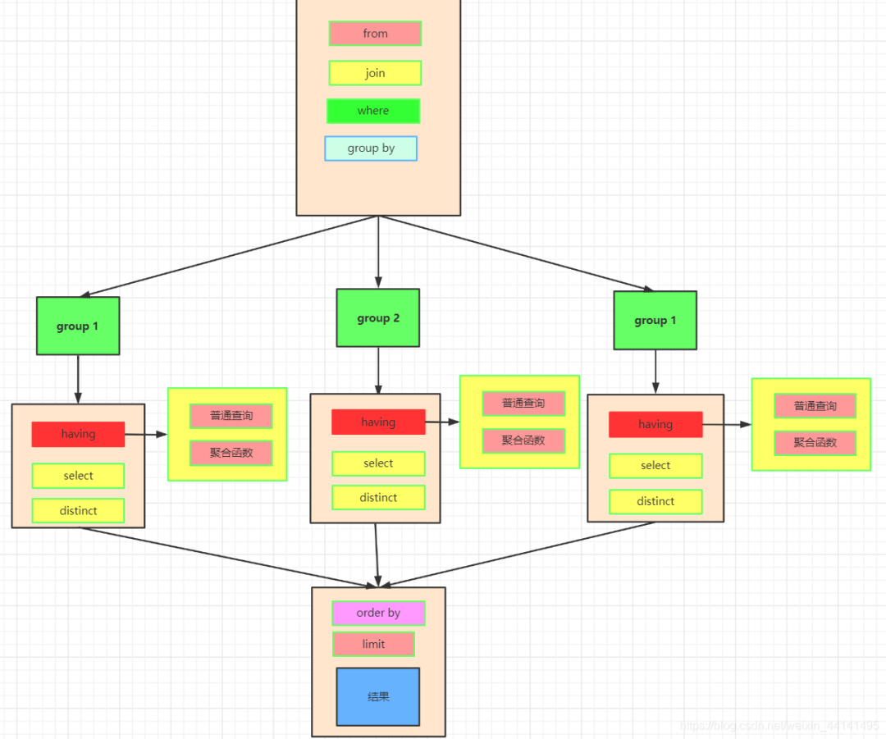
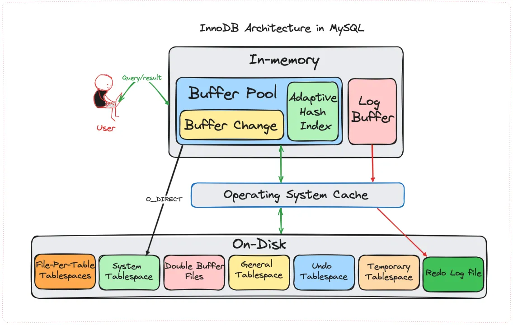

### drop、delete 与 truncate 的区别

- DROP 是物理删除，?来删除整张表，包括表结构，且不能回滚。
- DELETE ?持?级删除，可以带 WHERE 条件，可以回滚。
- TRUNCATE ?于清空表中的所有数据，但会保留表结构，不能回滚。


### UNION 与 UNION ALL 的区别

UNION 会?动去除合并后结果集中的重复?。UNION ALL 不会去重，会将所有结果集合并起来。


### SQL 查询语句的执行顺序



### LIMIT 为什么在最后执?

### 1. **逻辑依赖关系**

LIMIT 的作用是**限制最终返回的行数**，这一操作必须在完成数据的筛选、分组、排序等所有前置处理后进行。如果在早期阶段执行 LIMIT，可能会导致：


- **错误的聚合结果**：例如，`GROUP BY` 需要处理所有符合条件的行才能正确分组，若提前 LIMIT 可能丢失关键数据。
- **错误的排序结果**：`ORDER BY` 需对全量数据排序后才能确定 “前 N 行”，若提前截断可能导致排序逻辑失效。

### 2. **执行效率考量**

MySQL 的查询优化器会尽量在执行路径中**尽早过滤数据**（例如通过索引加速 WHERE 条件），但 LIMIT 本身无法在早期阶段发挥作用：


- **示例**：对于 `WHERE price > 100 LIMIT 10`，数据库需要先通过索引或全表扫描找到所有符合条件的行，再从中截取前 10 行。若表中存在大量高价商品，LIMIT 只能在筛选后生效。

### 3. **与其他子句的冲突**

如果 LIMIT 在其他子句之前执行，可能导致逻辑冲突：


- **与 DISTINCT 冲突**：若提前 LIMIT，可能返回重复值（例如，前 10 行中存在重复数据，但实际去重后不足 10 行）。
- **与 HAVING 冲突**：HAVING 基于分组后的结果筛选，若提前 LIMIT，可能遗漏关键分组。

### 4. **分页逻辑的实现**

LIMIT 常与 OFFSET 结合实现分页，例如 `LIMIT 10 OFFSET 20`（取第 21~30 行）。这种情况下，数据库必须：


- 先完成所有筛选、分组、排序操作。
- 再跳过 OFFSET 行后取 LIMIT 行。
  若提前 LIMIT，无法正确定位分页位置。

### 5. **优化器的特殊处理**

虽然 LIMIT 在逻辑上最后执行，但优化器可能通过**索引优化**或**提前终止扫描**来提升效率：


- **索引优化**：若 ORDER BY 与 LIMIT 结合且使用索引，数据库可能直接通过索引获取前 N 行，避免全表扫描。
- **提前终止**：对于 `WHERE` 条件能快速过滤大量数据的场景，数据库可能在扫描到足够行数后提前终止，减少后续处理开销。

### 示例说明

假设有 SQL：


sql


```sql
SELECT category_id, COUNT(*) 
FROM products 
WHERE price > 100 
GROUP BY category_id 
HAVING COUNT(*) > 5 
ORDER BY COUNT(*) DESC 
LIMIT 3;
```


执行流程为：


1. **FROM/WHERE**：筛选 `price > 100` 的商品。
2. **GROUP BY**：按 `category_id` 分组。
3. **HAVING**：过滤出分组后数量超过 5 的类别。
4. **ORDER BY**：按数量降序排序。
5. **LIMIT**：取排序后的前 3 行。


若 LIMIT 提前执行，可能在未完成分组或排序时就截断数据，导致结果错误。

### ORDER BY 为什么在 SELECT 之后执?

### 1. **逻辑依赖关系**

- **`SELECT` 定义结果集**：`SELECT` 子句负责确定最终输出的列，包括表达式、别名和聚合函数（如 `SUM()`、`COUNT()`）。只有在 `SELECT` 执行后，结果集的结构和内容才被完全确定。

- `ORDER BY` 依赖结果列

  ：

  ```
  ORDER BY
  ```


需要根据


  ```
  SELECT
  ```


输出的列进行排序。例如：

sql


  ```sql
  SELECT column1 + column2 AS sum_result
  FROM table
  ORDER BY sum_result; -- 必须先通过 SELECT 定义 sum_result
  ```

如果


  ```
  ORDER BY
  ```


在


  ```
  SELECT
  ```


前执行，数据库无法知道


  ```
  sum_result
  ```


是什么。

### 2. **别名的作用域**

- `SELECT` 中的别名在 `ORDER BY` 可见

  ：SQL 标准允许


  ```
  ORDER BY
  ```


使用


  ```
  SELECT
  ```


中定义的别名，但不允许在


  ```
  WHERE
  ```


或


  ```
  GROUP BY
  ```


中使用（因为这些子句在


  ```
  SELECT
  ```


前执行）。例如：

sql


  ```sql
  SELECT CONCAT(first_name, ' ', last_name) AS full_name
  FROM users
  ORDER BY full_name; -- 合法，依赖 SELECT 的别名
  ```

若


  ```
  ORDER BY
  ```


在


  ```
  SELECT
  ```


前执行，别名


  ```
  full_name
  ```


尚未创建，会导致错误。

### 3. **聚合函数的处理**

- 聚合函数在 `SELECT` 中计算

  ：

  ```
  GROUP BY
  ```


之后，

  ```
  SELECT
  ```


会应用聚合函数（如


  ```
  SUM()
  ```

、

  ```
  AVG()
  ```

），而


  ```
  ORDER BY
  ```


可能依赖这些计算结果。例如：

sql


  ```sql
  SELECT category, COUNT(*) AS product_count
  FROM products
  GROUP BY category
  ORDER BY product_count DESC; -- 按聚合结果排序
  ```

  ```
  COUNT(*)
  ```


的计算发生在


  ```
  SELECT
  ```


阶段，

  ```
  ORDER BY
  ```


必须在其后执行才能获取正确的聚合值。

### 4. **优化器的执行策略**

- 逻辑顺序 vs 物理顺序

  ：虽然


  ```
  ORDER BY
  ```


在逻辑上后执行，但优化器可能通过索引或临时表优化排序。例如：

sql


  ```sql
  SELECT id, name
  FROM users
  ORDER BY created_at;
  ```

如果


  ```
  created_at
  ```


有索引，优化器可能直接按索引顺序扫描数据，避免额外排序，但这属于物理优化，不改变逻辑执行顺序。

### 5. **与 `DISTINCT` 和 `LIMIT` 的协同**

- `DISTINCT` 在 `SELECT` 后应用

  ：若查询使用


  ```
  DISTINCT
  ```

，去重操作发生在


  ```
  SELECT
  ```


阶段，

  ```
  ORDER BY
  ```


需对去重后的结果排序。例如：

sql


  ```sql
  SELECT DISTINCT category
  FROM products
  ORDER BY category;
  ```

先通过


  ```
  SELECT DISTINCT
  ```


获取唯一的


  ```
  category
  ```

，再排序。

- **`LIMIT` 在 `ORDER BY` 后应用**：`ORDER BY` 确定排序顺序后，`LIMIT` 才能正确截取前 N 行。若 `ORDER BY` 提前执行，可能导致分页逻辑错误。

### 示例说明

考虑以下查询：


sql


```sql
SELECT 
    user_id, 
    COUNT(order_id) AS order_count
FROM orders
WHERE status = 'completed'
GROUP BY user_id
HAVING order_count >= 5
ORDER BY order_count DESC
LIMIT 10;
```


执行流程为：


1. **FROM/WHERE**：筛选已完成订单。
2. **GROUP BY**：按用户分组。
3. **HAVING**：过滤订单数≥5 的用户。
4. **SELECT**：计算每个用户的订单数（`order_count`）。
5. **ORDER BY**：按 `order_count` 降序排序。
6. **LIMIT**：取前 10 名用户。


若 `ORDER BY` 在 `SELECT` 前执行，数据库无法获取 `order_count` 的值，导致排序失败。


### MySQL 第 3-10 条记录怎么查


```sql
SELECT * 
FROM your_table
ORDER BY some_column
LIMIT 8 OFFSET 2;
```


```mysql
SELECT * 
FROM your_table
ORDER BY some_column
LIMIT 2, 8;
```


### 说说 SQL 的隐式数据类型转换

在 SQL 中，隐式数据类型转换是指数据库系统**自动**将一种数据类型转换为另一种数据类型的过程，无需用户显式使用函数（如 `CAST()` 或 `CONVERT()`）。这种转换通常发生在表达式计算、比较操作或函数调用时，但可能导致意外结果或性能问题。

### **常见隐式转换场景**

#### 1. **比较操作中的转换**

当比较不同类型的值时，数据库会尝试将它们转换为同一类型：


sql


```sql
-- 字符串与数字比较
SELECT * FROM users WHERE age = '25';  -- 字符串 '25' 被转为数字 25

-- 日期与字符串比较
SELECT * FROM orders WHERE order_date = '2023-01-01';  -- 字符串转为日期
```

#### 2. **算术运算中的转换**

参与运算的操作数会被转换为兼容类型：


sql


```sql
SELECT '100' + 5;  -- 字符串 '100' 转为数字 100，结果为 105

SELECT 10 / 3;     -- 整数除法，结果可能被转为浮点数（取决于数据库）
```

#### 3. **函数参数的转换**

函数会自动转换参数类型：


sql


```sql
SELECT CONCAT('Hello', 123);  -- 数字 123 转为字符串 '123'，结果为 'Hello123'

SELECT LENGTH(12345);         -- 数字转为字符串，计算长度为 5
```

#### 4. **条件表达式中的转换**

`CASE`、`IF` 等表达式要求结果类型一致：


sql


```sql
SELECT 
    CASE WHEN condition THEN 1 ELSE 'A' END;  -- 数字 1 可能转为字符串 '1'
```

#### 5. **JOIN 条件中的转换**

连接条件涉及不同类型时：


sql


```sql
SELECT * 
FROM users u 
JOIN orders o ON u.id = o.user_id;  -- 若 u.id 是 INT，o.user_id 是 VARCHAR，则可能发生转换
```

### **隐式转换的风险**

#### 1. **意外结果**

sql


```sql
SELECT * FROM products WHERE price = '10.5abc';  -- 字符串被截断为 10.5，导致匹配成功
```

#### 2. **索引失效**

若索引列被隐式转换，查询可能无法利用索引：


sql


```sql
-- 若 user_id 是 INT 类型，以下查询会导致全表扫描
SELECT * FROM orders WHERE user_id = '123';  -- 索引无法作用于函数 `CAST(user_id AS VARCHAR)`
```

#### 3. **性能下降**

类型转换可能触发全表扫描或额外计算：


sql


```sql
SELECT * FROM logs WHERE log_time > '2023-01-01';  -- 字符串转为日期可能逐行计算
```

#### 4. **数据截断**

转换为较小数据类型时可能丢失精度：


sql


```sql
SELECT CAST(12345.67 AS INT);  -- 结果为 12345，小数部分被截断
```

### **不同数据库的转换规则差异**

不同数据库系统的隐式转换规则可能不同：


- **MySQL**：倾向于将字符串转为数字进行比较（如 `'25' = 25` 为真）。
- **SQL Server**：严格要求类型匹配，字符串与数字比较可能报错。
- **PostgreSQL**：通常需要显式转换，隐式转换较少。

### **如何避免隐式转换？**

1. **显式类型转换**
   使用 `CAST()` 或 `CONVERT()` 函数明确转换类型：

   sql


   ```sql
   SELECT * FROM users WHERE age = CAST('25' AS INT);
   ```

2. **保持类型一致**
   确保比较操作两侧的数据类型相同：

   sql


   ```sql
   -- 若 user_id 是 INT，查询参数也用 INT
   SELECT * FROM orders WHERE user_id = 123;  -- 而非 '123'
   ```

3. **使用参数化查询**
   在应用代码中使用预编译语句（Prepared Statement），避免手动拼接 SQL：

   python


运行


   ```python
   # Python + MySQL 示例
   cursor.execute("SELECT * FROM users WHERE age = %s", (25,))
   ```


4. **检查索引列类型**
   确保索引列与查询条件的数据类型一致，避免索引失效。

### **总结**

隐式类型转换是 SQL 中常见但需谨慎的特性，它可能导致意外结果或性能问题。建议：


- **优先使用显式转换**，提高代码可读性和安全性。
- **避免在索引列上进行隐式转换**，以免影响查询性能。
- **了解数据库的转换规则**，不同系统的行为可能存在差异。
### InnoDB 和 MyISAM 主要有什么区别

InnoDB 和 MyISAM 的最?区别在于事务?持和锁机制。InnoDB ?持事务、?级锁，适合?多数业务系统；?
MyISAM 不?持事务，?的是表锁，查询快但写?性能差，适合读多写少的场景。

从存储结构上来说，MyISAM ?三种格式的?件来存储，.frm ?件存储表的定义；.MYD 存储数据；.MYI 存
储索引；? InnoDB ?两种格式的?件来存储，.frm ?件存储表的定义；.ibd 存储数据和索引。


### InnoDB 的 Buffer Pool



## MySql查询不区分大小问题遇到过么，如何解决方案？


**解决方案一：**

修改数据库字符排序匹配规则(从MySQL 8.0.1版本开始，支持_cs（case sensitive collation）排序规则。在此版本之前，MySQL仅支持_bin（binary collation）排序规则，它是区分大小写的)

*_bin: 表示的是binary case sensitive collation，也就是说是区分大小写的
*_cs: case sensitive collation，区分大小写
*_ci: case insensitive collation，不区分大小写字符匹配规则

**解决方案二:**

使用关键字BINARY修饰

mysql查询默认是不区分大小写的 如:

```
select * from 表名 where 字段名 ='aaa';
```


与

```
select * from 表名 where 字段名 ='Aaa';
```


查询结果相同

解决方式(使用关键字BINARY 修饰)

```
select * from 表名 where BINARY 字段名 ='aaa';
```


原理:

对于CHAR、VARCHAR和TEXT类型，BINARY属性可以为列分配该列字符集的 校对规则。BINARY属性是指定列字符集的二元 校对规则的简写。排序和比较基于数值字符值。因此也就自然区分了大小写。

**解决办法三:**

使用varbinary数据类型

数据库中varchar字符串类型是不区分大小写查询的,将varchar改为varbinary类型,再次查询就会使查询的字段区分查询条件大小写

## mysql，给了一个表中，里面有很多重复数据，如何用一条sql把重复的数据一次性清除掉？

### **方法 1：使用`DELETE` + `JOIN`（适用于有唯一标识列的情况）**

假设表结构为 `users(id, name, email)`，其中 `email` 列存在重复值，需保留 `id` 最小的行：


sql


```sql
DELETE u1
FROM users u1
JOIN users u2 
  ON u1.email = u2.email 
  AND u1.id > u2.id;
```


**解释**：


- 通过 `JOIN` 自连接找到所有 `email` 相同但 `id` 更大的记录（即非最小 `id` 的重复行）。
- 删除这些重复行，保留每个组中 `id` 最小的行。

### **方法 2：使用`DELETE` + `WHERE`子查询（适用于无唯一标识列的情况）**

若表中没有唯一标识列（如 `id`），可通过组合字段判断重复：


sql


```sql
DELETE FROM users
WHERE (name, email) IN (
    SELECT name, email
    FROM users
    GROUP BY name, email
    HAVING COUNT(*) > 1
)
AND ROWID NOT IN (  -- ROWID 是 MySQL 隐式的行标识符（若表无主键）
    SELECT MIN(ROWID)
    FROM users
    GROUP BY name, email
);
```


**注意**：


- 若表有主键，将 `ROWID` 替换为实际主键列（如 `id`）。
- 若无主键，部分 MySQL 版本可能需要先添加临时主键。

### **方法 3：创建临时表（适用于复杂场景或需保留数据备份）**

sql


```sql
-- 创建临时表，仅插入不重复的数据
CREATE TABLE temp_users AS
SELECT DISTINCT * 
FROM users;

-- 删除原表，重命名临时表
DROP TABLE users;
ALTER TABLE temp_users RENAME TO users;
```


**优点**：简单直接，避免复杂的 `DELETE` 逻辑。
**缺点**：需临时存储空间，可能影响数据完整性（如索引、外键）。

### **方法 4：使用窗口函数（MySQL 8.0+）**

sql


```sql
WITH ranked AS (
    SELECT *,
           ROW_NUMBER() OVER (PARTITION BY email ORDER BY id) AS rn
    FROM users
)
DELETE FROM users
WHERE id IN (SELECT id FROM ranked WHERE rn > 1);
```


**解释**：


- 通过 `ROW_NUMBER()` 为每个 `email` 分组内的记录分配行号（按 `id` 排序）。
- 删除行号大于 1 的记录（即重复行）。

### **注意事项**

1. **备份数据**：执行删除前务必备份表数据，避免误操作。

2. 唯一索引

   ：删除重复数据后，可添加唯一索引防止再次出现重复：

   sql


   ```sql
   ALTER TABLE users ADD UNIQUE (email);
   ```


![img](data:image/png;base64,iVBORw0KGgoAAAANSUhEUgAAAHgAAAAwCAYAAADab77TAAAACXBIWXMAABYlAAAWJQFJUiTwAAAAAXNSR0IArs4c6QAAAARnQU1BAACxjwv8YQUAAAjBSURBVHgB7VxNUxNJGO7EoIIGygoHQi0HPbBWeWEN+LFlKRdvsHf9AXBf9y7eZe/wA5a7cPNg3LJ2VYjFxdLiwFatVcBBDhAENfjxPO3bY2cyM/maiYnOU5VMT0/PTE+/3+9Md0LViJWVla6PHz8OHB4e9h8/fjyNbQ+qu1SMVqCUSqX2Mea7KG8nk8mt0dHRUi0nJqo1AGF7cPHT79+/H1IxQdsJr0DoNRB6P6iRL4EpsZ8+ffoZv9NW9TZ+Wzs7O9unTp3ar5WLYjQH0uLDhw+9iUSiD7sD+GXMsaNHj65Dstf8aJHwuWAPuOOyqGGiJm6J0RqQPjCXwygOSdU+6POvF30qCHz//v2+TCYzSuKCaw729vaWr1+/vqNitB2E0L+i2I3fPsrLly5d2rXbJNwnWJJLqX0eq+H2hji/I+qL6q6Q5ITdEAevCnG3Lly4sKxidAyePn1KIlNlk8h/G8FMmgZ0qIxaRoNVFaOjQG2LzQF+jHqGnXr+UTUbb7mrq+ufWC13HkgzRDda6yKkPUOasqwJLB4Z8Sr2lDsX4gy/Ypm5C26TtL1K3G2GQipGR8PQkIkp7Vcx/SjHtmPp7XwIDZmQ0qnllPqaFdlSPyiWl5dvgPPTGJC1sbGxvIoAjx49Sh87duwuy/B3lhClLK6urg6XSqWb6XR69uzZs0UVHkjLDN8bkMBMf6k3b97squ8cUFmLGNyNI0eO5M+fP79g6pECvIn6LIpL+OVVRMB9ctyCmQpPnjwZBgH+Qp1CMin37NmzafRpQ4UAppL7+vpoh3tTCIt68MAKXBRZtorcizdQD7yO4QE3crncb0HngzA8N232QYwCJG1a1QFKCwY0i/tleb5qMa5cuVLEczj7Fy9eXEPsegfE/h27WdDhNrZ1PZMf+J4A2ojF7hSISylWUYZGSIiP+x3DYA++fPkyXUVFpVWTgCrMUVoEoRKYzAMCVe0jnlVvMfiDhUKB0ryB8gL6dYNqm3WgR3FkZKQpZ5e0BPOw2JVSLQA6PWEezgswD+PYLKoagQGp217hnElTxqBOwu5OWodPSpsc6mf8rvHu3bt5SGKFGoVmmMUmq2rvC8djQsq6DpJ8m2MERiTzhSLJROQEhm0ZxIDmgtrgwYb9jkG9D3q031P198G5BwfYp2k24Jjq7u4mE4ZiJ1uFyAkM7s6BO8vqMIgFECln7V/DZrbGS9YtwVCfU5Z63vRoYqSP162LeVzIv3379k+/g/BD5ngv+gDQBndUCxA5gT3Ucx6/h/g5BA6yw5CarFu910Ngkd4JuY+nc0bvWn0Z+Ic4PqMaBDWLlwq37sN+k5nSdrsafJCGkVQRgoNrSyqBwX54cHBQ4eSIHQ4duN+cKUOTzKtviw3px0lTwTFCmPQAtn+OZRUyIpVgqMZrlmokigzwWQA3U1U6jkmQHXajVgmGJ3nL3INeKrzLSMOjACctLwmUTemLQ0hjwniuTfiwEKkEM4Fg71MFWuWCq+01n8s05GQx9sZmnGVI8SY9YBU9tJPm/oFwmnmZZLH6p5+LJsz0sdnwyAuRSbBJLNh1eNBFq1wwoQJRYzysgcGo2oaJBQziNGLwOSTep5EmHEac6ekh494mTGKbKa821Bp29ssHRbRbs65bZp74IsD4E+wPVLKyIoxIGDAyAjPH6lbPsL2bVthT4Yz4xMMV8SUGqiYVLY6MjnehOqdshvLBcICp4LX8CKwZhBoKZmDGVK58TV1p1YznX4MnrSuokmHCxs0YgQkjMR+REdjkXS0wXXnP7HglPuqxw20GncUC4wXGyNQq0BAmRGRmzajupSDvuxlEQmCm3CR5XxfcKk3qKlKA1ASqTkj4M+N1zAqTluoNk8TWa9jOnytBYxOPksrndJg5Sv8gEieLqUDVAMjRtMN2nReB2wmI0x1Coa+O/T0JeLUHcy7Z+zhnPirpJSKRYA/1nEddhf0CI6RRf9euKxaLPDdvXatioPr7+yNJCjQCpkCNHcXW0Sz2y40TJ044hIdzVRYtQGNo6RWndBbXmzehZBgIncBwZsaVyzFi+s6PS93xsDBH3tpPu+11VFmfRmCYmWEOX0Xiee7Zx1lv+ou4fBJtbtnH+bEBiLwAhhjk+XzpAPVeCEuqo1DR4/YO1VZQZ93xsJcdbldI5mmcZebX8V6bz2IzH8MmnWNn+EXimQMkvJw3xeuYWJn1YarsUCWYDof7bQwIFhg7uuNhY4cN17ttMD8QUDVCJKZaaERk5drMRM0FNaQjhVDoD+nbhPUcWq0i9JlOpVK6zwyLaKN5TZtxQcQ7SHBsoI73Sks61cTioYZLoRLY68V+tfiOeWkTGxq47HDDThYGMVunRtBffAQ1MAxGZsa1tTNJqYPd1M/JLzVMW4m9nTdZbIf9W6YNjs+KynbuaSeDwgA/2TnkVx38xLLZrzrcb46ofqupGx6Xtyx2uGETuMzJMqqtFuDZNtGnUCXC3F9iWn7jxcyXZ5iD8GcBTD8JopGAC2B2esyOCqfthZZh2nXKtBE13xRkvhKLpQRuQK+uV+azxLMI6wRj/iCi8OM6quxqhGPcHJbtffHiRQZakLMOdxNQE7+AC3/CznOomXUVo+MBoT2DzTnFGaIg7mupH1Axvhc4kxmSXNCDdhg7GTNhKUbnQmiYYZm0TdKxgo3QE5bsD9NidCZcEwlLOtEBr9XY3qHHjx/3qhgdCZHesomEmsAyYWldDozJjMMYHQRZoeGy7K6biYROqlIormeIQ8zPqRgdBa7TYa3Q4CRbKhZhsVZt2eJSDvFs//aGJDUokEMkrqzQ4EwDLnvZwAOyDAAleQAnXo096/YFl7ziwjlKiMslr9xzvH0XQrMkmYgXQmsjuBdC85Jcg8ClDOUiZ6xqvZQhiM25xDux+m4NxOklURnfli1lCKyL8NW+lKHr4u5l82J8YzAxhdeQ/8Op+q/hxUjdMMsJqy/c0ycTx1sy/fRHh7zx08sJIyn1up7lhD8DfU3/IDqhNFQAAAAASUVORK5CYII=)

3. **性能考虑**：大表删除操作可能耗时较长，建议在低峰期执行。

### **示例表结构和数据**

sql


```sql
CREATE TABLE users (
    id INT PRIMARY KEY,
    name VARCHAR(50),
    email VARCHAR(50)
);

INSERT INTO users VALUES
(1, 'Alice', 'alice@example.com'),
(2, 'Bob', 'bob@example.com'),
(3, 'Charlie', 'alice@example.com');  -- 重复 email

-- 删除重复后的数据应保留 id=1 和 id=2 的记录
```


根据实际表结构和需求选择合适的方法，推荐优先使用方法 1（简单高效）或方法 4（功能强大）。


## Mysql中的like模糊查询一定不走索引吗？

#### 1. **前缀匹配（`'xxx%'`）：可能走索引**

如果 `LIKE` 的匹配模式是**以固定字符开头，通配符在末尾**（如 `col LIKE 'abc%'`），此时 **B-tree 索引可能被使用**。
原因是：B-tree 索引是按字段值的前缀有序排列的，`'abc%'` 可以利用索引的有序性，快速定位到以 `'abc'` 开头的记录范围，无需全表扫描。

**示例**：
假设有表 `user`，字段 `name` 上创建了普通 B-tree 索引：

sql


```sql
CREATE INDEX idx_name ON user(name);
```

查询：

sql


```sql
SELECT * FROM user WHERE name LIKE 'zhang%'; -- 可能使用 idx_name 索引
```

MySQL 优化器会判断：`'zhang%'` 可以通过索引快速定位到所有以 `'zhang'` 开头的记录，因此可能选择走索引。

#### 2. **后缀匹配（`'%xxx'`）或中间匹配（`'%xxx%'`）：通常不走索引**

如果 `LIKE` 的匹配模式是**通配符在开头**（如 `col LIKE '%abc'`）或**通配符在中间**（如 `col LIKE 'a%c'`），此时 **B-tree 索引无法被有效利用，通常会走全表扫描**。

原因是：B-tree 索引的有序性是基于字段值的完整前缀，而 `'%abc'` 或 `'%abc%'` 需要匹配 “任意字符 + 固定字符”，索引无法通过有序性定位到具体范围，只能逐行扫描判断。

**示例**：

sql


```sql
SELECT * FROM user WHERE name LIKE '%zhang'; -- 通配符在开头，通常不走索引
SELECT * FROM user WHERE name LIKE '%zhang%'; -- 通配符在中间，通常不走索引
```

#### 3. **特殊场景：覆盖索引可能被利用**

即使是 `'%xxx%'` 这样的模式，如果查询的字段**全部包含在某个索引中**（即 “覆盖索引”），MySQL 可能会选择扫描该索引（而非全表），因为索引的体积通常比全表小，扫描更快。

**示例**：
表 `user` 有索引 `idx_name_age (name, age)`，查询：

sql


```sql
SELECT name, age FROM user WHERE name LIKE '%zhang%'; -- 可能扫描 idx_name_age 索引
```

虽然 `'%zhang%'` 无法通过索引有序性定位，但由于查询的 `name` 和 `age` 都在索引中，优化器可能选择扫描索引（比全表扫描高效）。

#### 4. **优化器的最终决策**

即使满足前缀匹配条件，MySQL 优化器也可能**放弃使用索引**，转而选择全表扫描。这通常发生在：

- 表数据量极小（全表扫描比索引查找更快）；
- 匹配的记录占比极高（如 `name LIKE 'a%'` 匹配了表中 80% 的记录，索引定位的成本可能高于全表扫描）。

### 总结

`LIKE` 模糊查询是否走索引的核心判断标准是：**匹配模式能否利用索引的有序性快速定位范围**。

- `'前缀%'`：可能走索引（B-tree 索引支持前缀匹配）；
- `'%后缀'` 或 `'%中间%'`：通常不走索引（无法利用索引有序性）；
- 特殊场景（如覆盖索引）可能扫描索引而非全表。

## 什么是回表？如何解决回表？

### 一、什么是回表？

InnoDB 的索引分为两种类型：

- **聚簇索引（Clustered Index）**：以主键为索引键，其叶子节点直接存储**完整的行数据**（即整行记录的所有字段）。一张表只有一个聚簇索引（通常默认是主键索引，若未定义主键则会隐式生成）。
- **二级索引（Secondary Index，非聚簇索引）**：以非主键字段为索引键（如普通索引、联合索引等），其叶子节点**只存储索引键值 + 主键值**（不存储完整行数据）。

当使用**二级索引**查询数据时，若查询的字段**不只是二级索引本身包含的字段**（即需要获取二级索引中未存储的其他字段），则需要分两步查询：

1. 先通过二级索引找到匹配记录的**主键值**；
2. 再用主键值去**聚簇索引**中查询完整的行数据（获取所需的其他字段）。

这个 “通过二级索引找到主键后，再去聚簇索引查询完整数据” 的过程，就称为**回表**。

### 二、回表的问题

回表的本质是**多一次索引查询**（从二级索引到聚簇索引），会增加磁盘 IO 操作。在数据量较大或查询频繁的场景下，回表会显著降低查询性能：

- 例如，一张千万级数据的表，若一条查询需要回表，可能会额外触发成百上千次聚簇索引的查找，IO 成本大幅上升。

### 三、如何解决回表？

解决回表的核心思路是：**避免从二级索引到聚簇索引的二次查询**，即让查询所需的所有字段都能直接从二级索引中获取，无需回表。最常用的方法是**覆盖索引**。

#### 1. 覆盖索引（Covering Index）

**覆盖索引**是指：查询所需的**所有字段**（包括 `WHERE` 条件中的过滤字段和 `SELECT` 后的返回字段）都包含在某个二级索引中。此时，通过该二级索引即可直接获取所有需要的数据，无需回表。

**示例说明**：
假设有一张用户表 `user`，结构如下：

sql


```sql
CREATE TABLE user (
  id INT PRIMARY KEY, -- 聚簇索引（主键索引）
  name VARCHAR(50),
  age INT,
  email VARCHAR(100),
  INDEX idx_name (name) -- 二级索引（只包含 name + id）
);
```

- **场景 1：需要回表**
  若查询：

  sql


  ```sql
  SELECT id, name, age FROM user WHERE name = '张三';
  ```

分析：
二级索引 `idx_name` 只包含 `name` 和 `id`，而查询需要 `age` 字段（不在 `idx_name` 中）。因此，查询会先通过 `idx_name` 找到 `name='张三'` 对应的主键 `id`，再用 `id` 去聚簇索引中查询 `age`，触发**回表**。

- **场景 2：使用覆盖索引，避免回表**
  若创建联合索引，包含查询所需的所有字段：

  sql


  ```sql
  CREATE INDEX idx_name_age (name, age); -- 二级索引（包含 name + age + id，因为二级索引默认携带主键）
  ```

再执行同样的查询：

sql


  ```sql
  SELECT id, name, age FROM user WHERE name = '张三';
  ```

分析：
联合索引 `idx_name_age` 包含 `name`、`age` 和主键 `id`（二级索引默认存储主键），查询所需的 `id`、`name`、`age` 都能直接从该索引中获取，**无需回表**，直接返回结果。

#### 2. 其他辅助思路

- **优先使用聚簇索引查询**：若查询条件直接基于主键（聚簇索引），则无需回表（因为聚簇索引本身存储完整数据）。例如 `SELECT * FROM user WHERE id = 100`，直接通过聚簇索引获取数据，无回表。
- **控制返回字段**：避免使用 `SELECT *`（查询所有字段），只查询必要的字段。若查询的字段较少，更容易通过覆盖索引避免回表。

### 总结

- **回表**：使用二级索引查询时，因所需字段不在二级索引中，需通过主键到聚簇索引查询完整数据的过程，会增加 IO 成本。
- **解决方法**：核心是使用**覆盖索引**（让查询的所有字段都包含在二级索引中），避免二次查询聚簇索引。
- 注意：索引并非越多越好，过多的联合索引会增加写入（INSERT/UPDATE/DELETE）时的索引维护成本，需根据实际查询场景设计。

## 聚簇索引=主键索引吗？

在 InnoDB 引擎中，每张表都会有一个特殊的索引“聚簇索引”，也被称之为聚集索引，它是用来存储行数据的。一般情况下，聚簇索引等同于主键索引，但这里有一个前提条件，那就是这张表需要有主键，只有有了主键，它才能有主键索引，有主键索引才能等于聚簇索引。

所以看到这里，我们应该明白一个道理：聚簇索引并不完全等于主键索引，因为一张表从结构上来讲，可以没有主键（索引），如果没有主键（索引），那么聚簇索引就不再是主键索引了。


## Mysql自增ID用完会怎么办

- 主键自增ID用完

  当主键自增 ID 达到上限后，再新增下一条数据时，它的 ID 不会变（还是最大的值），只是此时再添加数据时，因为主键约束的原因，ID 是不允许重复的，所以就会报错提示主键冲突。
- row_id用完

如果表没有设置主键，InnoDB 会自动创建一个全局隐藏的 row_id，其长度为 6 个字节，当 row_id 达到上限后，它的执行流程和主键 ID 不同，它是再次归零，然后重新递增，如果出现相同的 row_id，后面的数据会覆盖之前的数据


## 如何在千万级别的Mysql表中如何高效添加一个新的列
### 一、使用 `ALGORITHM=INPLACE` 和 `LOCK=NONE`（MySQL 5.6+）

**核心原理**：
MySQL 5.6+ 引入了 Online DDL 功能，通过 `INPLACE` 算法避免重建整个表，仅修改元数据。使用 `LOCK=NONE` 允许在操作期间继续读写表。

**示例语法**：

sql


```sql
ALTER TABLE table_name
ADD COLUMN new_column INT DEFAULT 0,
ALGORITHM=INPLACE,
LOCK=NONE;
```

**适用条件**：

- 列允许 `NULL` 或设置了 `DEFAULT` 值（否则需全量更新数据）。
- 对于非 `NULL` 且无默认值的列，MySQL 会隐式锁表并填充 `0` 或空字符串。

**注意事项**：

- 若表存在 `FULLTEXT` 索引，可能降级为 `COPY` 算法（需重建表）。
- 执行前需确认可用磁盘空间充足（约为表大小的 20%）。

### 二、使用 `pt-online-schema-change`（Percona Toolkit）

**核心原理**：
通过创建影子表（Shadow Table），在原表上触发触发器同步数据，最后切换表名。整个过程对应用透明，仅在切换时短暂锁表。

**操作步骤**：

1. **安装工具**：

   bash


   ```bash
   yum install percona-toolkit  # CentOS/RHEL
   apt-get install percona-toolkit  # Ubuntu/Debian
   ```

2. **执行命令**：

   bash


   ```bash
   pt-online-schema-change \
   --alter "ADD COLUMN new_column INT DEFAULT 0" \
   D=db_name,t=table_name \
   --user=username \
   --password=password \
   --execute
   ```

**优点**：

- 完全在线操作，对业务影响极小。
- 自动处理触发器和索引，支持大表操作。

**缺点**：

- 需要额外的磁盘空间（约为原表大小）。
- 同步期间会增加主从复制延迟。

### 三、分批次导入数据（适用于复杂场景）

**核心原理**：
将大表按主键范围拆分，逐批处理并导入新表，最后替换原表。

**操作步骤**：

1. **创建临时表**：

   sql


   ```sql
   CREATE TABLE new_table LIKE old_table;
   ALTER TABLE new_table ADD COLUMN new_column INT DEFAULT 0;
   ```

2. **分批次复制数据**：

   sql


   ```sql
   -- 示例：每次复制10万行
   INSERT INTO new_table 
   SELECT * FROM old_table 
   WHERE id BETWEEN start_id AND end_id;
   ```

3. **切换表名**：

   sql


   ```sql
   RENAME TABLE old_table TO old_table_backup, new_table TO old_table;
   ```

**优化建议**：

- 使用事务包裹每批数据，确保原子性。
- 复制期间监控数据库负载，避免影响业务。

### 四、预创建列（设计阶段优化）

**最佳实践**：
在表设计阶段预留扩展列（如 `extra_data JSON`），避免后期频繁修改表结构。

sql


```sql
CREATE TABLE users (
  id BIGINT PRIMARY KEY,
  name VARCHAR(100),
  extra_data JSON  -- 预留字段，存储动态扩展属性
);
```

### 五、对比与选择建议

| 方法                      | 适用场景               | 优点               | 缺点                       |
| ------------------------- | ---------------------- | ------------------ | -------------------------- |
| `ALGORITHM=INPLACE`       | 简单列添加（有默认值） | 快速，无需额外空间 | 可能短暂锁表               |
| `pt-online-schema-change` | 复杂变更，需完全在线   | 无业务中断         | 需要双倍空间，增加复制延迟 |
| 分批次导入                | 超大数据量，需精细控制 | 灵活，可暂停恢复   | 操作复杂，耗时长           |
| 预创建列                  | 设计阶段规划           | 避免后期修改       | 需要预判业务变化           |

### 六、注意事项

1. **备份数据**：无论采用哪种方法，执行前务必备份全量数据。
2. **选择低峰期操作**：即使是 Online DDL，仍可能对性能产生轻微影响。
3. **监控资源**：操作期间监控磁盘空间、CPU、内存和复制延迟。
4. **验证索引**：操作后检查索引是否正常，特别是外键约束。

# ================================
### 一、利用主从复制架构：从库先行变更，再切换角色

**核心原理**：
借助主从复制的 “读写分离” 特性，先在从库（非业务主库）执行表结构变更和数据填充，待从库数据与主库一致且变更完成后，切换主从角色（将从库提升为主库），避免直接在主库操作导致的锁表或性能波动。

#### 操作步骤：

1. **确认主从同步状态**
   确保从库已追上主库的 binlog，避免数据不一致：

   sql


   ```sql
   -- 在从库执行，查看Seconds_Behind_Master是否为0
   SHOW SLAVE STATUS\G
   ```

2. **在从库停止同步，执行表结构变更**
   先暂停从库同步（避免主库新数据干扰变更），添加新列：

   sql


   ```sql
   STOP SLAVE;  -- 停止从库同步
   ALTER TABLE table_name ADD COLUMN new_column [类型] [默认值];  -- 从库添加新列
   ```

3. **填充新列数据（如需关联其他表，结合 JOIN）**
   若新列的值依赖其他表（如从`user_info`表关联`order`表获取用户等级），用`JOIN`批量更新：

   sql


   ```sql
   -- 示例：从关联表user_info同步level到order表的new_column
   UPDATE order o
   JOIN user_info u ON o.user_id = u.id
   SET o.new_column = u.level
   WHERE o.new_column IS NULL;  -- 避免重复更新
   ```

（可分批次执行，如按`order.id`范围拆分，每次更新 10 万行，减少锁表时间）

4. **从库重新同步，追平主库数据**
   变更完成后，重启从库同步，让从库追上主库在变更期间产生的新数据：

   sql


   ```sql
   START SLAVE;
   -- 再次确认Seconds_Behind_Master为0
   SHOW SLAVE STATUS\G
   ```

5. **切换主从角色**
   通过`VIP`或域名切换，将业务流量切到已完成变更的从库（新主库），原主库降级为从库。

    - 若用`MGR`（MySQL Group Replication），可直接通过`switchover`平滑切换；
    - 传统主从可通过`pt-table-sync`确保最后一致性，再修改应用连接地址。

#### 适用场景：

- 已有主从架构，且从库可承担临时变更（非核心业务读库）；
- 新列需要关联其他表数据（需`JOIN`填充），直接在主库做`UPDATE JOIN`会导致大表锁和性能暴跌。

#### 优点：

- 主库全程无变更操作，业务读写不受影响；
- 从库变更和`JOIN`更新可在低峰期执行，风险可控。

#### 缺点：

- 需主从架构支持，切换过程可能有秒级中断（依赖切换工具）；
- 若主库在变更期间写入大量数据，从库追同步可能耗时较长。

### 二、“新建表 + JOIN 迁移 + 主从切换” 组合方案

**核心原理**：
当直接`ALTER`大表风险过高时，可在从库新建目标表（含新列），通过`JOIN`原表和关联表批量迁移数据，再通过主从切换替换原表。

#### 操作步骤：

1. **从库新建目标表（含新列）**

   sql


   ```sql
   -- 从库执行：复制原表结构并添加新列
   CREATE TABLE new_table LIKE old_table;
   ALTER TABLE new_table ADD COLUMN new_column [类型];
   ```

2. **通过 JOIN 批量迁移数据到新表**
   用`INSERT ... SELECT ... JOIN`从原表和关联表迁移数据，分批次执行：

   sql


   ```sql
   -- 示例：每次迁移id在[start, end]范围的数据，关联user_info表获取new_column值
   INSERT INTO new_table (col1, col2, ..., new_column)
   SELECT o.col1, o.col2, ..., u.level  -- 从关联表取new_column的值
   FROM old_table o
   JOIN user_info u ON o.user_id = u.id
   WHERE o.id BETWEEN 1 AND 100000;  -- 分批次，每次10万行
   ```

3. **同步增量数据**
   迁移历史数据后，通过触发器或 binlog 解析工具（如 Canal）同步从库在迁移期间产生的增量数据到`new_table`。

4. **验证数据一致性**
   对比`old_table`和`new_table`的行数、关键字段哈希值，确保数据一致：

   sql


   ```sql
   -- 校验行数
   SELECT COUNT(*) FROM old_table;
   SELECT COUNT(*) FROM new_table;
   
   -- 校验随机样本
   SELECT MD5(CONCAT(col1, col2, new_column)) FROM new_table WHERE id = 12345;
   ```

5. **切换表名并提升从库为主库**
   从库数据确认无误后，重命名表并切换主从角色：

   sql


   ```sql
   -- 从库执行：原子性重命名，避免锁表
   RENAME TABLE old_table TO old_table_bak, new_table TO old_table;
   ```

之后将该从库提升为主库，承接业务流量。

#### 适用场景：

- 新列需要复杂关联逻辑（多表 JOIN），直接`ALTER`+`UPDATE`效率极低；
- 原表存在碎片或冗余字段，希望借机优化表结构（如调整字段顺序、删除无用列）。

#### 优点：

- 完全避免在原表上执行`ALTER`和大事务`UPDATE`，对主库无影响；
- 可顺带优化表结构，提升后续查询性能。

#### 缺点：

- 操作步骤较复杂，需严格校验数据一致性；
- 增量数据同步需额外工具支持，适合有成熟数据同步体系的团队。

### 三、关键注意事项

1. **数据一致性优先**：
   无论主从切换还是数据迁移，必须通过校验（行数、哈希值、随机抽样）确保新表数据与原表一致，避免业务异常。
2. **控制批量操作粒度**：
   分批次执行`JOIN`和`INSERT/UPDATE`时，单次操作行数建议控制在 1 万 - 10 万（根据服务器性能调整），避免长时间占用锁资源。
3. **回滚方案**：
   操作前预留回滚通道（如保留原表备份、主从切换前记录原主库信息），一旦出现问题可快速切回。
4. **监控主从延迟**：
   从库变更期间需实时监控主从延迟，若延迟过大，可暂停迁移任务，优先让从库追平主库。
