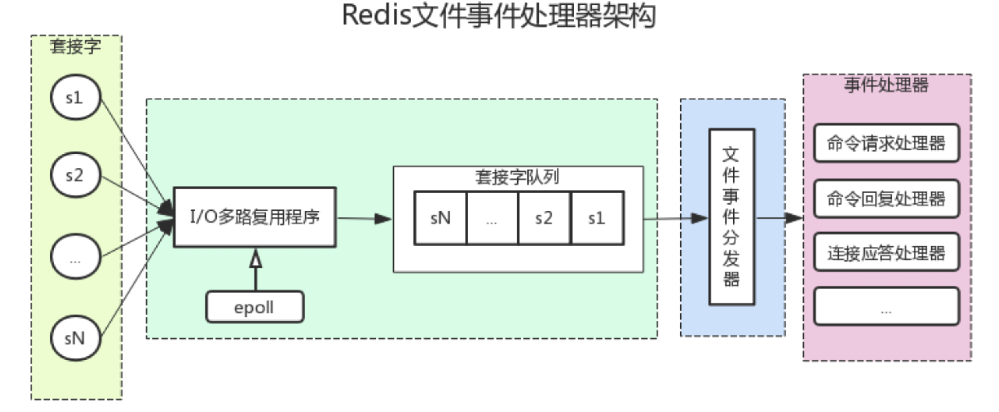

## Redis为什么那么快


1. Redis 的所有数据都放在内存中，但是内存的读写速度本身就比磁盘快几个数量级
2. Redis 采用了基于 IO 多路复用技术的事件驱动模型来处理客户端请求和执行 Redis 命令。
3. Redis对底层数据结构进行了极致的优化


## Redis的基本数据类型的底层原理

Redis 的基本数据结构（String、List、Hash、Set、Sorted Set）并非直接对应底层实现，而是通过 “对象系统”（redisObject）封装，每个对象包含 `type`（数据结构类型）和 `encoding`（底层编码方式）。底层编码会根据数据规模自动优化，平衡性能与内存占用。以下是各结构的底层原理：

### 1. String（字符串）

**底层编码**：`int` / `embstr` / `raw`（基于 SDS 实现）
String 是 Redis 最基础的结构，底层依赖 **SDS（Simple Dynamic String，简单动态字符串）** 而非 C 语言原生字符串，SDS 结构如下（以 `sdshdr8` 为例）：


c


运行


```c
struct sdshdr8 {
    uint8_t len;   // 已使用长度（O(1) 获取字符串长度）
    uint8_t alloc; // 总分配长度（避免频繁扩容）
    unsigned char flags; // 标识 SDS 类型（如 sdshdr8/16/32/64，按长度选类型节省内存）
    char buf[];    // 字节数组（存储实际数据）
};
```


- **int**：当值为整数（如 `123`），直接用 `long` 类型存储（无需 SDS），节省内存。
- **embstr**：当字符串长度 ≤ 39 字节（Redis 3.2+），`redisObject` 与 SDS 连续存储（一块内存），减少内存碎片。
- **raw**：当字符串长度 > 39 字节，`redisObject` 与 SDS 分开存储（两块内存），适合长字符串。

### 2. List（列表）

**底层编码**：`quicklist`（Redis 3.2+ 统一使用，替代早期的 ziplist + linkedlist）
List 是有序、可重复的元素集合，底层通过 **quicklist** 实现，它是 “ziplist 组成的双向链表”，结合了 ziplist 节省内存和 linkedlist 灵活操作的优点。


- **ziplist**：压缩列表，连续内存块，存储短元素时节省空间。每个节点包含 `prevlen`（前节点长度，支持反向遍历）、`encoding`（数据类型）、`data`（实际数据）。
- **quicklist**：将多个 ziplist 作为节点，用双向链表连接。每个 ziplist 长度由配置 `list-max-ziplist-size` 控制（默认 -2，即每个 ziplist 最多 8KB）。


**优势**：既避免了 linkedlist 内存碎片多的问题，又解决了 ziplist 过长时插入删除效率低的问题。

### 3. Hash（哈希表）

**底层编码**：`ziplist` / `hashtable`
Hash 是键值对集合（field-value），底层根据数据规模动态切换编码：


- **ziplist**：当满足两个条件时使用：
    - 键值对数量 ≤ `hash-max-ziplist-entries`（默认 512）；
    - 所有 field 和 value 长度 ≤ `hash-max-ziplist-value`（默认 64 字节）。
      存储方式：field 和 value 连续存放（field1 → value1 → field2 → value2...），按插入顺序排列。
- **hashtable**：不满足 ziplist 条件时使用，即 Redis 字典结构，类似 Java HashMap：
    - 由 2 个哈希表（`ht[0]` 主表，`ht[1]` 用于 rehash）组成，数组 + 链表解决哈希冲突；
    - 支持 **渐进式 rehash**：扩容时逐步将 `ht[0]` 数据迁移到 `ht[1]`，避免阻塞主线程。

### 4. Set（集合）

**底层编码**：`intset` / `hashtable`
Set 是无序、不可重复的元素集合，底层根据元素类型和数量切换编码：


- **intset**：当所有元素为整数，且数量 ≤ `set-max-intset-entries`（默认 512）时使用，是 “有序整数数组”：
    - 支持动态升级（int16 → int32 → int64），根据最大元素值自动调整存储类型；
    - 有序存储，通过二分查找快速定位元素（O (logn)）。
- **hashtable**：当元素包含非整数，或数量超过阈值时使用，本质是字典（仅用 key 存储元素，value 为 null），利用哈希表的 O (1) 查找 / 插入 / 删除特性。

### 5. Sorted Set（有序集合，ZSet）

**底层编码**：`ziplist` / `skiplist + dict`
ZSet 是有序、不可重复的元素集合（按 score 排序），底层根据数据规模切换编码：


- **ziplist**：当满足两个条件时使用：
    - 元素数量 ≤ `zset-max-ziplist-entries`（默认 128）；
    - 所有 member 长度 ≤ `zset-max-ziplist-value`（默认 64 字节）。
      存储方式：每个元素由两个连续节点组成（member → score），按 score 升序排列。
- **skiplist + dict**：不满足 ziplist 条件时使用，两者共享元素内存（避免重复存储）：
    - **skiplist（跳跃表）**：多层有序链表，支持 O (logn) 的范围查询（如 `ZRANGE`）和按 score 排序；
    - **dict（字典）**：支持 O (1) 的通过 member 快速查询 score。

### 总结

Redis 底层设计的核心是 “自适应优化”：对小规模、短数据用紧凑结构（ziplist、intset）节省内存；对大规模、长数据用灵活结构（hashtable、skiplist、quicklist）保证性能。这种设计让 Redis 在内存效率和操作速度之间达到了平衡。


## IO多路复用

多路是指网络连接，复用指的是同一个线程

- IO 多路复用是一种同步IO模型，实现一个线程可以监视多个文件句柄；
- 一旦某个文件句柄就绪，就能够通知应用程序进行相应的读写操作；
- 没有文件句柄就绪就会阻塞应用程序，交出CPU。

### select

它仅仅知道了，有I/O事件发生了，却并不知道是哪那几个流（可能有一个，多个，甚至全部），我们只能无差别轮询所有流，找出能读出数据，或者写入数据的流，对他们进行操作。所以select具有O(n)的无差别轮询复杂度，同时处理的流越多，无差别轮询时间就越长。

**缺点**
- 单个进程所打开的FD是有限制的，通过 FD_SETSIZE 设置，默认1024 ;
- 每次调用 select，都需要把 fd 集合从用户态拷贝到内核态，这个开销在 fd 很多时会很大；
- 对 socket 扫描时是线性扫描，采用轮询的方法，效率较低（高并发）

### poll
poll本质上和select没有区别，它将用户传入的数组拷贝到内核空间，然后查询每个fd对应的设备状态， 但是它没有最大连接数的限制，原因是它是基于链表来存储的.

**缺点**
- 每次调用 poll ，都需要把 fd 集合从用户态拷贝到内核态，这个开销在 fd 很多时会很大
- 对 socket 扫描是线性扫描，采用轮询的方法，效率较低（高并发时）

### epoll

epoll 是 Linux 特有的高性能 I/O 多路复用机制，它采用事件驱动的方式，仅会通知发生事件的文件描述符。
**优点**
- 运用红黑树来管理文件描述符，使用事件链表来存储就绪事件，在处理大量连接时，性能表现卓越。
- 采用回调机制，避免了轮询操作，不会随着描述符数量的增加而导致性能下降。
- 借助 mmap 实现了内核空间和用户空间的数据共享，减少了数据复制的开销。
- 

**缺点**
- 仅在 Linux 系统上可用，不具备跨平台性。

### epoll 水平触发（LT）与 边缘触发（ET）的区别？

EPOLL事件有两种模型：

- Edge Triggered (ET) 边缘触发只有数据到来,才触发,不管缓存区中是否还有数据。
- Level Triggered (LT) 水平触发只要有数据都会触发。

### 三者的比较

| 特性               | select             | poll               | epoll                |
| ------------------ | ------------------ | ------------------ | -------------------- |
| 文件描述符数量限制 | 通常为 1024        | 无明确限制         | 无明确限制           |
| 事件通知机制       | 轮询               | 轮询               | 事件驱动（回调）     |
| 时间复杂度         | O(n)               | O(n)               | O(1)                 |
| 数据复制           | 每次调用都需要复制 | 每次调用都需要复制 | 仅在添加描述符时复制 |


### Redis中的事件处理模式




### Redis为什么早期选择单线程

1. 单线程模型不需要考虑复杂的锁机制，不存在多线程环境下的死锁、竞态条件等问题，开发起来更快，也更
   容易维护
2. Redis 的核心功能是对内存中的数据结构（如字符串、哈希、列表等）进行操作，而内存操作的速度极快（纳秒级）。在早期场景中，Redis 的性能瓶颈往往不在于CPU 处理能力，而在于网络 I/O 速度（如客户端请求的接收与响应）或内存容量。
   单线程足以高效处理内存中的指令（因为内存操作本身耗时极短），多线程带来的线程切换、调度开销（微秒级）反而可能抵消并行计算的收益，导致整体性能下降。
3. 单线程可以保证命令执行的原子性，无需额外的同步机制
4. 无需考虑线程间的同步、通信（如线程安全的数据结构设计），降低了代码复杂度，便于开发和调试。
5. 数据结构的实现无需兼容多线程场景，可专注于优化内存效率和操作性能（如精简数据结构的实现细节）。
   这种简洁性让 Redis 早期能够快速迭代开发，同时保证了代码的稳定性（减少并发相关的 bug）。
6. 早期 Redis 的主要场景是缓存（如减轻数据库压力），核心需求是 “快速响应” 而非 “复杂计算”。单线程模型足以满足当时的性能需求（例如，单线程 Redis 在早期即可轻松达到每秒数万甚至数十万的 QPS），无需为了 “理论上的并行性” 引入不必要的复杂性。 


### Redis 6.0 使用多线程是

Redis 6.0 引入的多线程机制，核心目标是优化网络 IO 的性能瓶颈，且严格限定在网络数据的读取、写入和请求解析阶段，而核心的数据操作（如键值对的增删改查、数据结构的处理）仍保持单线程。这种设计既解决了单线程在高并发下的网络 IO 瓶颈，又延续了单线程模型在数据一致性和简单性上的优势。

#### 多线程处理网络 IO 的具体流程

Redis 6.0 的多线程网络 IO 处理流程大致如下：


1. **接收请求**：多个 IO 线程同时从不同客户端的 Socket 中读取网络数据（字节流）。
2. **解析请求**：IO 线程将读取的字节流解析为具体的 Redis 命令（如`GET key`、`SET key value`）。
3. **主线程处理命令**：解析后的命令被传递给主线程，由主线程单线程执行（操作内存中的数据结构，保证线程安全）。
4. **返回结果**：主线程执行完命令后，将结果交给 IO 线程，由 IO 线程将结果写回客户端的 Socket。

#### 设计的关键约束（保证安全性和简单性）

1. **核心操作仍单线程**：数据的增删改查、事务、Lua 脚本等核心逻辑仍由主线程单线程处理，避免了多线程操作共享数据带来的锁竞争和数据一致性问题。
2. **线程数量可控**：默认不启用多线程（需通过`io-threads-do-reads yes`开启），且线程数通常建议设置为 CPU 核心数（如 4 核 CPU 设为 4 线程），避免过多线程导致切换开销。
3. **无锁设计**：IO 线程仅处理 “网络数据” 和 “命令解析”，与主线程通过简单的队列传递数据（解析后的命令→主线程，执行结果→IO 线程），无需复杂的锁机制。