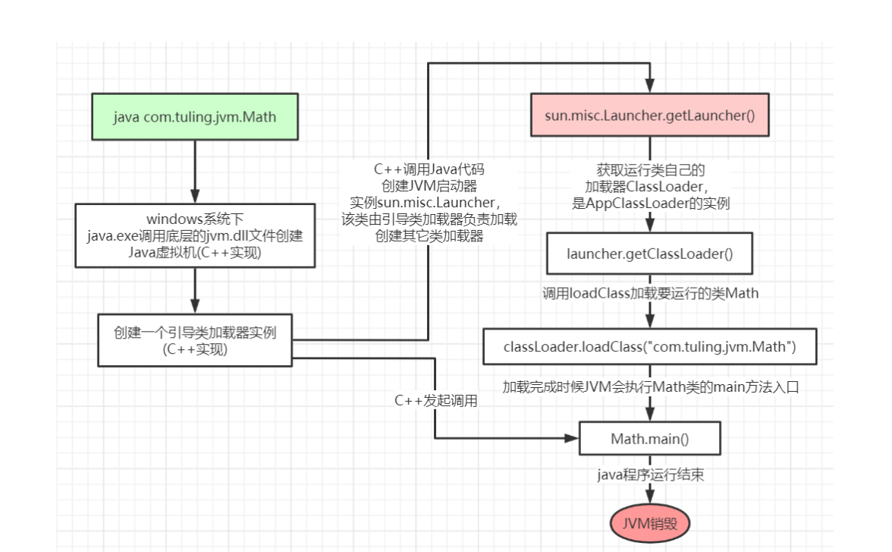
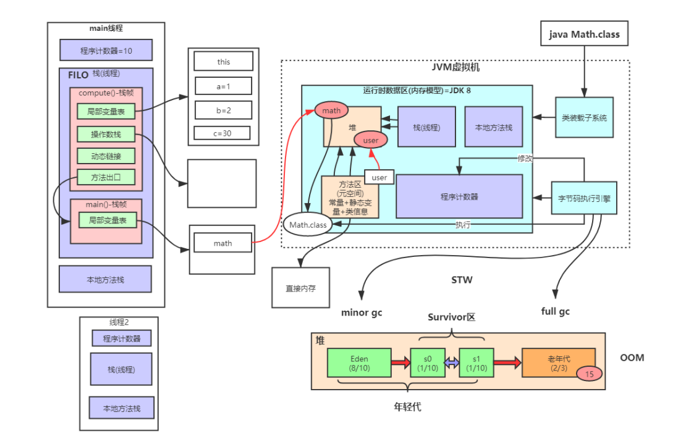
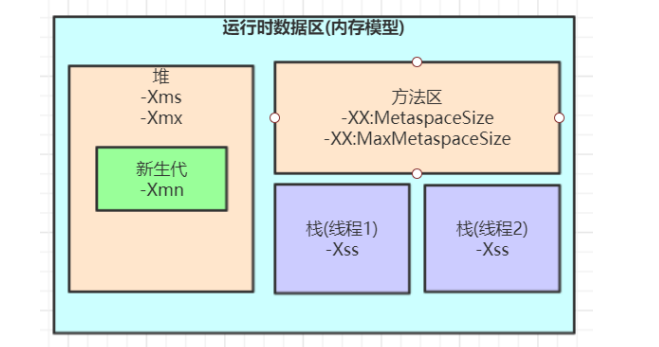
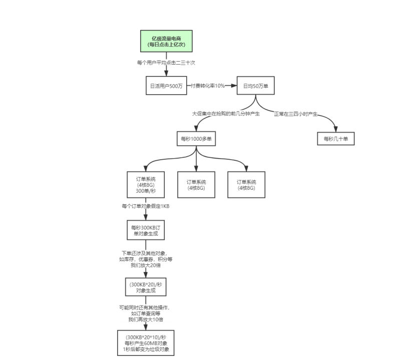
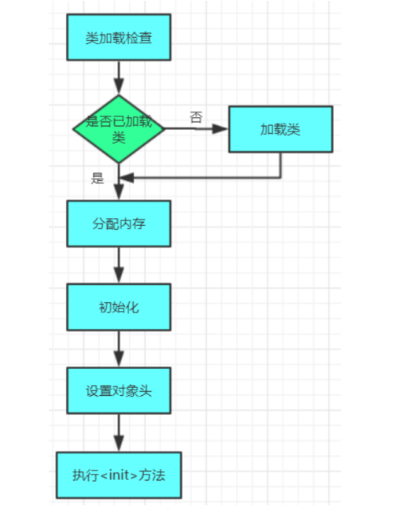
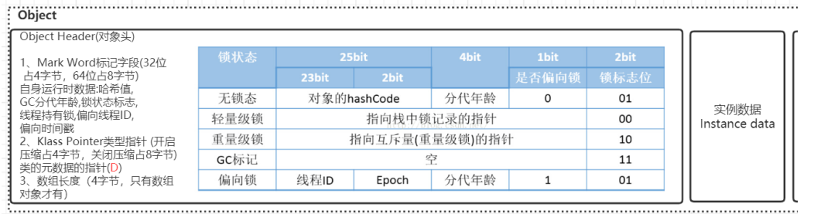
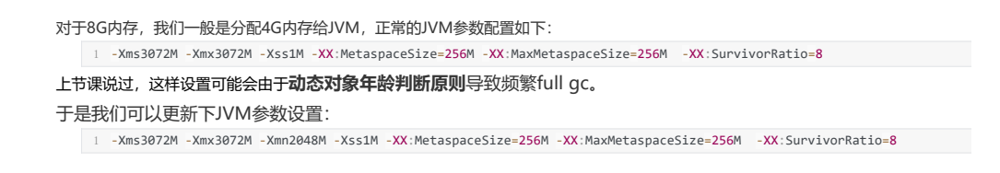

### Java执行命令的过程




其中loadClass的类加载过程有如下几步：**加载 >> 验证 >> 准备 >> 解析 >> 初始化 >> 使用 >> 卸载**


### Java中的类加载器

1. 引导类加载器（Bootstrap ClassLoader）： 主要负责加载JVM自身需要的类库，比如lib/rt.jar、resources.jar、charsets.jar等。
2. 扩展类加载器（Extension ClassLoader）： 主要负责加载JRE的扩展目录中类库，比如lib/ext.jar。
3. 应用程序类加载器（Application ClassLoader）： 主要负责加载用户类路径（ClassPath）上所有的库，比如用户自定义的.class文件。
4. 自定义类加载器（Custom ClassLoader）： 用户可以自定义类加载器，比如Tomcat的WebAppClassLoader。


### 双亲委派机制的过程

1. 当一个类加载器收到一个类的加载请求时，它会先尝试将这个请求委派给它的父类加载器去完成。
2. 如果父类加载器无法完成这个请求（例如在它的搜索路径中没有找到该类），那么子类加载器会尝试自己去加载这个类。
3. 这样做的目的是为了确保Java核心库的类型安全，避免用户自定义的类覆盖了JDK中的核心API。
4. 这样可以保证Java程序的稳定性和安全性。

### 双亲委派机制的好处

- **类型安全**：保证了Java核心库的类型安全，避免了用户自定义的类覆盖JDK中的核心API。
- **防止内存泄露**：每个类加载器都有自己的命名空间，这样就可以做到隔离性，不会出现同一个类被多次加载的情况。
- **易于管理**：双亲委派模型使得Java类加载器的层次结构清晰明了，便于管理和维护。

- 沙箱安全机制：自己写的java.lang.String.class类不会被加载，这样便可以防止核心
API库被随意篡改
- 避免类的重复加载：当父亲已经加载了该类时，就没有必要子ClassLoader再加载一次，保证被加载类的唯一性

### 如何打破双亲委派机制？

在某些情况下，我们可能需要打破双亲委派机制，比如需要动态地加载第三方库或者框架等。这时可以通过继承`java.lang.ClassLoader`并重写其`loadClass()`方法来实现。但是需要注意的是，这样做可能会破坏Java的类型安全性和稳定性，因此需要谨慎使用。


### 加载过程

1. 首先，检查一下指定名称的类是否已经加载过，如果加载过了，就不需要再加载，直接
返回。
2. 如果此类没有加载过，那么，再判断一下是否有父加载器；如果有父加载器，则由父加
   载器加载（即调用parent.loadClass(name, false);）.或者是调用bootstrap类加载器来加
   载。
3. 如果父加载器及bootstrap类加载器都没有找到指定的类，那么调用当前类加载器的findClass方法来完成类加载

### **全盘负责委托机制**

全盘负责委托机制指的是当一个类加载器负责加载某个类的所有部分时，它必须确保该类的所有依赖也都由自己来加载。这样可以避免不同类加载器之间的冲突和混乱。


### Tomcat 如果使用默认的双亲委派类加载机制行不行

 不行，因为Tomcat需要加载的类非常多，而且很多都是第三方库。如果使用默认的双亲委派机制，那么这些第三方库就会被JDK自带的ClassLoader所加载，这样会导致一些问题：

1. **版本冲突**：不同的Web应用可能会用到不同版本的同一个第三方库，但是它们都被同一个ClassLoader（即系统ClassLoader）加载，这就会导致版本冲突。
2. **隔离性差**：所有的Web应用都共享一个ClassLoader，这意味着它们之间没有任何隔离，任何一个应用的改动都可能影响到其他应用。
3. **性能问题**：由于所有Web应用都共享一个ClassLoader，因此它们的类信息都会被缓存起来，这就导致了内存占用过高的问题。

**为了解决这些问题，Tomcat引入了自定义的类加载器架构，其中最核心的是`WebAppClassLoader`。它实现了自己的双亲委派模型，并且为每个Web应用创建了一个独立的类加载器实例，这样就可以实现类的隔离和版本控制。同时，`WebAppClassLoader`还支持热部署、动态重载等功能，使得Java Web开发更加灵活和高效。**


### JVM整体架构和内存模型




### JVM内存参数



XX：MaxMetaspaceSize： 设置元空间最大值， 默认是-1， 即不限制， 或者说只受限于本地内存大小。

-XX：MetaspaceSize： 指定元空间触发Fullgc的初始阈值(元空间无固定初始大小)， 以字节为单位，默认是21M，达到该值就会触发
full gc进行类型卸载， 同时收集器会对该值进行调整： 如果释放了大量的空间， 就适当降低该值； 如果释放了很少的空间， 那么在不超
过-XX：MaxMetaspaceSize（如果设置了的话） 的情况下， 适当提高该值。

由于调整元空间的大小需要Full GC，这是非常昂贵的操作，如果应用在启动的时候发生大量Full GC，通常都是由于永久代或元空间发生
了大小调整，基于这种情况，一般建议在JVM参数中将MetaspaceSize和MaxMetaspaceSize设置成一样的值，并设置得比初始值要大，对于8G物理内存的机器来说，一般我会将这两个值都设置为256M。


### Xss的大小设置关系

 -Xss： 设置每个线程的栈大小， 默认值依赖于平台。譬如在Solaris平台下，默认值为320KB， 在Saparc平台上默认为512KB。

**-Xss设置越小count值越小，说明一个线程栈里能分配的栈帧就越少，但是对JVM整体来说能开启的线程数会更多，反之则相反。**

### 堆内存大小设置关系

-Xms： 设置JVM启动时占用最小堆内存的大小， 默认值是物理内存的1/64；

-Xmx： 设置JVM可占用的最大堆内存大小， 默认值是物理内存的1/4；

-XX：NewSize： 设置新生代的最小空间大小， 默认值是整个堆大小的1/3；

-XX：MaxNewSize： 设置新生代的最大空间大小， 默认值与-Xmx相同， 即可以达到整个堆的最大值；

-XX：SurvivorRatio： 新生代中Eden区与两个Survivor区的比例值， 默认值是8， 即Eden:From:To=8:1:1；

-XX：PretenureSizeThreshold： 直接晋升到老年代的对象大小， 这个参数只对Serial和ParNew两款收集器有效；

-XX：+UseTLAB： 开启TL


### 日均百万级别的订单系统如何设置JVM参数



分析上面的img_3中的图设计出合理的JVM参数
1. -Xms： 堆内存最小值，一般设置为物理内存的1/4，或者1G，这样JVM启动时就占用了1G内存，这样能保证JVM启动时能分配到足够的内存，从而避免了频繁的GC。
2. -Xmx： 堆内存最大值，一般设置为物理内存的1/4或者2G，这样JVM在运行过程中能根据需要动态调整堆内存大小，从而避免了频繁的GC。
3. -Xss： 每个线程的栈大小，一般设置为256K或者512K，这样能保证JVM在运行过程中不会因为线程过多而出现内存溢出。
4. -XX：NewSize： 新生代的最小空间大小，一般设置为堆内存的1/3或者512M，这样能保证JVM在运行过程中不会因为新生代太小而出现频繁的GC。
5. -XX：MaxNewSize： 新生代的最大空间大小，一般设置为堆内存的1/3或者512M，这样能保证JVM在运行过程中不会因为新生代太大而出现频繁的GC。
6. -XX：SurvivorRatio： 新生代中Eden区与两个Survivor区的比例值，一般设置为8或者16，这样能保证JVM在运行过程中不会因为新生代太小而出现频繁的GC。
7. -XX：PretenureSizeThreshold： 直接晋升到老年代的对象大小，这个参数只对Serial和ParNew两款收集器有效，一般设置为1M或者2M，这样能保证JVM在运行过程中不会因为新生代太小而出现频繁的GC。
8. -XX：+UseTLAB： 开启TLAB，一般设置为true或者false，这样能保证JVM在运行过程中不会因为新生代太小而出现频繁的GC。
9. -XX：+UseConcMarkSweepGC： 开启CMS收集器，一般设置为true或者false，这样能保证JVM在运行过程中不会因为新生代太小而出现频繁的GC。
10. -XX：+UseParNewGC： 开启ParNew收集器，一般设置为true或者false，这样能保证JVM在运行过程中不会因为新生代太小而出现频繁的GC。

### JVM参数调优的宗旨

1. 避免内存碎片：JVM内存分配时，会尽量避免内存碎片，因此尽量避免频繁的GC。
2. 避免频繁的GC：JVM内存分配时，会尽量避免频繁的GC，因此尽量避免频繁的GC。
3. 避免内存溢出：JVM内存分配时，会尽量避免内存溢出，因此尽量避免频繁的GC。
4. 避免频繁的Full GC：JVM内存分配时，会尽量避免频繁的Full GC，因此尽量避免频繁的GC。
5. 避免频繁的Young GC：JVM内存分配时，会尽量避免频繁的Young GC，因此尽量避免频繁的GC。
6. 避免频繁的Old GC：JVM内存分配时，会尽量避免频繁的Old GC，因此尽量避免频繁的GC。
7. 避免频繁的PermGen GC：JVM内存分配时，会尽量避免频繁的PermGen GC，因此尽量避免频繁的GC。

通过上面这些内容介绍，大家应该对JVM优化有些概念了，就是尽可能让对象都在新生代里分配和回收，尽量别
让太多对象频繁进入老年代，避免频繁对老年代进行垃圾回收，同时给系统充足的内存大小，避免新生代频繁的进行垃圾回收


### 对象的创建

1. 类加载检查：虚拟机遇到一条new指令时，首先将去检查这个指令的参数是否能在常量池中定位到一个类的符号引用，并且检查这个符号引用代表的类是否已被加载、解析和初始化过。如果没有，那必须先执行相应的类加载过程。这里的new一般是指语言级别的，也就是new关键词、对象克隆、对象序列化等。
2. 分配内存：在类加载检查通过后，接下来虚拟机将为新生对象分配内存。对象所需内存的大小在类加载完成后便可确定。为对象分配空间的任务等同于把一块确定大小的内存从Java堆中划分出来。分配方式有“指针碰撞”和“空闲列表”两种，选择哪种分配方式由Java堆是否规整决定。

```这个步骤有两个问题：
1.如何划分内存。
2.在并发情况下， 可能出现正在给对象A分配内存，指针还没来得及修改，对象B又同时使用了原来的指针来分配内存的
情况。
划分内存的方法：
“指针碰撞”（Bump the Pointer）(默认用指针碰撞)
如果Java堆中内存是绝对规整的，所有用过的内存都放在一边，空闲的内存放在另一边，中间放着一个指针作为分界点
的指示器，那所分配内存就仅仅是把那个指针向空闲空间那边挪动一段与对象大小相等的距离。
“空闲列表”（Free List）
如果Java堆中的内存并不是规整的，已使用的内存和空 闲的内存相互交错，那就没有办法简单地进行指针碰撞了，虚拟
机就必须维护一个列表，记 录上哪些内存块是可用的，在分配的时候从列表中找到一块足够大的空间划分给对象实例，并更新列表上的记录
```

```解决并发问题的两种方案：
1. 锁分段：虚拟机将Java堆划分为多个段，每个段都用一个锁保护，当对象实例创建时，虚拟机会先尝试给对象分配内存，如果分配失败，则尝试分配给下一个段，直到成功为止。
2. 锁分段+锁粗化：虚拟机将Java堆划分为多个段，每个段都用一个锁保护，当对象实例创建时，虚拟机会先尝试给对象分配内存，如果分配失败，则尝试分配给下一个段，直到成功为止。当对象实例创建成功之后，虚拟机会尝试将对象实例的创建动作进行锁粗化，即将对象实例创建动作的锁范围尽可能的缩小，从而提高并发性能。
锁分段+锁粗化是解决并发问题的两种方案，它们都可以有效地提高对象的创建效率。
```

3. 初始化零值：内存分配完成后，虚拟机需要将分配到的内存空间都初始化为零值（不包括对象头），这一步操作保证了对象的实例字段在Java代码中可以不赋初始值就直接使用，程序能访问到这些字段的数据类型所对应的零值。
4. 设置对象头：初始化零值之后，虚拟机要对对象进行必要的设置，例如这个对象是哪个类的实例、如何才能找到类的元数据信息、对象的哈希码、对象的GC分代年龄等信息。这些信息存放在对象的对象头之中。根据虚拟机当前运行
5. 执行init方法：从虚拟机的视角来看，new指令之后紧接着就是执行<init>方法，即类的构造函数，之前的工作仅仅是保证了对象实例的创建动作能够正常进行，而对象的构造函数是真正初始化对象的关键。
6. 返回对象引用：通过上述步骤之后，一个新的对象已经完全创建出来，此时会将其引用赋值给调用new指令的变量。





### 压缩指针

### **一、指针压缩的基本原理**

#### **1. 传统指针（未压缩）**

在 64 位 JVM 中，理论上指针需要 64 位（8 字节）来表示内存地址，可寻址范围为 `2^64`（约 16EB）。但实际应用中，大部分系统的内存远小于这个范围（如常见的 8GB、32GB、256GB 等），导致指针中大量位闲置。例如：

- 若系统内存为 256GB（即 `2^38` 字节），理论上只需 38 位即可表示所有内存地址，但传统指针仍需 64 位。

#### **2. 压缩指针（Compressed OOPs）**

HotSpot JVM 通过以下方式将 64 位指针压缩为 32 位（4 字节）：

- **对齐优化**：强制对象起始地址对齐到 8 字节边界（即地址最后 3 位始终为 0，如 `0x1000`、`0x1008`、`0x1010` 等）。因此，地址的最后 3 位无需存储，可被省略。
- **压缩表示**：将实际地址除以 8（右移 3 位），用 32 位表示压缩后的地址。访问时，JVM 自动将压缩值乘以 8（左移 3 位）还原为真实地址。

**示例**：
若对象实际地址为 `0x1008`（二进制 `0001 0000 0000 1000`），压缩后存储为 `0x201`（二进制 `0010 0000 0001`，即 `0x1008 ÷ 8 = 0x201`）。

### **二、为什么需要指针压缩？**

#### **1. \**减少内存占用\****

- **压缩前**：每个对象引用占 8 字节，导致堆内存中指针占用空间显著增加（尤其是对象密集型应用）。

- 压缩后

  ：指针仅占 4 字节，减少约 50% 的指针内存开销。例如：

   - 若有 1 亿个对象引用，压缩前需 800MB 内存，压缩后仅需 400MB。

#### **2. \**提高缓存利用率\****

- 更小的指针意味着对象头和对象本身占用空间更小，缓存行（Cache Line）可容纳更多对象，减少缓存失效（Cache Miss），提升 CPU 访问效率。

#### **3. \**降低 GC 压力\****

- 减少堆内存使用量，降低 GC 频率和停顿时间。
- 压缩后的指针更易被 CPU 处理，加速 GC 标记和复制过程。

#### **4. \**兼容性与性能平衡\****

- 64 位 JVM 相比 32 位 JVM 的优势是支持更大内存，但传统 64 位指针会导致内存开销增加约 20%~30%。指针压缩在保留 64 位寻址能力的同时，接近 32 位 JVM 的内存效率。

### **三、指针压缩的启用条件**

指针压缩默认开启，但需满足以下条件：

1. **64 位 JVM**：32 位 JVM 本身使用 32 位指针，无需压缩。
2. **堆内存小于 32GB**：因为 32 位压缩指针最多可表示 `2^32 × 8 = 32GB` 的内存空间。若堆内存超过 32GB，JVM 会自动禁用指针压缩。
3. **无自定义 `-XX:-UseCompressedOOPs` 参数**：通过该参数可显式禁用指针压缩。
4. 堆内存小于4G时，不需要启用指针压缩，jvm会直接去除高32位地址，即使用低虚拟地址空间

### **四、指针压缩的局限性**

1. **堆内存上限**：最大支持 32GB 堆内存（实际可能略低，因对齐等开销）。若需更大内存，需禁用指针压缩，但会增加内存开销。
2. **对齐限制**：对象必须按 8 字节对齐，可能导致部分内存碎片化（但通常影响较小）。
3. **性能开销**：指针解压缩需要额外计算（左移 3 位），但现代 CPU 对此操作效率极高，通常可忽略不计。

### **五、如何验证指针压缩是否启用？**

1. **查看 JVM 启动日志**：
   添加 `-XX:+PrintFlagsFinal` 参数，搜索 `UseCompressedOOPs`：


### 四种引用





   ```bash
   java -XX:+PrintFlagsFinal -version | grep UseCompressedOOPs
   # 输出: bool UseCompressedOOPs = true {product}
   ```

2. **通过代码检测**：


   ```java
   import sun.misc.Unsafe;
   import java.lang.reflect.Field;
   
   public class PointerSizeCheck {
       public static void main(String[] args) throws Exception {
           Field theUnsafe = Unsafe.class.getDeclaredField("theUnsafe");
           theUnsafe.setAccessible(true);
           Unsafe unsafe = (Unsafe) theUnsafe.get(null);
           System.out.println("Pointer size: " + unsafe.addressSize() * 8 + " bits");
       }
   }
   ```

- 压缩时输出 `4 bytes`（32 位）；
- 未压缩时输出 `8 bytes`（64 位）。

### **六、总结**

指针压缩是 HotSpot JVM 针对 64 位环境的关键优化技术，通过地址对齐和数值缩放将 64 位指针压缩为 32 位，显著减少内存占用并提升性能。其核心价值在于：

- 在保留 64 位寻址能力的同时，接近 32 位 JVM 的内存效率；
- 降低 GC 压力，提高缓存利用率；
- 适用于大多数堆内存不超过 32GB 的应用场景。

当堆内存超过 32GB 时，需权衡内存容量与指针开销，或考虑使用分层指针（Class Data Sharing）等其他优化技术。