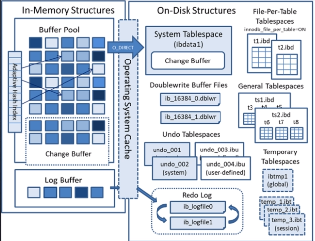

## free链表

Innodb中的Bufferpool中的free链表是用来管理空闲的页面的。当页面被释放时，它们会被加入到free链表中以便后续使用。

## flush链表

## lru链表 

lru链表管理正在被使用的缓存页，按照页面的访问频率排序，便于淘汰不常用的页面。

分为冷热两部分，是对常规的lru的改进，新读取的页面先放入冷端，若被再次访问则移动到热端，保证常用页面留在 Buffer Pool 中。

淘汰机制：当需要新缓存页时，优先淘汰 LRU 链表尾部（冷端最久未使用）的页面。

## Bufferpool中还有一个适应性哈希的概念

InnoDB存储引擎引入了一个称为“适应性哈希索引”（Adaptive Hash Index）的优化技术。这个特性允许InnoDB自动地为某些频繁访问的数据页创建哈希索引，从而提高查询效率。

当数据库执行一个查询时，如果发现某个数据页被多次连续读取（例如，通过主键或唯一索引进行查找），InnoDB会自动在该数据页上创建一个哈希索引。这样，下次对该数据的快速定位就可以直接使用该哈希索引而无需遍历B+树结构，从而显著提高性能。

需要注意的是，这种自适应哈希索引是动态生成的，并且只在需要的时候才会存在。它不会占用额外的磁盘空间，也不会影响原有的B+树结构的完整性。但是，在某些情况下，过多的哈希索引可能会降低更新操作的性能，因为它们需要在每次修改后保持同步。因此，在使用自适应哈希索引时，需要根据实际情况进行调整和监控。

总的来说，适应性哈希索引是一种在特定场景下能够显著提升查询性能的技术，但它也需要根据实际工作负载和数据特征来合理配置和使用。

### 一、内存结构（In-Memory Structures）

1. **Buffer Pool（缓冲池）**
    - 作用：InnoDB 性能核心，缓存磁盘数据页（表数据、索引等），避免频繁磁盘 IO。
    - 内部管理：
        - 用 **LRU 链表** 维护缓存页热度（区分 “热页”“冷页”，优先淘汰冷页）；
        - 含 **Adaptive Hash Index（自适应哈希索引）** ，加速热点数据查询；
        - 嵌入 **Change Buffer（变更缓冲区）** ，异步缓存非唯一索引的修改（延迟合并到磁盘，降低写性能损耗）。
2. **Log Buffer（日志缓冲区）**
    - 作用：临时缓存 redo log（ redo 日志），批量刷盘减少磁盘 IO 次数。
    - 刷盘时机：事务提交时（默认）、缓冲区满、或定期（如 1 秒）刷入磁盘 redo log 文件。

### 二、磁盘结构（On-Disk Structures）

1. **System Tablespace（系统表空间，ibdata1）**
    - 作用：存储 InnoDB 元数据（如数据字典、Undo 日志默认存储区）、共享表数据（若未开启 `innodb_file_per_table`）。
    - 特殊点：默认包含 **Change Buffer** 持久化区域，存储内存 Change Buffer 的异步合并内容。
2. **Doublewrite Buffer Files（双写缓冲区文件，ib_\*.dblwr）**
    - 作用：解决 “部分写失效” 问题。刷脏页到磁盘前，先写双写文件；若宕机导致页写入不完整，重启时从双写文件恢复完整页，保障数据一致性。
3. **Undo Tablespaces（回滚表空间，undo_\*.ibu 等）**
    - 作用：存储 Undo 日志（事务回滚、MVCC 读历史版本），支持事务回滚、多版本并发控制。
    - 分类：系统 Undo 表空间（`undo_001`/`undo_002`）、用户自定义 Undo 表空间（`undo_003`/`undo_004` 等）。
4. **Redo Log（重做日志，ib_logfile0/ib_logfile1）**
    - 作用：持久化记录事务修改，宕机时可基于 redo log 恢复未落盘的脏页，保障事务持久性（Durability）。
    - 特点：循环写、顺序 IO，性能远高于随机写磁盘数据页。
5. **File-Per-Table Tablespaces（独立表空间，t1.ibd/t2.ibd 等）**
    - 开启条件：`innodb_file_per_table=ON` 时，每张表独立生成 `.ibd` 文件，存储表数据与索引。
    - 优势：方便单表管理（如迁移、 truncate ），避免系统表空间膨胀。
6. **General Tablespaces（通用表空间，ts1.ibd/ts2.ibd 等）**
    - 作用：手动创建的共享表空间（`CREATE TABLESPACE …`），可存储多张表数据，灵活管理表存储位置。
7. **Temporary Tablespaces（临时表空间）**
    - 分类：
        - 全局临时表空间（`ibtmp1`）：存储会话临时表、内部临时表。
        - 会话临时表空间（`temp_*.ibt`）：每个会话独立，存储会话级临时数据，会话结束后回收。

### 三、核心交互流程

- **写流程**：
    1. 事务修改数据 → 先写 `Log Buffer` → 提交时刷 `redo log` 到磁盘；
    2. 数据页修改（若为非唯一索引）→ 异步缓存到 `Change Buffer`；
    3. 脏页（修改后的数据页）在合适时机（如缓存池满、后台线程触发）→ 先写 `Doublewrite Buffer` → 再落盘到数据文件（表空间）。
- **读流程**：
    1. 优先查 `Buffer Pool`，命中则直接返回；
    2. 未命中则从磁盘加载数据页到 `Buffer Pool`，同时可能触发 `Change Buffer` 合并（将异步修改应用到数据页）。

### 四、关键设计目的

- **性能**：通过 `Buffer Pool` 缓存、`Change Buffer` 异步写、`Log Buffer` 批量刷盘，减少磁盘 IO 依赖。
- **数据一致性**：`redo log` 保障事务持久化，`Doublewrite Buffer` 解决部分写失效，`Undo log` 支持回滚与 MVCC。
- **灵活性**：`innodb_file_per_table` 分离表空间、`General Tablespaces` 自定义存储、临时表空间隔离会话数据，适配不同场景需求。

## 双写缓冲区

### 1. 解决部分写失效问题

当 InnoDB 将内存中的脏页（已修改但未写入磁盘的页）刷新到磁盘时，若发生意外宕机（如断电），可能导致**数据页只写入了一部分**（例如一个 16KB 的页只写了 8KB 就中断）。这种 "部分写" 会导致磁盘上的页结构损坏，且无法通过 redo log 恢复（因为 redo log 记录的是页的修改操作，而非完整页数据）。

双写缓冲区通过以下方式避免此问题：

- 脏页刷新时，先将完整的页数据写入**双写缓冲区**（位于磁盘的共享表空间，连续存储）。
- 成功写入双写缓冲区后，再将数据从双写缓冲区写入实际的数据文件（.ibd）。
- 若宕机发生在写入数据文件的过程中，重启后 InnoDB 可从双写缓冲区中读取完整的页数据，覆盖损坏的部分，再通过 redo log 恢复后续修改。

### 2. 平衡性能与可靠性

虽然双写缓冲区本质上是 "写两次数据"（先写缓冲区，再写数据文件），但由于：

- 双写缓冲区的存储空间是连续的，写入效率高（顺序 IO）。
- 仅在刷新脏页时触发，而非每次页修改。

因此，其带来的性能损耗通常在 10% 以内，却显著提升了数据可靠性。