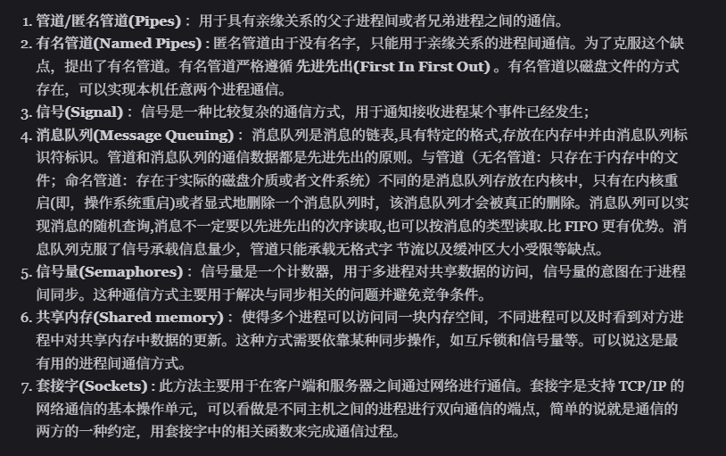

### 1. **进程管理（Process Management）**

负责对计算机中运行的程序（进程）进行管理，是操作系统最核心的功能之一。


- **核心任务**：进程的创建、调度、终止，以及进程间的同步与通信（如解决进程冲突、资源竞争问题）。
- **关键机制**：通过进程调度算法（如时间片轮转、优先级调度）分配 CPU 资源，确保多个进程高效并发执行。

### 2. **内存管理（Memory Management）**

对计算机内存（主存）资源进行分配、回收和保护，确保多个进程安全、高效地使用内存。


- **核心任务**：内存空间的分配与释放、地址映射（虚拟内存与物理内存的转换）、内存保护（防止进程越界访问）、虚拟内存管理（通过硬盘扩展内存空间）。
- **关键机制**：分页（Paging）、分段（Segmentation）、虚拟内存技术（如请求分页）。

### 3. **文件管理（File Management）**

负责对存储在外部设备（如硬盘、SSD）上的文件进行组织、访问和保护。


- **核心任务**：文件的创建、删除、读写，目录结构的维护（如树形目录），文件权限管理（读 / 写 / 执行权限），以及文件存储空间的分配与回收。
- **关键机制**：文件系统（如 FAT32、NTFS、EXT4）、索引节点（Inode）、目录项等。

### 4. **设备管理（Device Management）**

对计算机的外部设备（如键盘、磁盘、打印机、网络卡等）进行管理，协调设备与 CPU、内存之间的数据交换。


- **核心任务**：设备的分配与回收、I/O 操作的控制（如中断驱动、DMA 直接内存访问），以及设备驱动程序的管理。
- **关键机制**：设备控制器、I/O 调度算法（如先来先服务、优先级调度）、中断处理程序。

### 5. **作业管理（Job Management）**

处理用户提交的 “作业”（即用户要求计算机完成的一系列任务），负责作业的调度、执行与控制。


- **核心任务**：接收用户作业、按照一定策略（如批处理调度算法）安排作业执行顺序，监控作业的运行状态（如运行、就绪、完成），并返回结果。
- **适用场景**：在批处理系统中尤为重要（如服务器批量处理任务）。

### 6. **用户接口管理（User Interface Management）**

提供用户与操作系统交互的方式，是用户操作计算机的 “桥梁”。


- 核心形式

  ：

    - 命令接口（如 Linux 的 Shell、Windows 的 CMD）：通过输入命令执行操作；
    - 图形用户接口（GUI，如 Windows 的桌面、macOS 的图形界面）：通过图标、窗口等可视化元素操作；
    - 程序接口（系统调用，如 C 语言的`fork()`、`open()`）：供应用程序调用操作系统功能。


这六大管理功能相互配合，使操作系统能够高效、安全地协调计算机的硬件资源（CPU、内存、设备）和软件资源（文件、程序），为用户和应用程序提供稳定的运行环境。


进程和线程的管理：进程的创建、撤销、阻塞、唤醒，进程间的通信等。

存储管理：内存的分配和管理、外存（磁盘等）的分配和管理等。

文件管理：文件的读、写、创建及删除等。设备管理：完成设备（输入输出设备和外部存储设备等）的请求或释放，以及设备启动等功能。

网络管理：操作系统负责管理计算机网络的使用。网络是计算机系统中连接不同计算机的方式，操作系统需要管理计算机网络的配置、连接、通信和安全等，以提供高效可靠的网络服务。

安全管理：用户的身份认证、访问控制、文件加密等，以防止非法用户对系统资源的访问和操作


## 为什么要有用户态和内核态？只有一个内核态不行么？

计算机区分**用户态（User Mode）** 和**内核态（Kernel Mode）**，本质是为了实现**权限隔离与系统安全**，这是多任务操作系统发展的必然结果。如果只有一个内核态，整个系统的稳定性、安全性和可控性会被彻底破坏。

### 核心问题：为什么不能只有内核态？

内核态拥有**最高权限**（可以直接访问所有硬件资源，如 CPU、内存、磁盘、网卡等，也能执行所有指令）。如果所有程序（包括应用程序）都在 kernel 态运行，会导致两个致命问题：

#### 1. **应用程序失控会直接摧毁系统**

应用程序（如浏览器、文档编辑器）本质上是用户编写的代码，可能存在 Bug、逻辑错误甚至恶意行为（如病毒）。


- 若在 kernel 态运行，一个应用程序的错误（比如误修改内核数据结构、越界访问内存、直接操作硬件）会直接影响操作系统内核本身。例如：
    - 一个 bug 可能覆盖内核的进程调度表，导致所有程序无法被调度；
    - 恶意程序可以直接读写硬盘上的系统文件（如删除操作系统内核），或监听键盘输入窃取密码。
- 最终结果：整个系统会因单个程序的问题而崩溃，且无法隔离故障。

#### 2. **资源竞争失控，系统无法有序运行**

操作系统的核心职责是**统一管理硬件资源**（CPU、内存、IO 设备等）。如果所有程序都在 kernel 态，意味着它们可以直接争抢资源，而没有 “裁判”（内核）进行协调：


- 多个程序可能同时试图读写同一块内存，导致数据混乱；
- 某个程序可能长期占用 CPU 或硬盘，导致其他程序无法运行（即 “饿死”）；
- 没有统一的权限控制，任何程序都能随意修改其他程序的内存或文件（比如进程 A 直接删除进程 B 的数据）。

### 用户态与内核态的本质作用：权限隔离

两者的核心区别是**运行权限**：


- **内核态**：权限最高，可执行所有 CPU 指令，直接访问所有硬件资源（如物理内存、磁盘控制器、网卡），负责核心资源管理（进程调度、内存分配、IO 控制等）。
- **用户态**：权限极低，只能访问被内核分配的有限资源（如用户程序自己的内存空间），不能直接操作硬件，也不能执行特权指令（如修改 CPU 状态、切换内存页表）。

### 如何协作？通过 “系统调用” 架起桥梁

用户态程序若需要访问内核态资源（如读写文件、分配内存），不能直接操作，必须通过**系统调用（System Call）** 向内核 “申请”：


1. 用户态程序触发系统调用（如 `open()` 打开文件），CPU 切换到内核态；
2. 内核验证请求的合法性（如权限检查），执行相应操作（如实际读写磁盘）；
3. 操作完成后，CPU 切回用户态，将结果返回给应用程序。

### 总结：区分的核心价值

1. **安全性**：隔离应用程序与内核，防止恶意或错误程序破坏系统核心资源；
2. **稳定性**：用户态程序崩溃（如 Bug）只会影响自身，不会牵连内核和其他程序；
3. **可控性**：内核统一管理资源，通过系统调用实现 “按需授权”，保证多任务环境下的有序运行。


因此，用户态与内核态的区分，是现代操作系统实现 “安全、稳定、高效” 的基础 ―― 没有这种隔离，多任务、多用户的计算机环境就无从谈起。


## 用户态和内核态是如何切换的？

### **1. 核心触发方式**

用户态到内核态的切换必须通过**特定的事件**触发，这些事件分为三类：

#### **（1）系统调用（System Call）**

- **场景**：用户程序主动请求内核服务（如打开文件、创建进程）。

- 机制

  ：

    1. 用户程序调用库函数（如 C 语言的`open()`、`read()`）；
    2. 库函数执行**软中断指令**（如 x86 的`int 0x80`或`syscall`），触发 CPU 从用户态切换到内核态；
    3. 内核根据系统调用号（如`open`对应`__NR_open`）执行相应服务例程；
    4. 处理完成后，通过`iret`/`sysret`指令返回用户态。

#### **（2）异常（Exception）**

- **场景**：用户程序执行过程中发生错误（如除零、非法内存访问）。

- 机制

  ：

    1. CPU 检测到异常（如缺页中断、段错误），自动保存当前上下文（PC、寄存器等）；
    2. 切换到内核态，跳转到**异常处理程序**（如 Linux 的`do_page_fault`）；
    3. 内核处理异常（如分配物理内存、终止错误进程）；
    4. 返回用户态（或终止程序）。

#### **（3）外部中断（Interrupt）**

- **场景**：硬件设备（如键盘、网卡）需要内核处理。

- 机制

  ：

    1. 设备通过中断控制器（如 8259A、APIC）向 CPU 发送中断信号；
    2. CPU 在每条指令执行结束后检查中断标志，若有中断则暂停当前程序；
    3. 切换到内核态，执行**中断处理程序**（如网卡驱动的数据包接收函数）；
    4. 处理完成后返回用户态，恢复被中断的程序。

### **2. 切换流程详解**

无论哪种触发方式，用户态与内核态的切换都遵循以下步骤：

#### **（1）保存上下文（Context Save）**

- 用户态

  ：

    - CPU 将当前程序的寄存器值（如 EAX、EBX）、程序计数器（PC）、堆栈指针（SP）等保存到**用户栈**。

- 内核态

  ：

    - 切换到**内核栈**（每个进程有独立的内核栈），保存用户态的寄存器值和状态信息（如 CS:IP、SS:SP）。
    - 修改**CPU 状态寄存器**（如 x86 的 EFLAGS），将特权级从 3（用户态）提升到 0（内核态）。

#### **（2）执行内核代码**

- CPU 跳转到

  中断向量表

  或

  系统调用表

  指定的地址，执行内核代码：

    - 系统调用：执行对应的内核服务例程（如`sys_open()`）；
    - 异常：执行异常处理程序（如`do_divide_error()`）；
    - 中断：执行设备驱动的中断处理函数（如`eth_rx()`）。

#### **（3）恢复上下文（Context Restore）**

- 内核处理完成后，通过

  iret

  （中断返回）或

  sysret

  （系统调用返回）指令：

    - 从内核栈恢复用户态的寄存器值和状态信息；
    - 修改 CPU 特权级，从内核态回到用户态；
    - 继续执行用户程序（从保存的 PC 处继续）。

### **3. 关键技术细节**

#### **（1）特权级与内存隔离**

- 硬件支持

  ：CPU 通过

  段寄存器

  （如 x86 的 CS、SS）和

  页表

  实现特权级检查。

    - 用户态只能访问**用户空间**（如 Linux 的 0~3GB）；
    - 内核态可访问**整个物理内存**（包括内核空间，如 Linux 的 3~4GB）。

#### **（2）中断向量表（IVT）与中断描述符表（IDT）**

- **IVT**：x86 实模式下的中断处理表，共 256 项，每项指向一个中断处理程序地址。
- **IDT**：保护模式下的中断表，支持更复杂的特权级检查和处理程序切换。

#### **（3）系统调用表**

- 内核维护一张

  系统调用表

  （如 Linux 的

  ```
  sys_call_table
  ```

  ），存储每个系统调用号对应的内核函数地址。

    - 例如：`sys_open`对应系统调用号`__NR_open`（通常为 2）。

### **4. 性能优化**

频繁的态切换会带来开销（约 100~1000 个 CPU 周期），现代操作系统通过以下技术优化：

#### **（1）快速系统调用（Fast System Call）**

- 传统`int 0x80`需通过软件模拟中断，开销较大；
- 现代 x86 架构使用`sysenter/sysexit`（Linux 2.6+）或`syscall/sysret`（x86-64），直接从用户态跳转到内核态，减少上下文切换开销。

#### **（2）批量系统调用**

- 例如 Linux 的`io_uring`，允许一次提交多个 IO 请求，减少态切换次数。

#### **（3）内核旁路技术**

- 如 DPDK（数据平面开发套件），允许用户态程序直接操作网卡，绕过内核，大幅提升网络性能。

### **总结**

用户态与内核态的切换是通过**硬件中断机制**和**软件异常处理**实现的，核心流程包括：


1. **触发事件**（系统调用、异常、外部中断）；
2. **上下文保存**（用户态→内核态）；
3. **执行内核代码**；
4. **上下文恢复**（内核态→用户态）。


这种设计既保证了系统安全性（用户程序无法直接操作内核），又提供了灵活性（通过系统调用访问内核服务），是现代操作系统的基石之一。

## 进程和线程的区别

进程（Process）和线程（Thread）是操作系统中管理任务的核心概念，二者的核心区别在于**资源拥有方式**和**调度粒度**。以下从多个维度对比二者的差异：

### **1. 定义与核心角色**

- **进程**：操作系统进行**资源分配**的基本单位。一个进程对应一个运行中的程序（如浏览器、微信），拥有独立的内存空间、文件描述符、进程控制块（PCB）等资源。
- **线程**：操作系统进行**CPU 调度**的基本单位。线程是进程的 “子任务”，共享所属进程的全部资源，仅拥有独立的线程控制块（TCB）、程序计数器（PC）、寄存器组和栈（私有栈）。

### **2. 核心差异对比**

| **维度**            | **进程（Process）**                               | **线程（Thread）**                              |
| ------------------- | ------------------------------------------------- | ----------------------------------------------- |
| **资源拥有**        | 拥有独立的资源空间（内存、文件句柄、PCB 等）      | 共享所属进程的所有资源（内存、文件句柄等）      |
| **调度单位**        | 不是 CPU 调度的基本单位（调度粒度粗）             | 是 CPU 调度的基本单位（调度粒度细）             |
| **切换开销**        | 大（需保存 / 恢复整个进程的资源状态，如地址空间） | 小（仅需保存 / 恢复线程私有数据，如寄存器、栈） |
| **通信方式**        | 需通过 IPC 机制（管道、消息队列、共享内存等）     | 可直接通过共享内存（如全局变量）通信            |
| **独立性**          | 高（一个进程崩溃不影响其他进程）                  | 低（一个线程崩溃可能导致整个进程崩溃）          |
| **创建 / 销毁开销** | 大（需分配资源，如内存空间）                      | 小（仅需创建线程控制块和私有栈）                |

### **3. 关键细节解析**

#### （1）资源隔离性

进程的地址空间是完全独立的（通过虚拟内存机制隔离），一个进程无法直接访问另一个进程的内存；而线程共享进程的地址空间，因此可以直接读写进程的全局变量、静态变量等。


例如：两个进程修改同一份数据，需通过 “共享内存”（IPC 的一种）显式共享；两个线程修改同一份数据，直接操作全局变量即可（但需加锁同步，避免竞态）。

#### （2）调度与切换

CPU 调度的对象是线程：当切换进程时，操作系统需要保存当前进程的**页表、内存映射、文件描述符表**等大量资源，切换成本高；当切换线程时，只需保存线程的**寄存器状态、私有栈指针**等少量数据，切换成本低。


因此，多线程更适合 “频繁切换” 的场景（如 Web 服务器处理并发请求），而多进程适合 “资源隔离” 的场景（如浏览器的标签页，避免一个页面崩溃影响其他页面）。

#### （3）生命周期

- 进程是独立的 “生命体”：创建时需分配内存、初始化 PCB；销毁时需释放所有资源，过程复杂。
- 线程依赖于进程：线程的创建只需初始化 TCB 和私有栈，依赖进程的资源；进程销毁时，所有线程会被强制终止。

#### （4）故障影响范围

- 进程崩溃通常是 “局部” 的：由于资源隔离，一个进程的崩溃（如内存访问越界）不会直接影响其他进程。
- 线程崩溃可能 “牵一发而动全身”：线程共享进程的内存和资源，若一个线程因错误（如空指针）导致进程内存损坏，可能导致整个进程（包括所有线程）崩溃。

### **4. 为什么需要线程？**

线程的核心价值是**在共享资源的基础上实现轻量的并发**：


- 减少开销：多线程比多进程更节省内存和 CPU 资源（避免重复分配资源）。
- 高效通信：线程间无需复杂的 IPC 机制，通过共享内存即可快速交换数据。
- 适应 IO 密集型任务：当一个线程等待 IO（如网络请求、磁盘读写）时，CPU 可调度同一进程的其他线程执行，提高 CPU 利用率。

### **总结**

- **进程是 “资源容器”**：负责资源的分配和隔离，保证系统稳定性。
- **线程是 “执行单元”**：负责实际的任务运行，实现高效的并发调度。


二者的关系可以概括为：**一个进程包含至少一个线程（主线程），多个线程共享进程的资源，共同完成进程的任务**。

## 进程间的通信方式有哪些？



## 进程的调度算法有哪些?

### **一、批处理系统常用调度算法（非交互式，侧重吞吐量和效率）**

这类算法适用于早期无交互的批处理任务（如大型计算），关注作业完成效率。

#### 1. 先来先服务（First-Come, First-Served, FCFS）

- **核心思想**：按进程到达就绪队列的先后顺序调度，先到的先执行，直到完成或阻塞。

- 特点

  ：

    - 非抢占式（一旦运行，直到结束或阻塞才释放 CPU）。
    - 优点：实现简单，公平（按顺序）。
    - 缺点：对短作业不友好（长作业可能导致短作业长时间等待，产生 “护航效应”：短作业跟着长作业缓慢前进）；平均周转时间长。

- **适用场景**：早期批处理系统，或对公平性要求高于效率的场景。

#### 2. 短作业优先（Shortest Job First, SJF）

- **核心思想**：优先调度**预计运行时间最短**的就绪进程（非抢占式）。

- 特点

  ：

    - 能显著降低平均周转时间和平均等待时间，提高系统吞吐量（单位时间完成更多作业）。
    - 缺点：
        - 需预先知道进程的运行时间（实际中难以精确获取）。
        - 可能导致长作业 “饥饿”（长期得不到调度）。

- **适用场景**：已知作业运行时间的批处理系统（如后台任务调度）。

#### 3. 最短剩余时间优先（Shortest Remaining Time First, SRTF）

- **核心思想**：SJF 的**抢占式版本**。当新进程到达时，若其预计运行时间**小于当前运行进程的剩余时间**，则立即抢占 CPU，调度新进程。

- 特点

  ：

    - 比 SJF 响应更快，更适合短作业突发的场景。
    - 缺点：仍需预知运行时间，且长作业饥饿问题更严重（新短作业不断抢占）。

### **二、交互式系统常用调度算法（侧重响应时间和公平性）**

交互式系统（如桌面、服务器）需快速响应用户操作，因此调度算法更关注**响应时间**和**公平性**。

#### 4. 时间片轮转（Round-Robin, RR）

- **核心思想**：给每个就绪进程分配固定长度的 “时间片”（如 10ms），进程用完时间片后被剥夺 CPU，放入就绪队列尾部，依次循环。

- 特点

  ：

    - 抢占式（时间片用完强制切换），保证各进程 “轮流” 使用 CPU，公平性好。
    - 响应时间可控（最多等待 N 个时间片，N 为就绪进程数）。
    - 时间片大小是关键：
        - 太小：上下文切换频繁，开销大（如时间片 = 1ms，切换耗时 0.1ms，开销占 10%）。
        - 太大：退化为 FCFS，短作业响应变慢。

- **适用场景**：分时系统（如 Linux、Windows 的基础调度逻辑）。

#### 5. 优先级调度（Priority Scheduling）

- **核心思想**：为每个进程分配优先级（数字表示，如 0-127，数值越大优先级越高），高优先级进程优先获得 CPU。

- 分类

  ：

    - 非抢占式：仅当前进程结束或阻塞时，才调度高优先级进程。
    - 抢占式：当高优先级进程进入就绪态时，立即剥夺低优先级进程的 CPU。

- 特点

  ：

    - 灵活性高（可按进程类型设置优先级，如前台交互进程优先级高于后台计算进程）。
    - 缺点：低优先级进程可能 “饥饿”（永远得不到调度）。
    - 解决饥饿：“老化” 机制（低优先级进程的优先级随等待时间增加而逐渐提高）。

- **适用场景**：需要区分任务重要性的系统（如实时任务优先于普通任务）。

#### 6. 最高响应比优先（Highest Response Ratio Next, HRRN）

- **核心思想**：综合考虑进程的**等待时间**和**预计运行时间**，优先级用 “响应比” 衡量：
  响应比等待时间预计运行时间预计运行时间等待时间预计运行时间
  响应比越高，优先级越高，非抢占式调度。

- 特点

  ：

    - 兼顾短作业（运行时间短，响应比高）和长作业（等待时间越长，响应比越高，避免饥饿）。
    - 缺点：需计算响应比，增加系统开销；非抢占式，对实时性支持弱。

- **适用场景**：批处理与交互式混合的系统，平衡效率与公平。

#### 7. 多级反馈队列（Multilevel Feedback Queue, MLFQ）

- **核心思想**：结合了优先级调度和时间片轮转的优点，是**实际操作系统中最常用的调度算法之一**（如 UNIX、Linux 早期版本）。

- 机制：

    - 设有多个队列（如 Q1, Q2, Q3...），优先级依次降低（Q1 最高）。
    - 新进程先进入 Q1，按时间片轮转（Q1 时间片小，如 10ms）。
    - 若进程在 Q1 用完时间片仍未结束，降入 Q2（时间片变大，如 20ms），以此类推（低优先级队列时间片更大）。
    - 高优先级队列有进程时，低优先级队列进程无法运行；若低优先级进程等待时间过长，“提升” 到高优先级队列（避免饥饿）。

- 特点

  ：

    - 短作业 / 交互进程（如键盘输入）在高优先级队列快速完成，响应快。
    - 长作业逐渐降入低优先级队列，用大时间片减少切换开销。
    - 无需预知进程运行时间，自适应调整。

### **三、实时系统调度算法（保证截止时间）**

实时系统（如自动驾驶、工业控制）要求任务在**截止时间前必须完成**，调度算法需满足 “时间确定性”。

#### 8. 最早截止时间优先（Earliest Deadline First, EDF）

- **核心思想**：按任务的 “截止时间”（必须完成的时间点）调度，截止时间最早的任务优先执行（抢占式）。

- 特点

  ：

    - 动态优先级（截止时间随任务动态变化），适用于**动态实时任务**（任务到达时间和截止时间不固定）。
    - 只要系统负载不超过 100%，就能保证所有任务在截止时间前完成。

#### 9. 速率单调调度（Rate Monotonic Scheduling, RMS）

- **核心思想**：针对**周期性实时任务**（如每 10ms 采集一次传感器数据），按 “周期” 分配静态优先级 ―― 周期越短（频率越高），优先级越高。

- 特点

  ：

    - 静态优先级（运行前确定），实现简单，可通过数学证明 “可调度性”（若总利用率≤n (2^(1/n)-1)，n 为任务数，则任务不会错过截止时间）。
    - 适用于周期性、可预测的硬实时任务（如航空电子系统）。

### **总结**

不同调度算法的设计是对 “效率”“公平”“响应时间”“截止时间” 的权衡，没有 “最优” 算法，只有 “最合适” 的：


- 批处理系统：SJF/SRTF（效率优先）、HRRN（平衡）。
- 交互式系统：RR（公平）、MLFQ（兼顾响应与效率）。
- 实时系统：EDF（动态）、RMS（静态周期任务）。


实际操作系统（如 Linux 的 CFS、Windows 的调度器）通常是这些算法的混合与优化，以适应复杂场景。

## 什么是僵尸进程和孤儿进程？

### **1. 僵尸进程（Zombie Process）**

#### 定义

僵尸进程是指**已经终止（退出），但父进程尚未读取其退出状态**的子进程。此时，该进程的实体（代码、数据、内存等）已被释放，但进程控制块（PCB，用于存储进程状态、PID 等元信息）仍保留在进程表中，占据一项表项。

#### 产生原因

进程终止时，内核会释放其占有的资源（如内存、打开的文件描述符等），但会保留其 PID、退出状态（如正常终止 0、错误码）、终止时间等信息，等待父进程通过`wait()`或`waitpid()`系统调用来读取。
如果父进程**未调用`wait()`/`waitpid()`**（例如父进程逻辑遗漏或陷入死循环），子进程的 PCB 就会一直留在进程表中，成为僵尸进程。

#### 特点

- 进程状态为`Z`（Zombie），可通过`ps`命令查看（状态列显示`Z+`）。
- 已无实际运行的代码和数据，仅占用进程表项（少量内存）。
- 无法被`kill`命令杀死（因为进程已终止，信号无效）。

#### 危害

进程表的容量是有限的（例如 Linux 默认进程数上限由`pid_max`控制）。若大量僵尸进程积累，会耗尽进程表项，导致系统**无法创建新进程**。

#### 如何避免 / 处理

- **父进程主动回收**：父进程在创建子进程后，需通过`wait()`/`waitpid()`主动获取子进程的退出状态，内核会释放子进程的 PCB。
- **父进程退出**：若父进程先于僵尸进程退出，僵尸进程会被`init`进程（或`systemd`，PID=1）收养，`init`会定期调用`wait()`回收其资源，僵尸进程随之消失。
- **信号处理**：父进程可注册`SIGCHLD`信号的处理函数（子进程终止时内核会向父进程发送`SIGCHLD`），在信号处理中调用`wait()`回收子进程。

### **2. 孤儿进程（Orphan Process）**

#### 定义

孤儿进程是指**父进程已终止（退出），但自身仍在运行**的子进程。

#### 产生原因

当父进程因异常崩溃、被杀死（如`kill -9`）等原因提前终止，而其创建的子进程仍在运行时，这些子进程就会失去父进程，成为孤儿进程。

#### 特点

- 进程仍在正常运行（状态为`R`/`S`等），拥有完整的资源（代码、数据、内存等）。
- 操作系统会自动将孤儿进程**过继给 init 进程（PID=1）**，init 进程成为其新的父进程。

#### 危害

孤儿进程本身是正常运行的进程，由 init 进程负责管理，当孤儿进程终止时，init 会调用`wait()`回收其资源，因此**通常不会产生危害**。

#### 示例

- 父进程`A`创建子进程`B`后，`A`意外崩溃，`B`仍在运行，则`B`成为孤儿进程，被 init 收养。

### **总结：核心区别**

| 维度       | 僵尸进程（Zombie）             | 孤儿进程（Orphan）               |
| ---------- | ------------------------------ | -------------------------------- |
| 进程状态   | 已终止（状态`Z`）              | 仍在运行（状态`R`/`S`等）        |
| 父进程状态 | 父进程存活，但未回收子进程状态 | 父进程已终止，子进程被 init 收养 |
| 资源占用   | 仅占用进程表项（PCB）          | 占用完整运行资源（代码、内存等） |
| 危害       | 可能耗尽进程表，无法创建新进程 | 无特殊危害，由 init 正常管理回收 |


简言之，僵尸进程是 “死而不腐”（已终止但未被回收），孤儿进程是 “父死子存”（父进程死亡但自身仍运行）。前者需要通过父进程主动处理避免积累，后者由操作系统自动托管，无需额外干预。

## 死锁

死锁是指多个进程因竞争资源而陷入互相等待的状态，且没有任何一个进程能继续推进。死锁的产生必须同时满足以下 4 个**必要条件**（缺一不可）：

### 1. 互斥条件（Mutual Exclusion）

资源具有排他性，即一个资源在同一时间只能被**一个进程占用**。


- 例如：打印机、独占文件等资源，同一时刻只能被一个进程使用，其他进程必须等待其释放后才能获取。

### 2. 持有并等待条件（Hold and Wait）

进程在**已经持有至少一个资源**的同时，又在等待获取其他进程正在持有的资源。


- 例如：进程 A 已占用资源 1，又请求资源 2；进程 B 已占用资源 2，又请求资源 1―― 此时两者都 “持有部分资源并等待对方的资源”。

### 3. 不可剥夺条件（No Preemption）

进程已获得的资源**不能被强制剥夺**，只能由进程主动释放。


- 例如：若进程 A 占用了资源 1，即使进程 B 急需该资源，也不能强行夺走资源 1，只能等待进程 A 主动释放。

### 4. 循环等待条件（Circular Wait）

存在一个**进程 - 资源的循环链**，链中的每个进程都在等待下一个进程持有的资源。


- 例如：进程 A 等待进程 B 的资源，进程 B 等待进程 C 的资源，进程 C 等待进程 A 的资源 ―― 形成闭环等待，无法打破。

### 关键结论

这 4 个条件是死锁产生的**必要条件**（死锁发生时必然同时满足），但不是充分条件（满足 4 个条件不一定必然发生死锁，只是存在可能）。


若要避免死锁，只需**破坏其中任意一个条件**即可（例如：通过资源有序分配破坏循环等待，通过允许资源剥夺破坏不可剥夺条件等）。


### ### 死锁场景说明

假设有两个进程（`P1`、`P2`）和两个互斥资源（`R1`、`R2`），资源同一时间只能被一个进程占用：


- `P1` 已持有 `R1`，并等待获取 `R2`；
- `P2` 已持有 `R2`，并等待获取 `R1`；
- 两者互相等待对方释放资源，形成死锁。


### 写一个模拟死锁的代码


```java
public class DeadlockExample {
    private static final Object resource1 = new Object();
    private static final Object resource2 = new Object();

    public static void main(String[] args) {
        // 创建线程1
        Thread thread1 = new Thread(() -> {
            synchronized (resource1) {
                System.out.println("线程1: 已获取资源1");
                
                try {
                    // 模拟执行一些操作
                    Thread.sleep(100);
                } catch (InterruptedException e) {
                    e.printStackTrace();
                }
                
                System.out.println("线程1: 正在等待资源2");
                synchronized (resource2) {
                    System.out.println("线程1: 已获取资源1和资源2");
                }
            }
        });

        // 创建线程2
        Thread thread2 = new Thread(() -> {
            synchronized (resource2) {
                System.out.println("线程2: 已获取资源2");
                
                try {
                    // 模拟执行一些操作
                    Thread.sleep(100);
                } catch (InterruptedException e) {
                    e.printStackTrace();
                }
                
                System.out.println("线程2: 正在等待资源1");
                synchronized (resource1) {
                    System.out.println("线程2: 已获取资源2和资源1");
                }
            }
        });

        // 启动两个线程
        thread1.start();
        thread2.start();

        // 等待两个线程执行完成
        try {
            thread1.join();
            thread2.join();
        } catch (InterruptedException e) {
            e.printStackTrace();
        }

        System.out.println("程序执行完成"); // 这行不会被打印，因为死锁导致程序无法结束
    }
}
```

**结果**

```java
线程1: 已获取资源1
线程2: 已获取资源2
线程1: 正在等待资源2
线程2: 正在等待资源1
```

## 解决死锁

解决死锁的方法可以分为**预防、避免、检测和解除**四大类，核心思路是通过破坏死锁产生的条件、动态规避风险、及时发现并处理死锁，从而保证系统的正常运行。以下是具体分析：

### **一、死锁预防（Deadlock Prevention）**

**核心思想**：通过破坏死锁产生的**四个必要条件中的至少一个**，从根源上避免死锁发生。

#### 1. 破坏 “互斥条件”

- **原理**：互斥条件是指资源只能被一个进程独占（如打印机、锁）。若能让资源 “可共享”，则不会产生互斥竞争。

- 措施

  ：

    - 将互斥资源改为共享资源（如用 “假脱机技术” 让打印机通过缓冲区共享，多个进程间接使用）。

- **局限性**：许多资源本质上必须互斥（如数据库锁、文件写权限），无法完全破坏，因此该方法适用场景有限。

#### 2. 破坏 “持有并等待条件”

- **原理**：进程在持有部分资源的同时等待其他资源，是死锁的重要诱因。若要求进程 “要么不持有资源，要么持有所有需要的资源”，则可避免该条件。

- 措施

  ：

    - **一次性申请所有资源**：进程启动时必须声明所需的全部资源，系统检查并一次性分配所有资源（未满足则进程等待，不持有任何资源）。
    - **释放已持有资源再申请**：进程若需新资源，必须先释放已持有的所有资源，再重新申请全部所需资源。

- **优点**：简单易实现。

- **缺点**：资源利用率低（资源可能长期被闲置），进程等待时间长（需等所有资源就绪）。

#### 3. 破坏 “不可剥夺条件”

- **原理**：若允许进程已持有的资源被 “强制剥夺”，则可打破 “持有并等待” 的僵局。

- 措施

  ：

    - 当进程申请新资源未被满足时，释放已持有的所有资源（进入等待状态，稍后重新申请）。
    - 优先级高的进程可剥夺优先级低的进程的资源（如实时系统中，高优先级任务抢占低优先级任务的 CPU 或内存）。

- 局限性

  ：

    - 仅适用于可保存状态的资源（如内存、CPU），对不可保存的资源（如打印机，打印到一半被剥夺会导致数据混乱）不适用。
    - 频繁剥夺会增加系统开销（需保存 / 恢复进程状态）。

#### 4. 破坏 “循环等待条件”

- **原理**：循环等待是死锁的直接表现，若能让资源申请 “有序化”，则可避免闭环。

- 措施

  ：

    - **资源按序分配**：为所有资源编号（如 R1=1，R2=2，…），进程必须按 “资源编号递增” 的顺序申请资源（如申请了 R2 后，只能申请编号≥2 的资源）。
    - 例：进程 P1 需 R1 和 R2，必须先申请 R1（编号 1）再申请 R2（编号 2）；进程 P2 需 R2 和 R1，也必须先申请 R1 再申请 R2―― 避免 P1 持 R1 等 R2、P2 持 R2 等 R1 的循环。

- **优点**：实现简单，资源利用率较高。

- **缺点**：资源编号需提前确定，灵活性低（新增资源需重新编号）；可能导致资源浪费（进程可能提前申请暂时不用的高编号资源）。

### **二、死锁避免（Deadlock Avoidance）**

**核心思想**：不刻意破坏死锁条件，而是在**资源分配时动态判断 “是否可能导致死锁”**，只允许 “安全” 的分配（即分配后系统仍存在安全序列）。

#### 关键算法：银行家算法（Banker's Algorithm）

- **原理**：模拟银行放贷逻辑 ―― 假设系统拥有 “可利用资源”，进程需声明 “最大资源需求” 和 “已分配资源”，每次分配资源前检查：若分配后存在 “安全序列”（所有进程可按此序列获得所需资源并完成），则允许分配；否则拒绝。
- **安全序列**：进程按顺序 P1→P2→…→Pn，每个进程 Pi 在获得剩余所需资源后可完成，释放资源供后续进程使用。
- **适用场景**：资源需求可预测的系统（如批处理系统），需进程提前声明最大资源需求。
- **优点**：资源利用率高于预防法，可动态规避死锁。
- **缺点**：需提前获取进程的最大资源需求，实际中难以精确预测；算法复杂度高（O (n?m)，n 为进程数，m 为资源类型数）。

### **三、死锁检测（Deadlock Detection）**

**核心思想**：允许死锁发生，但通过算法**定期检测系统是否存在死锁**，适合无法预测资源需求或追求高资源利用率的场景（如多用户交互式系统）。

#### 1. 检测方法：资源分配图化简法

- 原理

  ：用 “资源分配图”（进程为节点，资源为节点，箭头表示持有或等待）判断是否存在死锁：

    - 若图中存在**不可化简的循环**（即无法通过释放进程已完成的资源消除循环），则存在死锁。

- 步骤

  ：

    1. 找出没有等待资源的进程（可完成），释放其持有的资源，移除该进程及相关箭头。
    2. 重复步骤 1，若剩余进程仍存在等待箭头且形成循环，则判定为死锁。

#### 2. 检测时机

- 定期检测（如每 10 秒一次）。
- 当系统资源利用率骤降、进程等待时间过长时触发检测。

### **四、死锁解除（Deadlock Recovery）**

当检测到死锁后，需采取措施解除死锁，常用方法如下：

#### 1. 资源剥夺（Resource Preemption）

- **原理**：从死锁进程中强制剥夺部分资源，分配给其他死锁进程，直至死锁解除。

- 措施

  ：

    - 按 “最小代价” 选择剥夺对象（如优先级低、剩余运行时间长的进程）。
    - 剥夺资源前保存进程状态，以便后续恢复（如内存分页可换出到磁盘）。

#### 2. 进程终止（Process Termination）

- 原理

  ：终止部分或全部死锁进程，释放其资源以打破循环等待。

    - 终止所有死锁进程：简单彻底，但代价大（可能丢失未完成工作）。
    - 逐个终止进程：每次终止一个 “代价最小” 的进程（如优先级低、已运行时间短），重新检测死锁是否解除，直至死锁消失。

#### 3. 系统重启（System Restart）

- **原理**：极端情况下，直接重启系统，强制释放所有资源，适合死锁检测和解除成本过高的场景（如嵌入式系统）。
- **缺点**：会丢失所有进程的运行状态，代价最大，仅作为最后的手段。

### **总结：四种方法的对比**

| 方法 | 核心思路               | 资源利用率 | 适用场景                                   | 缺点                         |
| ---- | ---------------------- | ---------- | ------------------------------------------ | ---------------------------- |
| 预防 | 破坏死锁必要条件       | 低         | 资源需求简单、安全性优先（如实时系统）     | 限制多，灵活性差             |
| 避免 | 动态判断安全分配       | 中         | 资源需求可预测（如批处理系统）             | 需提前声明资源需求，算法复杂 |
| 检测 | 定期检测死锁存在       | 高         | 资源需求复杂、允许偶尔死锁（如交互式系统） | 检测有延迟，可能影响系统响应 |
| 解除 | 死锁发生后采取措施消除 | 高         | 无法预防 / 避免死锁的场景                  | 可能丢失数据（如终止进程）   |


实际系统中常结合多种方法（如 Linux 采用 “检测 + 部分解除”，通过 OOM killer 终止占用资源多的进程；数据库用 “预防（按顺序加锁）+ 检测（超时检测）”），平衡安全性和资源利用率。


## 进程和线程的区别

### 1. **定义与本质**

- **进程**：是程序的一次动态执行过程，是**资源分配的基本单位**。每个进程对应一套独立的资源（如内存空间、文件描述符、全局变量等），并包含至少一个线程（主线程）。
- **线程**：是进程内的一个执行单元，是**CPU 调度的基本单位**。线程不独立拥有资源，而是共享所属进程的全部资源（如内存、文件句柄等），仅拥有自己的栈空间、寄存器状态等少量私有数据。

### 2. **资源分配**

- **进程**：拥有独立的资源空间（如虚拟地址空间、堆、全局变量等），进程间资源不共享，彼此隔离。
- **线程**：不独立分配资源，共享所属进程的资源（如代码段、数据段、打开的文件等），仅私有少量执行相关的上下文（如栈、程序计数器）。

### 3. **开销与效率**

- **创建 / 销毁开销**：
  进程创建需要分配独立资源（如内存映射、页表等），开销大、速度慢；
  线程创建仅需分配少量私有数据（栈、寄存器），开销小、速度快（通常比进程快 10-100 倍）。
- **切换开销**：
  进程切换需要保存 / 恢复整个进程的资源上下文（如内存映射、文件句柄等），开销大；
  线程切换仅需保存 / 恢复少量私有上下文（栈、寄存器），开销小，响应更快。

### 4. **通信方式**

- **进程间通信（IPC）**：因进程地址空间独立，通信需依赖专门机制，如管道、消息队列、共享内存、信号量等，实现复杂。
- **线程间通信**：因共享进程的内存空间（如全局变量、堆），可直接通过读写共享数据通信，实现简单，但需注意同步（如用互斥锁、条件变量避免数据竞争）。

### 5. **独立性与健壮性**

- **进程**：独立性强，一个进程崩溃通常不会影响其他进程（因资源隔离）。
- **线程**：依赖性强，同一进程内的线程共享资源，一个线程崩溃可能导致整个进程崩溃（如内存越界污染共享数据）。

### 6. **适用场景**

- **进程**：适合处理独立任务（如浏览器的标签页、多用户服务），需严格隔离资源时使用。
- **线程**：适合处理协作任务（如服务器并发处理请求、单程序内的多任务分工），需高效共享数据时使用。

### 总结

进程是 “资源容器”，线程是 “执行单元”。进程强调资源隔离，线程强调高效协作。二者配合使用（如多进程 + 多线程）可兼顾稳定性与效率。


## 软连接和硬连接

- 1、硬链接就是在目录下创建一个条目，记录着文件名与 inode 编号，这个 inode 就是源文件的 inode 。删除任意一个条目，文件还是存在，只要引用数量不为 0 。但是硬链接有限制，它不能跨越文件系统，也不能对目录进行链接。
- 2、符号链接文件保存着源文件所在的绝对路径，在读取时会定位到源文件上，可以理解为 Windows 的快捷方式。当源文件被删除了，链接文件就打不开了。因为记录的是路径，所以可以为目录建立符号链接。
### 1. **本质与原理**

- **硬连接**：
  是通过**索引节点（inode）** 直接关联文件的链接。多个硬连接与原文件共享同一个 `inode`（索引节点，存储文件元数据，如大小、权限、数据块位置等），只是文件名不同。
  可以理解为：同一个文件的 “多个名字”。
- **软连接（符号链接）**：
  是一个**独立的文件**，自身有独立的 `inode`，其内容是指向另一个文件（或目录）的**路径字符串**（如 `../docs/file.txt`）。
  可以理解为：一个 “指向目标文件的快捷方式”。

### 2. **核心区别对比**

| 维度                       | 硬连接（Hard Link）                                          | 软连接（Symbolic Link）                                      |
| -------------------------- | ------------------------------------------------------------ | ------------------------------------------------------------ |
| **inode 编号**             | 与原文件相同（共享同一个 inode）                             | 有独立的 inode（与原文件不同）                               |
| **指向对象**               | 只能指向**文件**，不能指向目录（除特殊情况 `.` 和 `..`）     | 可指向**文件或目录**                                         |
| **跨文件系统**             | 不能跨文件系统（因不同文件系统 inode 编号独立）              | 可以跨文件系统（通过路径引用，与文件系统无关）               |
| **删除原文件的影响**       | 原文件被删除后，硬连接仍有效（只要有至少一个硬连接存在，文件数据不删除） | 原文件被删除后，软连接变为 “断链”（无效链接，访问时提示 “文件不存在”） |
| **文件大小**               | 与原文件大小相同（因共享数据）                               | 大小为 “指向目标的路径字符串长度”（如指向 `a.txt` 的软连接大小为 5 字节） |
| **权限显示**               | 与原文件权限一致（实际权限由 inode 决定）                    | 权限显示为 `lrwxrwxrwx`（但实际访问权限由目标文件决定）      |
| **链接计数（link count）** | 原文件的链接计数会随硬连接数量增加（删除硬连接时计数减少）   | 不影响原文件的链接计数（软连接自身是独立文件）               |
| **对目录的支持**           | 不支持（避免目录结构循环，如 `A` 链接到 `B`，`B` 链接到 `A` 会导致递归） | 支持（可链接目录，如 `ln -s /usr/local/bin ~/bin`）          |

### 3. **使用场景**

- **硬连接**：
  适合需要 “防止误删文件” 的场景。例如：重要文件创建硬连接后，即使原文件被删除，通过硬连接仍能访问数据（直到所有硬连接都被删除，文件数据才会真正被释放）。
  例：`ln file.txt file_link`（为 `file.txt` 创建硬连接 `file_link`）。
- **软连接**：
  适合 “便捷访问” 或 “跨路径 / 跨文件系统” 的场景。例如：
  - 缩短路径（如用 `ln -s /long/path/to/app ~/app` 快速访问深层目录的程序）；
  - 链接目录（如 `ln -s /data/docs ~/docs` 将数据盘目录链接到用户目录）；
  - 跨分区 / 磁盘链接（如从 `/dev/sda1` 链接到 `/dev/sdb1` 中的文件）。

### 4. **典型示例**

- **硬连接**：
  创建 `file.txt` 的硬连接 `link_hard` 后：

  bash


  ```bash
  touch file.txt
  ln file.txt link_hard
  ls -i file.txt link_hard  # 显示相同的 inode 编号
  rm file.txt               # 删除原文件
  cat link_hard             # 仍能正常访问文件内容（因 link_hard 仍指向 inode）
  ```

- **软连接**：
  创建 `file.txt` 的软连接 `link_soft` 后：

  bash


  ```bash
  touch file.txt
  ln -s file.txt link_soft
  ls -i file.txt link_soft  # 显示不同的 inode 编号
  rm file.txt               # 删除原文件
  cat link_soft             # 提示“没有那个文件或目录”（软连接失效）
  ```

### 总结

硬连接是 “同一文件的多个名字”，依赖 inode 关联，限制较多但稳定性强；软连接是 “指向目标的快捷方式”，独立存在，灵活但依赖目标路径的有效性。实际使用中，软连接因灵活性更常用，硬连接多用于需保护文件不被误删的场景


## 分页和分段有什区别？

- 分页对程序员是透明的，但是分段需要程序员显式划分每个段。
- 分页的地址空间是一维地址空间，分段是二维的。
- 页的大小不可变，段的大小可以动态改变。
- 分页主要用于实现虚拟内存，从而获得更大的地址空间；分段主要是为了使程序和数据可以被划分为逻辑上独立的地址空间并且有助于共享和保护。

### 1. **基本概念**

- **分页（Paging）**
  是一种将**物理内存**和**逻辑地址空间**都划分为固定大小的 “页框”（物理内存）和 “页面”（逻辑地址）的内存管理方式。
  - 页面大小通常为 4KB、8KB 等（由操作系统决定）。
  - 通过**页表**（Page Table）实现逻辑页号到物理页框号的映射。
- **分段（Segmentation）**
  是一种将**逻辑地址空间**按程序的**逻辑结构**（如代码段、数据段、堆栈段）划分为不同 “段” 的内存管理方式。
  - 段的长度不固定，取决于程序逻辑（如代码段大小由程序代码量决定）。
  - 通过**段表**（Segment Table）实现段号到物理内存基址的映射。

### 2. **核心区别对比**

| 维度             | 分页（Paging）                               | 分段（Segmentation）                         |
| ---------------- | -------------------------------------------- | -------------------------------------------- |
| **划分单位**     | 固定大小的页面（如 4KB）                     | 可变长度的段（如代码段、数据段）             |
| **逻辑地址结构** | `[页号, 页内偏移]`                           | `[段号, 段内偏移]`                           |
| **内存碎片**     | 存在**内部碎片**（最后一页可能未被完全利用） | 存在**外部碎片**（段间空闲空间可能无法利用） |
| **地址映射**     | 通过页表实现页号到物理页框的映射             | 通过段表实现段号到物理基址的映射             |
| **共享与保护**   | 页面共享困难（需精确匹配页边界）             | 天然支持按段共享（如多个进程共享代码段）     |
| **透明性**       | 对程序员完全透明（由操作系统管理）           | 部分透明（段的划分反映程序逻辑结构）         |
| **内存利用率**   | 内部碎片可能浪费少量内存                     | 外部碎片可能导致内存浪费（需紧凑技术解决）   |
| **适用场景**     | 适合实现虚拟内存（如换页机制）               | 适合按逻辑模块管理内存（如动态链接库）       |

### 3. **内存碎片问题**

- **分页的内部碎片**
  由于页面大小固定，若程序最后一页只需 1KB 数据，但页面大小为 4KB，则剩余 3KB 被浪费（内部碎片）。
  例如：程序占用 5KB 内存，需 2 个页面（8KB），浪费 3KB。
- **分段的外部碎片**
  段的长度不固定，段间可能产生无法利用的小空闲区。
  例如：删除一个 10KB 的段后，剩余 10KB 空闲区，但新段需 15KB，则该空闲区无法被利用（外部碎片）。

### 4. **地址映射机制**

- **分页的映射过程**
  1. 逻辑地址 `[页号, 页内偏移]` 通过页表查找对应的物理页框号。
  2. 物理地址 = 物理页框号 × 页大小 + 页内偏移。
     例：页号 3 → 物理页框号 5，页内偏移 100 → 物理地址 = 5×4096 + 100 = 20580。
- **分段的映射过程**
  1. 逻辑地址 `[段号, 段内偏移]` 通过段表查找段的基址和限长。
  2. 检查偏移量是否越界（偏移 ≤ 限长），若合法则物理地址 = 基址 + 段内偏移。
     例：段号 1（基址 10000，限长 5000），段内偏移 200 → 物理地址 = 10000 + 200 = 10200。

### 5. **共享与保护**

- **分页的共享与保护**
  共享需精确匹配页边界（如两个进程共享的代码必须恰好占据整数个页面），实现复杂。
  保护通过页表项的权限位（如读 / 写 / 执行）控制，但粒度为整个页面。
- **分段的共享与保护**
  天然支持按段共享（如多个进程的代码段指向同一物理内存区域）。
  保护通过段表的限长字段和权限位（如代码段只读，数据段可读写）实现，粒度更细（按逻辑模块）。

### 6. **组合应用：段页式系统**

现代操作系统常结合分页和分段的优点，形成**段页式系统**：


- 先将逻辑地址空间按逻辑结构分段（如代码段、数据段）。
- 每个段再划分为固定大小的页（如 4KB）。
- 通过**段表 + 页表**实现地址映射：
  `[段号, 段内页号, 页内偏移]` → 段基址 → 页表 → 物理页框 → 物理地址。
  例：UNIX、Windows NT 等系统采用段页式管理。

### 总结

分页以固定大小的页面为单位管理内存，解决了外部碎片问题，但存在内部碎片；分段以程序逻辑模块为单位管理内存，支持灵活的共享和保护，但存在外部碎片。段页式结合二者优点，在现代系统中广泛应用。选择分页还是分段取决于具体需求：若需高效利用内存和实现虚拟内存，分页更优；若需按逻辑模块组织和保护内存，分段更合适。


## 交换空间

### 1. **核心作用**

- **内存扩展**：允许系统运行总内存需求超过物理 RAM 容量的程序（如 8GB 物理内存 + 8GB 交换空间 → 理论可运行 16GB 内存需求的程序）。
- **内存回收**：当物理内存紧张时，将不活跃的内存页（如休眠的进程、缓存数据）换出到交换空间，为活跃进程腾出空间。
- **进程挂起**：允许系统将整个进程暂时移至交换空间（如系统内存不足时，将后台进程挂起）。

### 2. **实现方式**

交换空间通常有两种实现形式：


- **交换分区（Swap Partition）**
  在硬盘上专门划分的独立分区（如 Linux 的 `/dev/sda2` 作为交换分区），性能较高（直接访问磁盘分区）。
- **交换文件（Swap File）**
  在文件系统中创建的特殊文件（如 Linux 的 `/swapfile`），灵活性高（可动态调整大小）。

### 3. **优缺点**

- **优点**：
  - 允许系统运行内存需求超过物理 RAM 的程序。
  - 在内存不足时提供缓冲，避免程序因内存不足而崩溃。
  - 支持系统休眠（将所有内存数据保存到交换空间，关机后恢复）。
- **缺点**：
  - 磁盘 IO 性能远低于内存，频繁交换会导致系统响应缓慢。
  - 交换空间占用磁盘空间，可能影响磁盘寿命（尤其是 SSD）。
  - 若交换空间不足，系统可能因 OOM（Out of Memory）强制终止进程。

**物理内存和交换空间的总容量就是虚拟内存的可用容量**

## 虚拟内存

虚拟内存（Virtual Memory）是现代操作系统核心的内存管理技术，它通过**抽象物理内存**，为每个进程提供一个 “独立、连续、私有的逻辑内存空间”（即虚拟地址空间），而实际的物理内存（RAM）可能被多个进程共享，或部分数据暂存在磁盘（如交换空间）中。

### 核心目标：解决三大问题

1. **内存隔离**：每个进程的虚拟地址空间独立，避免进程间意外修改彼此的内存（提升安全性）。
2. **内存扩展**：允许程序使用的内存总量超过物理内存大小（借助磁盘暂存数据）。
3. **管理简化**：进程无需关心物理内存的碎片化、分配细节，只需按连续虚拟地址编写代码。

### 实现原理：虚拟地址 → 物理地址的转换

虚拟内存的核心是**地址转换机制**，通过硬件（MMU）和软件（操作系统）协作完成：


1. **虚拟地址与物理地址**
  - 进程运行时，CPU 生成的是**虚拟地址**（如 32 位系统中范围为 0~4GB）。
  - 实际数据存储在**物理地址**（对应物理内存的真实位置，范围由 RAM 容量决定，如 8GB RAM 的物理地址为 0~8GB）。
2. **页表（Page Table）**
   操作系统为每个进程维护一张**页表**，记录虚拟地址与物理地址的映射关系。
  - 虚拟地址被划分为固定大小的 “页（Page）”（如 4KB/8KB），物理内存划分为同样大小的 “页框（Page Frame）”。
  - 页表中每个条目记录：虚拟页是否在物理内存中、对应的物理页框号、权限（读 / 写 / 执行）等。
3. **MMU（内存管理单元）**
   CPU 内置的硬件组件，负责根据页表将虚拟地址转换为物理地址：
  - 若虚拟页已在物理内存中（页表标记 “有效”），MMU 直接返回物理地址，访问内存。
  - 若虚拟页不在物理内存中（页表标记 “无效”），触发**缺页中断**，由操作系统处理。

### 关键技术：缺页中断与页面置换

当进程访问的虚拟页未在物理内存中（如被换出到磁盘），会触发缺页中断，操作系统按以下步骤处理：


1. 暂停当前进程，查找该虚拟页在磁盘中的位置（如交换空间或可执行文件）。
2. 在物理内存中分配一个空闲页框（若不足，通过**页面置换算法**淘汰一个不常用的页框，将其数据写入磁盘）。
3. 将磁盘中的数据加载到物理页框，更新页表映射关系（标记为 “有效”）。
4. 恢复进程运行，重新执行访问该地址的指令。

### 虚拟内存与相关概念的关系

- **与物理内存**：物理内存是实际的硬件存储（RAM），虚拟内存是对物理内存的 “抽象”，进程通过虚拟地址间接访问物理内存。
- **与交换空间**：交换空间是虚拟内存的 “后备存储”，当物理内存不足时，虚拟内存中不常用的页会被换出到交换空间（本质是磁盘空间）。
- **与分页**：分页是虚拟内存的主流实现方式（将地址空间划分为固定大小的页），部分系统也结合分段（按逻辑功能划分，如代码段、数据段）。

### 优势与局限

#### 优势：

- **安全性**：进程只能访问自己的虚拟地址空间，无法直接修改其他进程内存（除非显式共享）。
- **灵活性**：程序无需一次性加载全部到内存（按需分页），启动更快（如大型软件只需加载当前执行的代码段）。
- **资源利用率**：物理内存被多个进程共享，减少浪费（如多个进程共享同一份代码页，如库文件）。

#### 局限：

- **性能开销**：地址转换（页表查询）和缺页中断会增加耗时（现代系统通过 TLB 缓存页表条目缓解）。
- **颠簸（Thrashing）**：若物理内存严重不足，进程会频繁换入换出页面，导致 CPU 大部分时间用于磁盘 IO，系统响应急剧变慢。

### 总结

虚拟内存是操作系统对内存的 “智能抽象”，它通过地址转换、分页、缺页中断等技术，让进程 “感觉” 拥有无限连续的内存，同时高效管理物理内存和磁盘资源。没有虚拟内存，现代多任务操作系统（如同时运行浏览器、编辑器、游戏）几乎无法实现。