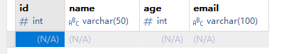
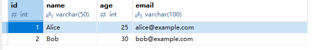
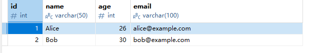
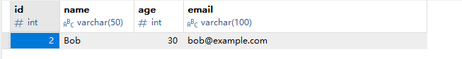

## 基本分类

SQL（结构化查询语言）是用于管理和操作数据库的标准语言。主要分为以下几类：


- **DDL（数据定义语言）**：创建、修改、删除数据库对象（表、索引等）
- **DML（数据操作语言）**：插入、查询、更新、删除数据
- **DCL（数据控制语言）**：控制用户权限（GRANT、REVOKE）
- **TCL（事务控制语言）**：管理事务（COMMIT、ROLLBACK）

## SQL 执行顺序

1. FROM 子句：确定表和连接类型
2. WHERE 子句：过滤行
3. GROUP BY 子句：分组
4. HAVING 子句：过滤分组
5. SELECT 子句：选择列
6. ORDER BY 子句：排序
7. LIMIT/OFFSET：限制结果数量

## 约束类型

`NOT NULL` - 指示某列不能存储 NULL 值。

`UNIQUE` - 保证某列的每行必须有唯一的值。

`PRIMARY KEY` - NOT NULL 和 UNIQUE 的结合。确保某列（或两个列多个列的结合）有唯一标识，有助于更容易更快速地找到表中的一个特定的记录。

`FOREIGN KEY` - 保证一个表中的数据匹配另一个表中的值的参照完整性。

`CHECK` - 保证列中的值符合指定的条件。

`DEFAULT` - 规定没有给列赋值时的默认值。

------


```sql
CREATE TABLE Users (
  Id INT(10) UNSIGNED NOT NULL AUTO_INCREMENT COMMENT '自增Id',
  Username VARCHAR(64) NOT NULL UNIQUE DEFAULT 'default' COMMENT '用户名',
  Password VARCHAR(64) NOT NULL DEFAULT 'default' COMMENT '密码',
  Email VARCHAR(64) NOT NULL DEFAULT 'default' COMMENT '邮箱地址',
  Enabled TINYINT(4) DEFAULT NULL COMMENT '是否有效',
  PRIMARY KEY (Id)
) ENGINE=InnoDB AUTO_INCREMENT=2 DEFAULT CHARSET=utf8mb4 COMMENT='用户表';
```
## 事务处理

不能回退 SELECT 语句，回退 SELECT 语句也没意义；也不能回退 CREATE 和 DROP 语句

MySQL 默认是隐式提交，每执行一条语句就把这条语句当成一个事务然后进行提交。当出现 START TRANSACTION 语句时，会关闭隐式提交；当 COMMIT 或 ROLLBACK 语句执行后，事务会自动关闭，重新恢复隐式提交。

通过 set autocommit=0 可以取消自动提交，直到 set autocommit=1 才会提交；autocommit 标记是针对每个连接而不是针对服务器的。


```sql
-- 开始事务
START TRANSACTION;

-- 插入操作 A
INSERT INTO `user`
VALUES (1, 'root1', 'root1', 'xxxx@163.com');

-- 创建保留点 updateA
SAVEPOINT updateA;

-- 插入操作 B
INSERT INTO `user`
VALUES (2, 'root2', 'root2', 'xxxx@163.com');

-- 回滚到保留点 updateA
ROLLBACK TO updateA;

-- 提交事务，只有操作 A 生效
COMMIT;
```
## 创建表

```sql
CREATE TABLE users (
    id INT PRIMARY KEY AUTO_INCREMENT,
    name VARCHAR(50) NOT NULL,
    age INT CHECK (age >= 18),
    email VARCHAR(100) UNIQUE
);
```



## 插入数据

```sql
INSERT INTO users (name, age, email)
VALUES ('Alice', 25, 'alice@example.com'),
       ('Bob', 30, 'bob@example.com');
```




## 更新数据

```sql
UPDATE users SET age = age + 1 WHERE name = 'Alice';
```




## 删除数据

```sql
DELETE FROM users WHERE age <= 26;
```




## 查询

```sql
-- 返回前 5 行
SELECT * FROM mytable LIMIT 5;
SELECT * FROM mytable LIMIT 0, 5;
-- 返回第 3 ~ 5 行
SELECT * FROM mytable LIMIT 2, 3;
```


## 触发器

发器是数据库中一种特殊的存储过程，它会在特定的数据库操作（如 INSERT、UPDATE 或 DELETE）发生时自动执行。触发器通常用于实现数据完整性约束、记录审计日志或自动执行相关操作。

```sql
CREATE TRIGGER trigger_name
BEFORE/AFTER INSERT/UPDATE/DELETE ON table_name
FOR EACH ROW
BEGIN
    -- 触发器逻辑
END;
```
```sql
-- 创建一个触发器，在插入新记录时自动设置 created_at 字段为当前时间
CREATE TRIGGER set_created_at
BEFORE INSERT ON mytable
FOR EACH ROW
BEGIN
    SET NEW.created_at = NOW();
END;
```

